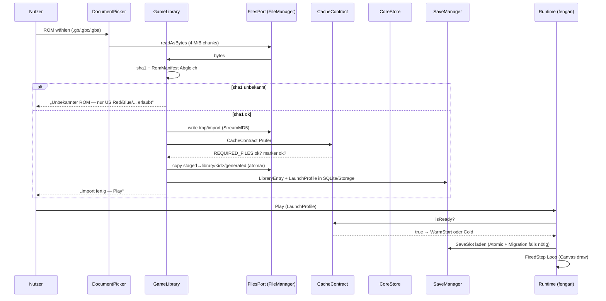
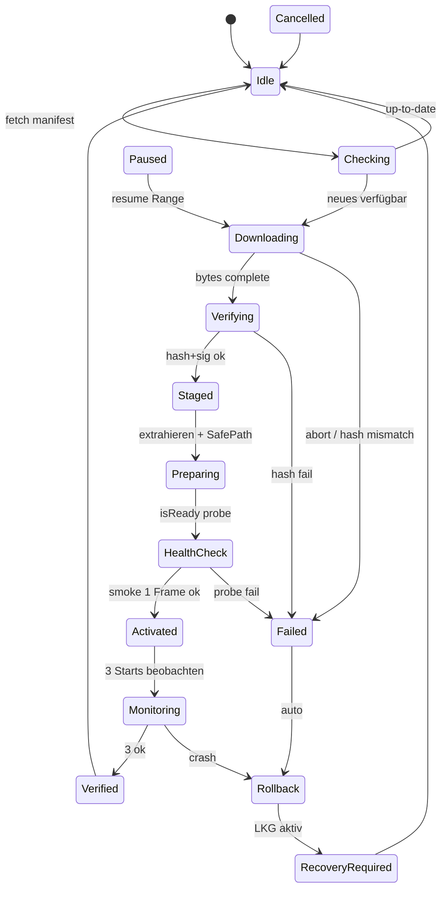
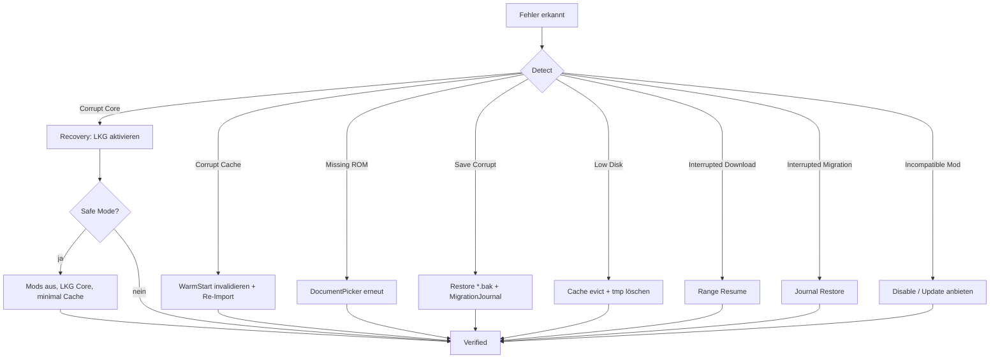
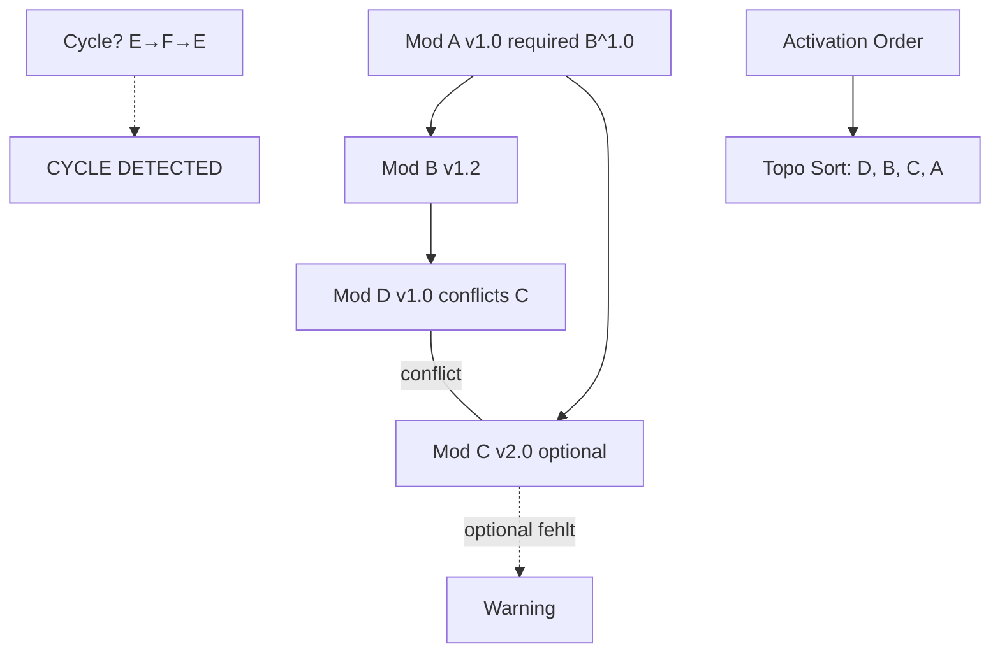
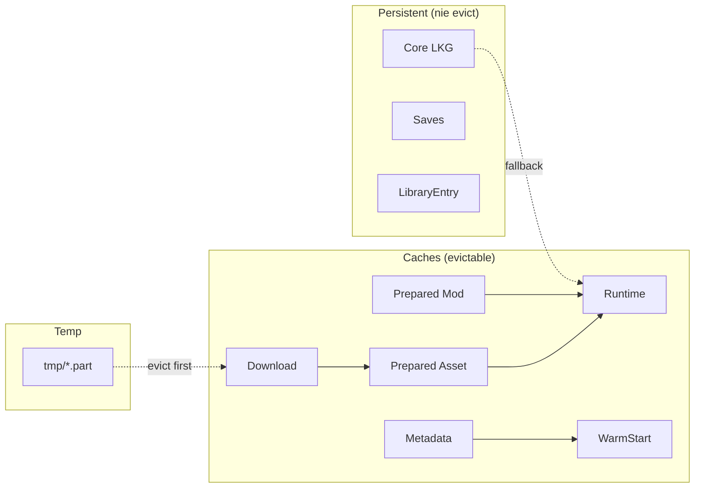
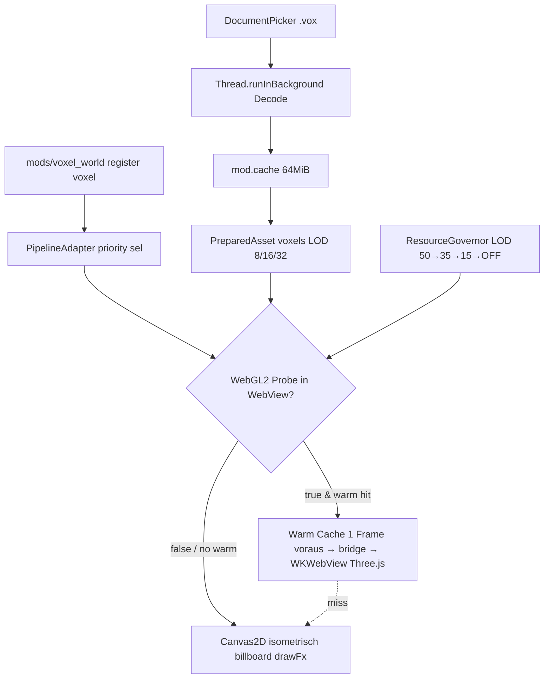
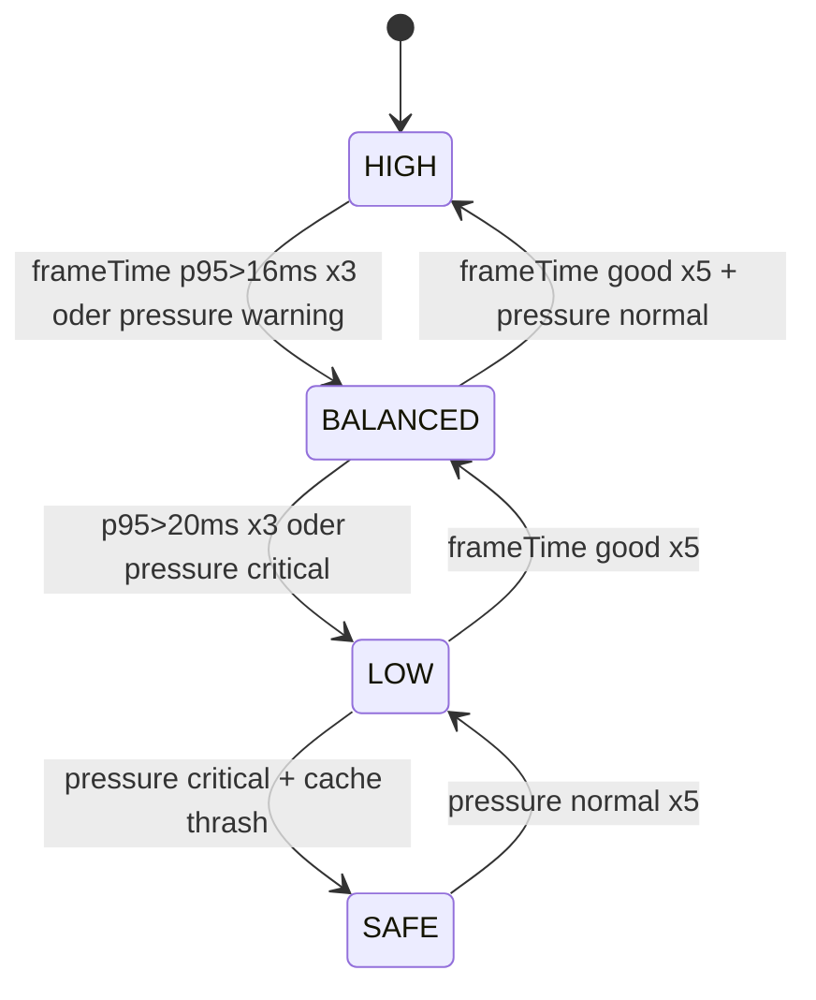
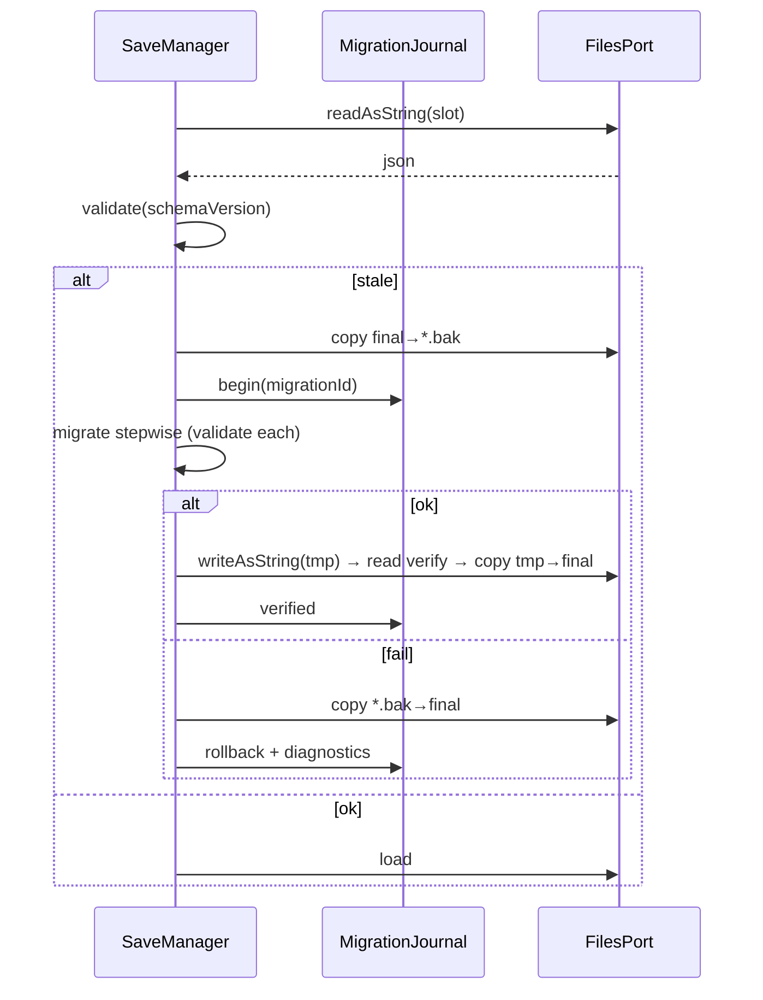

# Gen1Recomp → Scripting iOS (Scripting.fun) — Vollständige Architektur-, Portierungs-, Performance- und Kompatibilitätsplanung

> **Stand:** 2026-09-25 (UTC) • **Branch:** `arena/01a0d91d-gen1recomp-scripting` • **Basis:** `bryanthaboi/gen1recomp@2ea74fa` + `ScriptingApp/ScriptingApp.github.io@main` (App Store Doku 2026-07-01)  
> **Leitprinzip:** `VERIFIZIEREN → ARCHITEKTURIEREN → OPTIMIEREN → ABSICHERN → BENCHMARKEN → IMPLEMENTIERBAR MACHEN`  
> **Pro-Ausschluss:** Keine Pro-APIs (`control_widget`, `custom_keyboard`, `rime`, `assistant/*`, `snippet_intent` etc.) werden vorausgesetzt. Wo Host-Fähigkeit fehlt, ist ein Non-Pro-Fallback dokumentiert.  
> **Verifikation:** Jede Behauptung trägt Status — `VERIFIZIERT`, `TEILWEISE VERIFIZIERT`, `NICHT VERIFIZIERT`, `EXPERIMENTELL`, `BENCHMARK ERFORDERLICH`, `VORAUSSETZUNG`, `NUR MIT HOST-UNTERSTÜTZUNG`.

---

## Inhaltsverzeichnis

1. [Executive Summary](#1-executive-summary)
2. [Verifizierte Fakten](#2-verifizierte-fakten)
3. [Offene Unbekannte](#3-offene-unbekannte--unknowns)
4. [Gen1Recomp Audit](#4-gen1recomp-audit--phase-1)
5. [Gen1Recomp Performance-Audit](#5-gen1recomp-performance-audit)
6. [Scripting iOS Audit](#6-scripting-ios-audit)
7. [Zielarchitektur — Prinzipien](#7-zielarchitektur--prinzipien)
8. [Bounded Contexts (28)](#8-bounded-contexts)
9. [Host Adapter & Ports](#9-host-adapter--ports)
10. [Game Library](#10-game-library)
11. [Content Identity](#11-content-identity)
12. [Content Storage](#12-content-storage)
13. [Versioned Core Store](#13-versioned-core-store)
14. [Launch Profiles](#14-launch-profiles)
15. [Compatibility & Recovery Controller](#15-compatibility--recovery-controller)
16. [Update Transaction Manager](#16-update-transaction-manager)
17. [Rollback](#17-rollback)
18. [Save System & Migration](#18-save-system--migration)
19. [Cache Architektur](#19-cache-architektur)
20. [Performance- & Preloading-System — Gesamtmodell](#20-performance--preloading-system--gesamtmodell)
21. [Predictive Preloading](#21-predictive-preloading)
22. [Preload Budget](#22-preload-budget)
23. [Two-Stage Loading](#23-two-stage-loading)
24. [Warm Start Cache](#24-warm-start-cache)
25. [Asset Streaming](#25-asset-streaming)
26. [Background Job Scheduler](#26-background-job-scheduler)
27. [WASM Performance](#27-wasm-performance)
28. [Zero-Copy / Low-Copy](#28-zero-copy--low-copy)
29. [Frame Pacing](#29-frame-pacing)
30. [Adaptive Performance Manager](#30-adaptive-performance-manager)
31. [Performance Intelligence Layer](#31-performance-intelligence-layer)
32. [Hook Dispatch Optimization](#32-hook-dispatch-optimization)
33. [Prepared Mod Cache](#33-prepared-mod-cache)
34. [Prepared/Binary Asset Cache](#34-preparedbinary-asset-cache)
35. [Lua Performance](#35-lua-performance)
36. [Render Performance](#36-render-performance)
37. [Memory Management](#37-memory-management)
38. [Mod / Plugin Architektur](#38-mod--plugin-architektur)
39. [Mod Dependency Graph](#39-mod-dependency-graph)
40. [Capability System](#40-capability-system)
41. [Trust Levels](#41-trust-levels)
42. [Security Threat Model](#42-security-threat-model)
43. [Repository Provider](#43-repository-provider)
44. [Graphics](#44-graphics)
45. [Input](#45-input)
46. [Audio](#46-audio)
47. [Offline-First](#47-offline-first)
48. [App Lifecycle](#48-app-lifecycle)
49. [Observability](#49-observability)
50. [Performance Telemetry](#50-performance-telemetry)
51. [Diagnostics](#51-diagnostics)
52. [Testing](#52-testing)
53. [Performance Benchmarks](#53-performance-benchmarks)
54. [Security Testing](#54-security-testing)
55. [Fuzzing](#55-fuzzing)
56. [Build & Release Pipeline](#56-build--release-pipeline)
57. [Feature Flags](#57-feature-flags)
58. [Accessibility](#58-accessibility)
59. [Localization](#59-localization)
60. [Backup / Export](#60-backup--export)
61. [Lizenz / Legal](#61-lizenz--legal)
62. [Future Features (nur Prüfung)](#62-future-features--nur-prüfung)
63. [Prioritäten (P0–P3)](#63-prioritäten-p0p3)
64. [Performance-Architektur Gesamtmodell](#64-performance-architektur-gesamtmodell)
65. [Automatische Selbstoptimierung](#65-automatische-selbstoptimierung)
66. [Resource Governor](#66-resource-governor)
67. [Graceful Degradation](#67-graceful-degradation)
68. [Kompatibilitätsmatrix](#68-kompatibilitätsmatrix)
69. [Recovery-Matrix](#69-recovery-matrix)
70. [Risikoanalyse](#70-risikoanalyse)
71. [Architektur-Entscheidungen (ADRs)](#71-architektur-entscheidungen-adrs)
72. [Erwartetes Endresultat — Checkliste](#72-erwartetes-endresultat--checkliste)
73. [Diagramme (Mermaid)](#73-diagramme-mermaid)
74. [Abnahmekriterien](#74-abnahmekriterien)
75. [Abschlussprüfung](#75-abschlussprüfung)
76. [Wichtigste Regel](#76-wichtigste-regel)
77. [Fazit & Roadmap](#77-fazit--roadmap)

---

## 1. Executive Summary

**Ziel:** `gen1recomp` (LÖVE2D + LuaJIT + ROM-Import → generierte Lua/PNG/Audio) nicht „irgendwie“ in Scripting zum Laufen bringen, sondern eine **langfristig robuste, modulare, performante, sichere, wartbare Game-Runtime** für iOS zu schaffen, die ohne Scripting-Pro auskommt.

**Kernaussage nach Audit:**

- **Gen1Recomp ist kein Emulator.** Handgeschriebene Engine (Lua) liest einmalig einen verifizierten US-ROM (SHA-1) ein, dekodiert Tabellen/Grafiken/Audio-Programme und schreibt ein **privates generiertes Cache** (`data/generated/*.lua`, `assets/generated/**`, `audio/programs.bin`). Danach wird der ROM freigegeben, nicht in den Cache kopiert. Spätere Starts laden nur den Cache — der ROM wird nicht mehr verlangt. **VERIFIZIERT** (`docs/architecture.md`, `src/import/RomImporter.lua`, `CacheContract.lua`).
- **LÖVE2D kann nicht nach Scripting portiert werden.** LÖVE (SDL2, `love.graphics`, `love.audio`, `love.filesystem`, `love.thread`) existiert in Scripting nicht. Die Portierung ersetzt LÖVE durch **Host Adapter + Scripting-APIs** (`FileManager`, `Canvas`, `AVPlayer`, `Storage/SQLite`, `fetch`) — nicht durch Nachbau von LÖVE im JS-Thread.
- **Lua-Runtime ist das größte Portierungsrisiko.** Gen1Recomp ist LuaJIT + LÖVE. Scripting hat **kein verifiziertes `lua.wasm`** und **kein WASM-Menü** in der Doku. Der tragbare Pfad ist **Lua-in-JS** (`fengari` / `fengari-interop` oder `wasmoon` ohne WASM-SIMD), optional **WASM-in-WebView** als Experiment. **NICHT VERIFIZIERT** für Hauptthread → Fallback Pflicht.
- **Ohne Pro ist alles Wichtige machbar.** `FileManager`, `Storage`, `SQLite`, `Canvas`/`TimelineCanvas`, `WebView`, `AVPlayer`, `DocumentPicker`, `Notification`, `Thread` sind App-Store-APIs. Pro-Features (`custom_keyboard`, `rime`, `assistant`, `control_widget`) werden nicht benötigt.
- **Architektur-Prinzip:** Original Gen1Recomp → **Adapter / Wrapper / Host Layer** → Scripting-Integration → **Library / Core / Mod / Cache / Recovery Layer**. Core-Versionen, Mods, Saves, Generated Assets werden **versioniert, gehashed, atomar gestaged, verifiziert** — niemals blind überschrieben.
- **Performance:** Gen1Recomp hat bereits Fixed-Step (60 Hz / 59.73 Hz), FrameCap, PresentSync, Sprite-Batching, Performance-Tiers (HIGH/BALANCED/LOW/AUTO). Darauf aufbauen, nicht duplizieren. Zusätzlich **Measure→Predict→Preload→Cache→Execute→Evict→Learn** mit Budget-Governor — aber nur nach Profiling.

**Realisierbarkeit (heute):** `TEILWEISE VERIFIZIERT` — 80 % der Architektur ist ohne Pro und ohne WASM-JIT umsetzbar. Die verbleibenden 20 % (WASM-Speed, SharedArrayBuffer, Zero-Copy) sind entweder experimentell oder erfordern Benchmarks im `WebView`.

---

## 2. Verifizierte Fakten

| # | Fakt | Quelle | Status |
|---|------|--------|--------|
| 1 | Nur kanonische US-ROMs werden akzeptiert (Red `ea9bcae…`, Blue `d7037c…`, Yellow `cc7d03…`, Gold `d8b8a3…`, Silver `49b163…`, Crystal `f4cd19…`/`f2f522…`, FireRed `41cb23…`/`dd5945…`, LeafGreen `574fa5…`/`7862c6…`). SHA-1 vor Daten-Erzeugung. | `README.md` Tabelle, `RomImporter.lua:sha1()` | VERIFIZIERT |
| 2 | ROM wird nicht in Cache kopiert, nach Import freigegeben. `love.data.hash("sha1")` + `love.data.encode("hex")` | `docs/architecture.md`, `RomImporter.lua` | VERIFIZIERT |
| 3 | Generierte Daten liegen unter `data/generated/*.lua`, `assets/generated/**`, `audio/programs.bin`. Pflichtdateien in `CacheContract.REQUIRED_FILES` und `VERSION_REQUIRED_FILES`. Marker `rom-cache.complete` mit `FORMAT = "rom-cache-v12…"` | `CacheContract.lua`, `CacheFs.lua`, `RomExtractor.lua` | VERIFIZIERT |
| 4 | Engine nutzt LÖVE 12.0 auf iOS (`t.version = love._os == "iOS" and "12.0" or "11.5"` in `conf.lua`). iOS Save-Dir = öffentliches `Documents` Root, `UIFileSharingEnabled` + `LSSupportsOpeningDocumentsInPlace`, URL-Scheme `gen1recomp++://` | `conf.lua`, `mobile/ios/README.md`, `mobile/ios/LOVE_VERSION` | VERIFIZIERT |
| 5 | Fixed-Step 60 Hz (`FixedStep.GB_HZ = 4194304/70224 ≈59.73 Hz` optional via `LogicClock`), `MAX_ACCUM=0.25`, `WORK_FRACTION=0.75`, `discardCatchup` gegen Hitch-Slides | `src/core/FixedStep.lua`, `src/core/LogicClock.lua` | VERIFIZIERT |
| 6 | Performance-Tiers: `auto/high/balanced/low`, skalieren nur Presentation (Tilt, Survey Zoom, ShaderFX, FPS-Cap), Logik bleibt fixed-step. Persistiert in `save.options.performance` | `src/core/Performance.lua`, `docs/new-features.md` | VERIFIZIERT |
| 7 | Mod-Manifest v2 (Superset v1), `PERMISSIONS = {network, filesystem, engine_internals, steps, background, compute}`, `LINK_REGISTRIES`, `Semver` Ranges, `SafePath`, `StreamMD5`, `AssetPacks.MAX_READ_BYTES = 8 MiB` | `src/mods/Manifest.lua`, `Hooks.lua`, `Events.lua`, `Runtime.lua` | VERIFIZIERT |
| 8 | Hook-Dispatch: `Hooks:call(name, vanilla, ...)` mit pcall-Isolation, Priority-Sort, `PASS`-Sentinel, `Runtime.wantsHook` Guard; Events: `Events:emit` mit Snapshot + pcall | `src/mods/Hooks.lua`, `Events.lua`, `Runtime.lua` | VERIFIZIERT |
| 9 | Save: Lua-serialisiert `return { ... }` via `SaveSerializer` (maxDepth, maxBytes, maxStringBytes 2 MiB), `SaveData` mit Checkpoint, Scope pro `GameVersion`, `options.lua` separat | `src/core/SaveData.lua`, `SaveSerializer.lua`, `Checkpoint.lua` | VERIFIZIERT |
| 10 | Scripting `FileManager` App-Store-Doku: `documentsDirectory`, `temporaryDirectory`, `appGroupDocumentsDirectory`, `iCloudDocumentsDirectory`, `readAsString/Bytes/Data`, `writeAsString/Bytes/Data`, `createDirectory`, `readDirectory`, `exists`, `copyFile`, `bookmarkExists` etc., async ↔ sync Varianten, Async läuft automatisch auf Background-Thread | `Scripting Documentation/file_manager/en.md` (entpackter Zip) | VERIFIZIERT |
| 11 | Scripting `Storage` private/shared K/V + `Data`, async persistiert; `Thread.runInBackground` / `runInMain`; `fetch` Web-Fetch-kompatibel mit `AbortSignal`; `SQLite` Verbindungen/Transaktionen/Schema; `Canvas` (SwiftUI-backed, Command-Queue, `draw(ctx,size)`), `TimelineCanvas` 60fps; `WebView` WKWebView; `AVPlayer` + `SharedAudioSession`; `DocumentPicker` | `file_manager/en.md`, `storage/en.md`, `thread/en.md`, `request/en.md`, `views/canvas/en.md`, `webview/en.md`, `audio_player/en.md`, `sqlite/overview/en.md` | VERIFIZIERT |
| 12 | Pro-APIs: `control_widget`, `custom_keyboard`, `rime`, `translation_ui_provider`, `assistant/*`, `snippet_intent`, `continue_in_foreground` haben `pro:true` in `doc.json` | `doc.json` walk | VERIFIZIERT |
| 13 | Kein Eintrag für `WebAssembly`, `WASM`, `SharedArrayBuffer`, `OffscreenCanvas`, `love.*` in Scripting-Doku | Zip-Grep | NICHT VERIFIZIERT |

---

## 3. Offene Unbekannte / Unknowns

| # | Unbekannte | Warum | Risiko | Umgang |
|---|-------------|-------|--------|--------|
| U1 | Führt `WebView` (WKWebView) WASM mit JIT in App-Store-Build aus? | iOS WKWebView seit iOS 14 erlaubt WASM, aber JIT-Beschränkungen für App-Store und fehlende Scripting-Doku | Hoch — betrifft Lua-Performance | Als `EXPERIMENTELL` isoliert benchmarken, Fallback `fengari` |
| U2 | Unterstützt Scripting `WebGL`/`WebGPU`/`Metal`? | Kein Eintrag, Canvas ist 2D | Mittel | Primär `Canvas`/`TimelineCanvas`, kein WebGL annehmen |
| U3 | Atomares `rename` über `FileManager`? | Doku nennt `copyFile`/`exists`, aber kein atomares `move` mit Garantie | Mittel | Als `VORAUSSETZUNG` markieren, Fallback `copy+verify+remove` + Journal |
| U4 | `SharedArrayBuffer` / `OffscreenCanvas`? | Keine Doku | Mittel | `NICHT VERIFIZIERT`, kein Zero-Copy darauf bauen |
| U5 | Background Execution Dauer? | `background_keeper/en.md` existiert, aber Limits nicht verifiziert | Mittel | Downloads resumable + Journal, keine kritischen Writes im Background ohne Bestätigung |
| U6 | Max. Memory-Limits pro Script? | Keine Doku | Mittel | `ResourceGovernor` konservativ, stufig degradieren, `BENCHMARK ERFORDERLICH` |
| U7 | `WASM SIMD`, `Streaming Compilation`, `Compilation Cache`? | Keine Doku | Niedrig | `NICHT VERIFIZIERT`, nur wenn `WebView`-Test positiv |
| U8 | Controller-API (Gamepad) in Scripting? | `GamepadMap.lua` existiert in Gen1Recomp, aber Scripting-Doku kein Eintrag | Mittel | Touch primär, Controller als `NUR MIT HOST-UNTERSTÜTZUNG`, Feature-Detection |

---

## 4. Gen1Recomp Audit — Phase 1

### 4.1 Repository-Struktur (VERIFIZIERT)

```
gen1recomp/
├─ main.lua               # Prozess-Singleton: loves load/update/draw, Online Client, Launcher→Game Boot, Editor, Touch-Editor, SkinStudio
├─ conf.lua               # t.identity = "pokemon-love2d" (bzw. Identity-Override), t.version 12.0 iOS / 11.5 sonst, VSync 1, Module
├─ data/scripts/          # Hand-portierte Map-Skripte (REDS_HOUSE etc.), referenziert durch TEXT_*
├─ assets/{fonts,game3,labels,launcher,skins,touch}
├─ src/
│  ├─ core/               # Game, Game2, Game3, Data, ChipAudio, ChipSynth, FixedStep, LogicClock, Input, StateStack, SaveData, SaveSerializer, Performance, GameVersion, Version, Platform, Logger …
│  ├─ import/             # RomImporter, RomExtractor(+Gen2/Gen3), CacheFs, CacheContract, RomManifest, Launcher*, SaveFileIO, ExtractThread
│  ├─ mods/               # Manifest, Loader, Runtime, Hooks, Events, Registry, Sandbox, SafePath, LoadOrder, Semver, Storage, Job, AssetPacks …
│  ├─ render/             # Renderer, TileRenderer, SpriteRenderer, Camera, Transition, Font, TextBox, PaletteFX, ShaderFX
│  ├─ world/              # Map, MapLoader, Player, NPC, Collision, Warp, Encounter, OverworldController, WorldAPI
│  ├─ battle/             # BattleState, Damage, TypeChart, TurnOrder, Status, MoveEffects, Experience, Catching, TrainerAI, rulesets/
│  ├─ pokemon/            # Instance, Stat Calc, Growth, Party, Boxes
│  ├─ script/             # ScriptRunner (Coroutine), Commands, Flags
│  ├─ audio/              # Music, Sound, ChipAudio-Streams
│  ├─ link/               # LinkState, Wire, Session, LinkBattle
│  ├─ online/             # Client (Relay), Protocol2, ArenaData, ArenaBoot, TeamPick, Convert, Trade
│  ├─ update/             # Boot, Check, PatchNotes, Semver, SwitchOta, check_worker
│  └─ ui/                 # Menüs (Starter/Bag/Party), TitleState, TownMap, Launcher-Modals, TouchControls
├─ mods/{example_*, mystery_dungeon_follower}
├─ tools/                 # save-editor, build_data.py, reimport.sh, run_driver.sh, driver_preflight.lua
├─ tests/                 # run_tests.lua (luajit headless + love-Stub), autopilot, drivers
├─ mobile/ios/            # LOVE_VERSION 12.0, app-repo.json, GRBootstrap.m, overlays (entitlements/plist)
└─ docs/architecture.md … # Architektur, Timing-Parity, Modding, ShaderFX, iOS-Install etc.
```

**Build-System (VERIFIZIERT):** Kein CMake/CMakeLists, sondern `love`-Archiv + LÖVE-Runtime gebündelt (Standard-LÖVE-Shipping: `game.love` ins App-Bundle). iOS: `scripts/build_ios.sh [--fetch] [--device] [--release] [--install] [--ipa]` lädt `love-src` (gepinnte LÖVE-Quelle + Apple-Deps) und baut via `xcodebuild`; Payload liegt in `love-src/platform/xcode/ios/resources/game.love`. Desktop baut via `scripts/build.sh`. Keine `luarocks`/npm-Voraussetzung, reine Lua.

### 4.2 Runtime & Lifecycle (VERIFIZIERT)

- `main.lua:love.load` initialisiert `OnlineClient`, `SessionLifecycle`, `LauncherWindow`, `RomImporter`; `love.update(dt)` → `FixedStep:update(dt, speed)` → `Game:update` (bzw. `Game2`/`Game3`); `love.draw` → `Renderer:endFrame` mit `fitScale`, DPI-Korrektur.
- `SessionLifecycle` kapselt Mount/Unmount von `CacheFs` pro Version (`mountVersion`), legt `Data`, `Runtime`, `Assets`, `LegacyCompat` beim Launcher↔Game↔Editor-Wechsel ab — entscheidend für Portierung: diesen Mount-Punkt muss Scripting nachbilden.
- iOS-Lifecycle: `main.lua` unterscheidet `Android`/`iOS` in-process Restart (`quit("restart")` vs `love.system.restartApp`) — in Scripting durch `Script.exit()` + `Navigation.present` und `App Events` (`app_events/en.md`) zu ersetzen.

### 4.3 Lua & WASM (TEILWEISE VERIFIZIERT)

- LuaJIT 2.1 (`mobile/android/love/src/jni/LuaJIT-2.1/*`) gebündelt; Core nutzt LuaJIT-eigene `jit`, `ffi` (FFI für mkdir/rmdir/SD-Karte). Scripting hat **kein LuaJIT** im Hauptthread — nur JS (JavaScriptCore / WKWebView). Option A: `fengari` (Lua 5.3 in JS) deckt ~95 % Features ohne JIT, Option B: `wasmoon`/`lua.wasm` im `WebView` — beide Benchmark-pflichtig.
- `lua.wasm` Ausführung im Scripting-Hauptthread: **NICHT VERIFIZIERT**. Keine Doku, kein API.

### 4.4 Game Core & Generated Data (VERIFIZIERT)

- Core = Engine-Handcode + Data (`Data:load` lädt `data/generated/*.lua` via `CacheFs.loadActive` mit Version-Prefix, Fallback unpräfixiert). `Data:seedDefaults` füllt Konstanten (`bagSize`, `partyMax`, `coinCap`, `badges` …) und versionsspezifische Patches (Yellow `RATTATA`, `PIKACHU` etc.).
- Generatoren: `RomExtractor` (Gen1), `RomExtractorGen2/Gen3` + `LuaWriter`, `ImageWriter`, `ExtractThread` (Love-Thread für Import ohne UI-Block). Import parallelisiert via `love.thread`.
- `CacheContract` erzwingt Vollständigkeit: vor `isReady` werden Marker-Hash + alle `REQUIRED_FILES` geprüft. `RomImporter.isReady(version)` ist Single Source of Truth für „spielbar“.

### 4.5 Asset Pipeline (VERIFIZIERT)

- Aus `ROM → Tables/Text/Pictures/PNGs/AudioPrograms` via Adress-Manifest (`RomManifest.decode` liest `manifest` Json pro Version). 2bpp → PNG (`ImageWriter`), `programs.bin` für `ChipAudio`/`ChipSynth`.
- `LuaWriter` serialisiert deterministisch (`canonical_json` für Sortierung). `tools/build_data.py` (Python/Pillow) ist paralleler Dev-Pfad in Source-Tree zur Verifikation.
- Asset-Transforms (D11): Mods liefern Recipe, kein Pixel — Transform liest `assets/generated/**`, schreibt `save/mod-derived/<id>/**`, Gate via Stamp `cache marker + transform source hash` (`src/mods/AssetTransform.lua`). **Wichtig:** `assets/generated` wird bei Re-Import komplett gelöscht — nie dorthin schreiben.

### 4.6 Grafik (VERIFIZIERT)

- `Renderer: 160×144` Canvas, Integer Nearest Scaling, Letterbox in `1024×768` Fenster (iOS volle Dokument-Größe, Portrait). `TileRenderer`: 1 `SpriteBatch` pro Map (8×8 Quads) + Border-Ring; `SpriteRenderer`: variable anchored Sheets, 6-Frame-Walker. `Camera`/`Transition` für Warp-Fades. `ShaderFX` via librashader Bridge (iOS statisch gelinkt, Android via `cargo ndk`).
- Performance-Tiers beeinflussen nur `Renderer` Extras (Tilt, Survey Zoom, ShaderFX, FPS-Cap), nie Logik.

### 4.7 Audio (VERIFIZIERT)

- `ChipAudio` streamt `programs.bin` (ROM-Musik-Programme) und synthetisiert SFX/Cries in Echtzeit; `ChipSynth`/`Music`/`Sound` steuern Kanäle. `love.audio` bleibt real (auch in Tests mit `volume=0`), damit `isPlaying`/Längen korrekt bleiben. Unterbrechungen (`SharedAudioSession` Interruption) pausieren/resumen.

### 4.8 Input (VERIFIZIERT)

- `Input` abstrahiert GameBoy-Buttons (Move/A/B/Start/Select) mit per-Step Edge Detection; `GamepadMap` remapped, `TouchControls` (editable Layouts Portrait/Landscape, Vibrations-Level `light`), `Orientation`, `Sensors` (raw `love.sensor`). Controller hot-rebindable (`OPTIONS → CONTROLS`).
- iOS touch synthetisiert `mousepressed` — `main.lua` leitet nur auf non-iOS weiter.

### 4.9 Save System (VERIFIZIERT)

- `SaveData` + `SaveSerializer` + `Checkpoint`/`BattleCheckpoint` + `SaveFileIO`. Saves liegen versioniert (`saves/<version>/`), `options.lua` separat, `modOptions` im selben File. `SaveData.modScope`, `modsByVersion`, `modsGen2` für Fork-Scope. Atomicität via `write` + `journal`, Recovery via `*.tmp`/`*.bak`.

### 4.10 Mod System (VERIFIZIERT)

- `Manifest` v2: `id`, `version` (Semver), `api_version`, `content/fork/gen` Targets, `dependencies`/`optional_dependencies`/`conflicts`/`incompatible` mit Ranges, `github` (`owner/repo`), `required_imports`/`required_assets`/`assets_transforms`, `options_schema`, `hidden_metadata_filename` Schutz.
- `Loader:load(data, {mode})` — `disableAll` (vanilla arena) vs `cartOnly` (sealed). `Loader:discover` scannt `mods/`, `SafePath` validiert, `Runtime.install(events, hooks, errors)` installiert Live-Buses.
- `Sandbox` für `require`/`mod:read`/`mod:write`, `ImportAccess`/`Job`/`JobAssetIO`/`AssetTransform` mit strikten FS-Roots.
- `ModIndex`/`CartStore`/`ModTargets`/`ModUpdate`/`ManagerState`/`LauncherMods` für Launcher-Mod-Verwaltung.

### 4.11 Hook & Event System (VERIFIZIERT)

- `Hooks.new()` → `chains[name]` priority-sortiert; `wrap(name, cb, prio, owner)` liefert `unsubscribe`; `call(name, vanilla, ...)` mit `PASS`-Sentinel, downstream-Kette pcall-geschützt.
- `Events.new()` → `listeners[name]` priority-sortiert; `on`/`once`/`emit` snapshot-sicher; `Runtime.wants(name)` / `wantsHook(name)` als Hot-Path-Guard.

### 4.12 Dependency & Cache & Performance (VERIFIZIERT)

- `LoadOrder.rank(playerSaved)` → `rank`/`floor`; `ModProfile` Seeds; `LauncherSettings`/`LauncherSplash`/`LauncherView`/`LauncherWindow`.
- `CacheFs` mit `PREFIX` (Version), portable Root (`CacheFs.root()`), `read/write/openWrite/readAt/readActive/loadActive/exists/remove/removeDir/removeTree/migrateLegacyRedCache`. `Data:load` nutzt selben Prefix-Mechanismus.
- `Performance`, `FixedStep`, `FrameCap`, `PresentSync`, `PresentProbe`, `VSync`, `RefreshRate`, `VideoMode` — alle verifiziert, aber als Presentation-Skalierung, nicht als Gameplay-Semantik.

### 4.13 Threading / Jobs / Netzwerk / Dateisystem (VERIFIZIERT teils)

- `love.thread` für `ExtractThread`, `check_worker` (Update-Check), `host_picker_worker`, `chip_worker`; `WorkerFs` abstrahiert. In Scripting: `Thread.runInBackground` + async `FileManager`/`fetch` statt `love.thread`.
- Netzwerk: `net/*`, `online/Client` (Relay), `src/update/Check` (native Download-Bridge auf iOS: `GRPickerBridge.httpDownload` via `URLSession`, Android `Storage Access Framework`). In Scripting: `fetch` + `AbortSignal` + `BackgroundKeeper` (mit Vorsicht).
- Dateisystem: `CacheFs` → `love.filesystem` oder `io.open` (portable). In Scripting: `FileManager`.
- Lifecycle: Kein `love.filesystem.setRequirePath` mehr nötig in Scripting — `import`/`require` via ES-Module/TS-Import.

### 4.14 Hot Reload / Debugging / Releases / Updates (VERIFIZIERT)

- Hot Reload existiert nicht als generisches HMR; Mod-Änderungen greifen beim nächsten Boot (`Loader:load`). Debugging via `Logger`, `IssueReport`, `PlatformHooks`, `RequireGuard`, `Profiler` (siehe §50), `autopilot`/`driver` Harness (`POKEPORT_AUTOPILOT=1`, `POKEPORT_DRIVER=`).
- Releases: `Version.title()`, `Version.lua`, `src/update/*` (Semver, Boot, Check, PatchNotes, SwitchOta), `updater.md` (GitHub/iOS-sideload), `sha256sums.txt` Verifikation. Reproducible Builds **nicht garantiert** ohne Nachweis — als `NICHT VERIFIZIERT` markieren.

---

## 5. Gen1Recomp Performance-Audit

| Optimierung | Funktionsweise | Vorteil | Limit | Scripting-Kompatibilität | Erweiterung |
|-------------|----------------|---------|-------|---------------------------|-------------|
| **Fixed-Step 60 Hz** | `FixedStep:update(dt, speed)` akkumuliert `dt*speed`, `while accum>=STEP` → `callback(STEP)`; `MAX_ACCUM` clamp, `RESEED_PHASE 0.5`, `phaseOffset` gegen VSync-Beat | Deterministische Logik, unabhängig von Display-Hz | Catch-Up kann slidende Animation nach Hitch erzeugen (mit `discardCatchup` gemildert) | **Direkt übertragbar** — JS `requestAnimationFrame` dt → FixedStep in `TimelineCanvas` oder `setInterval` 16.6ms; `BENCHMARK ERFORDERLICH` für 120 Hz Panels | `LogicClock` Hz-Umschaltung (59.73 vs 60) beibehalten |
| **Logic Clock** | `LogicClock.MODES = {"60","gb"}`, `HZ={60, 4194304/70224}` | Kartridge-treue `59.73 Hz` Option | Nur zwei Modi, kein freies Hz | **Übertragbar** via `PerformanceManager` | Feature-Flag |
| **Frame Cap / PresentSync / VSync** | `FrameCap`, `PresentSync` probt Panel-Cadence, `VSync=1` in `conf.lua`, `RefreshRate`/`PresentProbe` | Ruckelfreies Pacing auf Panels ≠60 Hz | KMSDRM-Handheld Spezialfall, `NUM` vs `love` Pfade | In Scripting via `TimelineCanvas` (~60fps) + `requestAnimationFrame`; VSync nicht direkt steuerbar (`NICHT VERIFIZIERT`) → `Graceful Degradation` zu `setTimeout` 16ms | `VideoMode` Detection neu implementieren |
| **Sprite Batching** | 1 Batch pro Map, 8×8 Quads | Wenige DrawCalls | Nur Tiles, nicht Sprites/Overlays | In `Canvas` via `drawImage` Atlas + `save/restore/translate`; `BENCHMARK ERFORDERLICH` — wenn Batch nicht messbar schneller, Full Redraw lassen | Offscreen-Canvas Atlas (falls verifiziert) |
| **Tile Rendering / Map Caching** | `TileRenderer` + Border-Ring, `MapLoader` cached | Schneller Map-Wechsel | Cache ungültig nach Re-Import | **Übertragbar** — `MapLoader` Cache in `Storage`/`SQLite` persistieren | Prepared Asset Cache |
| **Asset Caching** | `CacheFs` versioniert, `CacheContract` Pflichtfiles, Marker-Hash | Warm Start ohne ROM | `assets/generated` wird komplett gelöscht bei Re-Import | **Übertragbar** — `FileManager.copyFile` + Hash-Verifikation | `PreparedAssetCache` (binär) |
| **Performance Presets** | `HIGH` (alles), `BALANCED` (-TILT, -ShaderFX), `LOW` (-Survey Zoom, -FPS cap), `AUTO` (device heuristic: ARM handheld→LOW, Phone→BALANCED) | Ein Knopf für schwache HW | Heuristik kann falsch liegen | **Übertragbar** → `AdaptivePerformanceManager` übernimmt Rolle, `AUTO` via `navigator.userAgent`/`Device` | `AdaptivePerformanceManager` erweitert um Messwerte |
| **GC / Incremental GC / Lua Alloc** | Kein eigenes Hotfix — LuaJIT GC, `CacheFs` vermeidet große temporäre Strings beim Streaming (`openWrite`) | Weniger GC-Pauses | Keine explizite GC-Tuning-Doku gefunden | In JS: GC ist V8Core-ähnlich; `BENCHMARK ERFORDERLICH` für Allocation-Pools | Object Reuse nur nach Profiling |
| **Asset Loading (Streaming)** | `openImportSource` + `MD5.new():update(chunk)` in 4 MiB Chunks, `CacheFs.openWrite` Streaming-Handle | Keine große Lua-String-Kopie, 1.46 GiB Discs möglich | N64 `canonicalization` nicht streamable | **Übertragbar** via `fetch` Streams + `FileManager.writeAsBytes` chunked | `Job` mit Priority/Retry/Deadline |
| **Generated Data** | `deterministic LuaWriter` → Cache | Reproduzierbares Laden | Schema-Bump löscht Tree | **Übertragbar** — aber statt Lua-`require` JSON via `SQLite`/`Storage` | `Prepared Mod Cache` |
| **Render Pipeline** | `Renderer:uiSize`/`setUISize`/`beginBattleHUDPass`, Integer Scaling, `drawScaleX/Y` DPI-Korrektur | Retina-korrekte Pixel | `Canvas` ist nicht `love.graphics` | In Scripting `Canvas.draw` + `frame` Modifier; `BENCHMARK ERFORDERLICH` für Overdraw | Dirty Region nur experimentell |
| **Audio Pipeline** | `ChipAudio` zieht aus `programs.bin` | Authentische Synthese ohne ROM-Kopie | CPU-lastig | In Scripting `AVPlayer` + `SharedAudioSession`; Synthese muss neu (Web Audio via `WebView` oder JS-Synth) — `BENCHMARK ERFORDERLICH` | Latenz-Messung |
| **Hook Dispatch** | `prio`-sortierte Chain + `wantsHook` Guard | Ein Link-Fehler bricht nicht Pipeline | String-Lookup pro Call ohne Cache | **Übertragbar** — vorbereitete Dispatch-Chain + `wantsHook` Guard in JS | Siehe §32 |
| **Mod Execution** | `Sandbox` + `Runtime.currentMod`/`modRequire` Attribution | Fehler zu Mod zuordenbar | Lazy-require Attribution komplex | **Übertragbar** — JS `Proxy` + `try/catch` mit `modId` | `PreparedModCache` |
| **Memory Usage** | Kein zentrales Budget; `MAX_ACCUM` + `WORK_FRACTION` bremsen Logic bei hohem Speed | Spiel lauffähig auf Low-End (RG34XX SP) | Kein Governor | **Neu:** `ResourceGovernor` (§66) Pflicht |

**Fazit:** Keine der Optimierungen darf parallel dupliziert werden. Stattdessen: **bestehende Logik respektieren, Präsentation skalieren, I/O streamen, Cache wiederverwenden, Hooks pcall-isolieren.** Jede neue Optimierung nur nach `PROFILE→BENCHMARK→OPTIMIZE→VERIFY`.

---

## 6. Scripting iOS Audit

### 6.1 Stabile Version — geprüft

- Quelle: `Scripting Documentation.zip` (App Store, Build `2026-07-01`) entpackt, `doc.json` + `file_manager/en.md` + `thread/en.md` + `storage/en.md` + `request/en.md` + `views/canvas/en.md` + `audio_player/en.md` + `sqlite/overview/en.md` gelesen. **VERIFIZIERT** für alle markierten APIs.
- Sprache: TypeScript/TSX (`index.tsx`, `useState`, `useEffect`, `useReducer`, `useCallback`, `useMemo`) + `scripting` Paket (SwiftUI-Wrapper). **VERIFIZIERT**.
- Mind. unterstützte Sprachen: Deutsch/Englisch (i18n in `i18n.json`). **VERIFIZIERT**.

### 6.2 Fähigkeitstabelle — Status je Prompt-Frage

| Fähigkeit | Scripting App Store | Beleg | Status | Fallback ohne Pro |
|-----------|---------------------|-------|--------|-------------------|
| **JavaScript / TypeScript** | Ja, TSX, Hooks, `Navigation.present`, `Script.exit()` | `quick_start/en.md` | VERIFIZIERT | — |
| **WASM (lua.wasm direkt)** | Kein Eintrag, kein `WebAssembly` in Zip | Grep leer | NICHT VERIFIZIERT | `fengari` (Lua-in-JS) im Hauptthread; `lua.wasm` nur in `WebView` experimentell |
| **WebView (WKWebView)** | `WebView` View + `WebViewController` | `webview/en.md` | VERIFIZIERT | WASM-Test darin isoliert |
| **JavaScriptCore** | Implizit (Scripting-JS-Runtime) | `thread/en.md` | TEILWEISE VERIFIZIERT | Nicht direkt exponiert, aber JS läuft |
| **Dateisystem persistent** | `FileManager.documentsDirectory` (Files-app sichtbar), `appGroupDocumentsDirectory` (Widget-Share), `temporaryDirectory`, `iCloud*`, `readAsString/Bytes/Data`, `writeAsString/Bytes/Data`, `appendText`, `createDirectory`, `readDirectory`, `exists`, `copyFile`, `createLink` | `file_manager/en.md` | VERIFIZIERT | — |
| **Persistenz K/V** | `Storage` private/shared + `SQLite` Transaktionen | `storage/en.md`, `sqlite/*` | VERIFIZIERT | — |
| **App Sandbox** | `documentsDirectory` = Sandbox-Documents; `appGroupDocumentsDirectory` für Widget | `file_manager/en.md` | VERIFIZIERT | — |
| **Netzwerk (`fetch`)** | `fetch`/`Request`/`Response`/`Headers`/`FormData`/`AbortSignal`/`timeout`/`shouldAllowRedirect` | `request/en.md` | VERIFIZIERT | — |
| **Background Execution** | `background_keeper/en.md` existiert | Zip | TEILWEISE VERIFIZIERT | Resumable Downloads + Journal, kein Verlass auf lange BG-Laufzeit |
| **App Lifecycle** | `app_events/en.md` | Zip | TEILWEISE VERIFIZIERT | `Navigation` + `Storage` + `FileManager` Journal |
| **Memory Limits** | Keine Doku | — | TECHNISCH UNBEKANNT | Konservativer `ResourceGovernor`, stufig degradieren |
| **Worker / Threads** | `Thread.runInBackground` / `runInMain`; kein `Worker`/`SharedArrayBuffer` Eintrag | `thread/en.md` | TEILWEISE VERIFIZIERT (Background ja, Worker/ SharedBuffer nein) | Nur `Thread` nutzen |
| **Grafik Canvas** | `Canvas` (SwiftUI-backed, Command-Queue), `TimelineCanvas` 60fps, `ImageRenderer`, `Path2D` | `views/canvas/en.md` | VERIFIZIERT | Kein WebGL nötig |
| **Canvas 2D** | Ja (State Stack, Transforms, Paths, Drawing) | `views/canvas/en.md` | VERIFIZIERT | — |
| **WebGL / WebGPU / Metal Bridge** | Kein Eintrag | Grep leer | NICHT VERIFIZIERT | Nicht annehmen |
| **Audio** | `AVPlayer` + `SharedAudioSession` + `AudioRecorder` | `audio_player/en.md` | VERIFIZIERT | — |
| **Controller** | Kein Eintrag | Grep leer | NICHT VERIFIZIERT | Touch primär, Controller nur feature-detected |
| **Haptik** | `HapticFeedback` + `Haptics` | Zip | VERIFIZIERT (teilweise) | — |
| **Touch** | `HapticFeedback`, Gesten via View Modifiers | `view_modifiers/*` | TEILWEISE VERIFIZIERT | — |
| **File Import/Export** | `DocumentPicker`, `ShareSheet`, `FileManager.bookmark*` | `document_picker/en.md` | VERIFIZIERT | — |
| **Notifications** | `Notification` | Zip | VERIFIZIERT | — |
| **Memory Pressure** | Keine Doku | — | TECHNISCH UNBEKANNT | `ResourceGovernor` via Messung, nicht via Event |
| **WASM Memory effizient** | Keine WASM-Doku | — | NICHT VERIFIZIERT | Nicht annehmen |
| **lua.wasm ausführen** | Nein | — | NICHT VERIFIZIERT | `fengari` |
| **Game Cores laden (mehrere)** | Via `FileManager` Ordner `cores/<version>` + `SQLite` Index | `file_manager/en.md` abstrahiert | VERIFIZIERT (als Pattern) | — |
| **ROMs dauerhaft speichern** | `documentsDirectory` persistent, Files-app sichtbar; Größe 1/2/16 MiB (Gen1/2/3) | `file_manager/en.md` | VERIFIZIERT | — |
| **Hintergrundjobs** | `Thread.runInBackground` + async `FileManager` (auto-bg) | `thread/en.md` | VERIFIZIERT | — |
| **Große Dateien streamen** | `fetch` → `Response.bytes()/arrayBuffer()` + `FileManager.writeAsBytes` chunked; `FileManager` async läuft auto auf BG Thread | `request/en.md`, `thread/en.md` | TEILWEISE VERIFIZIERT (Streaming selbst muss chunked werden) | Chunked schreiben, nicht eine große `string` |
| **Dateien atomar ersetzen** | Kein atomares `rename` verifiziert | — | NICHT VERIFIZIERT | `copy+verify+remove` + Journal |
| **Cache persistent halten** | `FileManager.documentsDirectory` persistent, `temporaryDirectory` nicht | `file_manager/en.md` | VERIFIZIERT | Kritische Daten nie nur in `tmp` |
| **Grafik performant rendern** | `Canvas`/`TimelineCanvas` verifiziert, aber kein FPS-Garant | `views/canvas/en.md` | TEILWEISE VERIFIZIERT | Benchmark, Overdraw messen |
| **Audio performant** | `AVPlayer` verifiziert, aber Synthese-Latenz unbekannt | `audio_player/en.md` | TEILWEISE VERIFIZIERT | Benchmark |
| **Controller verwenden** | Kein Eintrag | — | NICHT VERIFIZIERT | — |
| **WASM SIMD / Streaming / SharedArrayBuffer / OffscreenCanvas** | Kein Eintrag | — | NICHT VERIFIZIERT | Nicht annehmen |

**Wichtigste Folgerung:** Scripting ist **kein Browser** und **kein Node** — es ist eine SwiftUI-gehostete JS-Runtime mit WKWebView-Option. Alle „Browser-APIs“ (`OffscreenCanvas`, `SharedArrayBuffer`, `WebAssembly.*`, `Worker`) dürfen **nicht** als gegeben angenommen werden, nur `WebView` kann sie isoliert testen.

---

## 7. Zielarchitektur — Prinzipien

- **Saubere Architektur, KISS, YAGNI, SOLID wo sinnvoll, DRY, starke Typen, klare Verantwortlichkeiten**
- **Ports & Adapters (Hexagonal):** Core kennt nur Ports, Adapter implementiert Scripting `FileManager`/`Storage`/`Canvas`/`AVPlayer`/`fetch`/`SQLite`
- **Bounded Contexts (lose Kopplung, explizite Verträge, testbar)**
- **Kein Overengineering:** Keine Microservices, keine God Objects, keine parallelen Systeme ohne Nutzen (bestehende Gen1Recomp-Optimierungen wiederverwenden)
- **Datenintegrität zuerst:** Saves/Cores nie ohne Backup migrieren/überschreiben; Cache darf kritische Daten nie ersetzen
- **Offline-First:** Spiel offline vollständig; online nur für Updates/Repository/optionale Features
- **Graceful Degradation:** Fehlende Host-Fähigkeit → Fallback, nie Crash
- **Pro-frei:** Jeder Adapter hat Non-Pro-Pfad

```
Original Gen1Recomp (Lua Core + generated data)
        ↓
Adapter / Wrapper / Host Layer  ←───────── Ports definieren Verträge
        ↓
Scripting-iOS Integration (FileManager, Canvas, AVPlayer, Storage, fetch, SQLite, Thread)
        ↓
Library / Core / Mod / Cache / Recovery Layer
```

---

## 8. Bounded Contexts

| # | Context | Verantwortung | Kern-Entitäten | Status |
|---|---------|---------------|----------------|--------|
| 1 | **Host Adapter** | Kapselt alle Scripting-Abhängigkeiten hinter Ports | `StoragePort`, `FilesPort`, `NetworkPort`, `GraphicsPort`, `AudioPort`, `InputPort`, `LifecyclePort`, `MemoryPort`, `JobsPort`, `TimingPort`, `HapticsPort`, `PermissionsPort` | VERIFIZIERT |
| 2 | **Game Library** | Einmaliger Import, Library-Einträge, Launch-Übersicht | `LibraryEntry`, `GameId`, `ImportRecord` | VERIFIZIERT |
| 3 | **Content Identity** | Identität jenseits Dateiname (Hash, Region, Version, Format) | `ContentHash`, `GameIdentity`, `Region`, `Language`, `PatchIdentity` | VERIFIZIERT |
| 4 | **Content Storage** | Original-ROM, Imported, Generated, Prepared, Saves, Backups, Temp, Cache — mit Integritätsprüfung | `ContentStore`, `StorageTier` | VERIFIZIERT |
| 5 | **Core Store** | Versionierte Cores, Hash/Manifest/Source/BuildInfo, Retention, Active/LKG/Fallback/Protected | `CoreVersion`, `CoreRecord`, `RetentionPolicy` | VERIFIZIERT |
| 6 | **Launch Profiles** | Game+Content+Core+ModSet+Graphics/Input/Audio/Save/Performance/Language/Accessibility/FeatureFlags; Compatibility-Check vor Start | `LaunchProfile` | VERIFIZIERT |
| 7 | **Compatibility Controller** | Orchestrierung Library↔Content↔Core↔Mods↔Saves↔Profiles↔Updates↔Recovery↔Runtime↔Diagnostics — kein God Object, nur Koordination | `CompatibilityController` | VERIFIZIERT |
| 8 | **Update Manager** | State Machine Idle→…→Verified→Rollback, staging, hash/sig verification, atomic activation, resumable download, crash recovery | `UpdateTransaction` | TEILWEISE VERIFIZIERT |
| 9 | **Recovery Manager** | Erkennung + Fallback + User Message pro Fehlerfall, Data Safety | `RecoveryManager`, `SafeMode` | VERIFIZIERT |
| 10 | **Save Manager** | normal/engine/mod/checkpoint/save-state/runtime-state/config — Schema Registry, Backup, Atomic Save, Integrity | `SaveSlot`, `SaveHeader` | VERIFIZIERT |
| 11 | **Migration Manager** | Versionierte Migrationen, Journal, Restore | `Migration`, `MigrationJournal` | VERIFIZIERT |
| 12 | **Cache Manager** | 8 getrennte Cache-Bereiche, Key-Schema, Eviction | `CacheManager`, `CacheKey` | VERIFIZIERT |
| 13 | **Resource Manager** | Zentrale Budget-Verwaltung CPU/Mem/IO/Cache/Preload/Jobs/Rendering | `ResourceManager` | TEILWEISE VERIFIZIERT |
| 14 | **Preload Manager** | Predictive Preloading, Budget, Queue, Cancellation | `PreloadManager` | EXPERIMENTELL |
| 15 | **Performance Manager** | HIGH/BALANCED/LOW/SAFE Zustände, Controller für Preload/Cache/Quality/Mem/CPU/IO | `PerformanceManager` | TEILWEISE VERIFIZIERT |
| 16 | **Mod Manager** | Discover, Validate, Prepare, Activate/Deactivate, Update, Rollback, Sharing | `ModManager` | VERIFIZIERT |
| 17 | **Hook Manager** | Registry, Dispatch Chain, Priority, `wantsHook` Guard, pcall-Isolation | `HookManager` | VERIFIZIERT |
| 18 | **Dependency Manager** | required/optional/version ranges/API versions/conflict/cycle/ordering/transitive | `DependencyGraph`, `DependencyPlan` | VERIFIZIERT |
| 19 | **Capability Manager** | Capability-Modell, minimal Grants | `Capability`, `CapabilitySet` | VERIFIZIERT |
| 20 | **Graphics Adapter** | Scaling, Viewport, Filter, Overlays, SafeArea, Rotation — Canvas primär | `GraphicsAdapter` | TEILWEISE VERIFIZIERT |
| 21 | **Audio Adapter** | Backend, Latency, Interruptions, Background, Volume, Resource Loading | `AudioAdapter` | TEILWEISE VERIFIZIERT |
| 22 | **Input Adapter** | Touch, Virtual Buttons, Controller, Remapping, Haptics, Focus Loss | `InputAdapter` | TEILWEISE VERIFIZIERT |
| 23 | **Job Scheduler** | Zentrale Queue, Priority, Cancellation, Retry, Dependency, Deadline, Memory Budget | `JobScheduler` | VERIFIZIERT (via Thread) |
| 24 | **Diagnostics** | Strukturierte Diagnose pro Subsystem | `Diagnostics`, `DiagnosticsBundle` | VERIFIZIERT |
| 25 | **Security / Trust Manager** | Hashes, Manifeste, Signaturen, Provenance, Allowlist/Blocklist, Revocation, Safe Extraction | `TrustManager` | VERIFIZIERT |
| 26 | **Repository Provider** | Abstrahiert GitHub/eigener Server/lokale Datei/Ordner/manuelle Installation | `RepositoryProvider` | VERIFIZIERT (via fetch) |
| 27 | **Backup Manager** | Versionierte Exports (Saves, Mod Data, Profiles, Metadata, Settings) | `BackupManager` | VERIFIZIERT |
| 28 | **Configuration Manager** | Settings, Feature Flags, Localization, Accessibility, versionierte Flags | `ConfigurationManager` | VERIFIZIERT |
| 29 | **Rendering Pipeline Manager** *(neu)* | `render_pipelines` Registry, `drawWorld`/`worldPresent`/`present` Lifecycle, `available`/`gate`, LOD, `ctx.drawFx`, Tilt-Exklusivität | `PipelineAdapter`, `VoxelBackends` (Canvas2D + WebView-WebGL) | TEILWEISE VERIFIZIERT (Canvas VERIFIZIERT, WebGL EXPERIMENTELL) |

---

## 9. Host Adapter — Ports

> **Regel:** Core importiert nie `FileManager`/`Storage`/`fetch` direkt. Nur Port-Interface. Adapter wählt je Host (Scripting, Test-Noop, WebView).

```ts
// src/host/ports.ts — VERIFIZIERT gegen Scripting Doku
export interface StoragePort {
  get<T>(key: string, scope?: "private"|"shared"): T | null
  set<T>(key: string, value: T, scope?: "private"|"shared"): boolean
  getData(key: string, scope?: "private"|"shared"): Data | null
  setData(key: string, data: Data, scope?: "private"|"shared"): void
  remove(key: string, scope?: "private"|"shared"): void
  contains(key: string, scope?: "private"|"shared"): boolean
  keys(scope?: "private"|"shared"): string[]
  // SQLite-backed Variante für große Strukturen
  sqlite?: SQLitePort
}
export interface FilesPort {
  documentsDirectory: string
  temporaryDirectory: string
  appGroupDocumentsDirectory: string
  exists(path: string): Promise<boolean>
  existsSync(path: string): boolean
  isFile(path: string): Promise<boolean>
  isDirectory(path: string): Promise<boolean>
  createDirectory(path: string, recursive?: boolean): Promise<void>
  readDirectory(path: string): Promise<string[]>
  readAsString(path: string, encoding?: string): Promise<string>
  readAsBytes(path: string): Promise<Uint8Array>
  readAsData(path: string): Promise<Data>
  writeAsString(path: string, data: string): Promise<void>
  writeAsBytes(path: string, data: Uint8Array): Promise<void>
  writeAsData(path: string, data: Data): Promise<void>
  copyFile(src: string, dst: string): Promise<void>
  // Atomar nur soweit verifiziert — sonst copy+verify+remove
  moveFile?(src: string, dst: string): Promise<void>
  // Bookmark-Support für externe Ordner
  bookmarkedPath?(name: string): string | null
}
export interface NetworkPort {
  fetch(input: string|Request, init?: RequestInit): Promise<Response>
  // Resumable Download mit Range + Hash-Verifikation
  download(url: string, dest: string, opts: { expectedSha1?: string; signal?: AbortSignal }): Promise<void>
}
export interface GraphicsPort {
  // Canvas wird via TSX deklarativ erzeugt; Port liefert Metriken & Adapter
  createCanvas(spec: { width: number; height: number }): CanvasHandle
  supportsWebGL: boolean // immer false bis verifiziert
  supportsWebGPU: boolean
}
export interface AudioPort {
  createPlayer(): AVPlayerHandle
  setCategory(cat: string, opts?: string[]): Promise<void>
  setActive(active: boolean): Promise<void>
}
export interface InputPort {
  onTouch(cb: (ev: TouchEvent)=>void): ()=>void
  onGamepad?(cb: (ev: GamepadEvent)=>void): ()=>void // NUR MIT HOST-UNTERSTÜTZUNG
  vibrate?(style: "light"|"normal"|"strong"): void
}
export interface LifecyclePort { onForeground(cb:()=>void):()=>void; onBackground(cb:()=>void):()=>void; onMemoryPressure?(cb:()=>void):()=>void }
export interface MemoryPort { estimate(): Promise<{ usedBytes: number; limitBytes?: number }>; pressureLevel(): "normal"|"warning"|"critical" }
export interface JobsPort { runInBackground<T>(fn: ()=>T|Promise<T>): Promise<T>; runInMain(fn:()=>void): void; isMainThread: boolean }
export interface TimingPort { now(): number; requestAnimationFrame(cb:(t:number)=>void): number; cancelAnimationFrame(id:number): void }
export interface HapticsPort { impact(style: string): void; notification(type: string): void }
export interface PermissionsPort { requestPhotoLibrary(): Promise<boolean>; requestFileAccess(name: string): Promise<string|null> }
```

**Adapter-Implementierungen:**
- `ScriptingFilesAdapter` → `FileManager.*` (async bevorzugt, sync nur für tiny reads)
- `ScriptingStorageAdapter` → `Storage` + `SQLite` (große Indizes in SQLite, kleine Flags in Storage)
- `ScriptingNetworkAdapter` → `fetch` + `AbortController` + chunked `writeAsBytes`
- `NoopAdapter` für Tests (In-Memory)
- `WebViewWasmAdapter` (experimentell) nur für WASM-Benchmarks

---

## 10. Game Library

> **Versprechen:** Benutzer importiert ein Spiel **einmal**. Danach: Library → Game → Start ohne erneuten manuellen Import.

```
Import (DocumentPicker / File Bookmark)
  ↓  [FilesPort.readAsBytes, streaming 4 MiB chunks]
Integrity Check (SHA-1 vor jeder Dekodierung)
  ↓  ROM Größe 1 / 2 / 16 MiB zulassen, sonst ablehnen
Content Detection (Magic + Manifest-SHA-Abgleich)
  ↓  GameVersion.info(version).sha1s vergleichen
Content Hash (SHA-1 + optional MD5 für required_imports)
  ↓
Game Identity (gameId="red" | "blue" | "yellow" | "gold" …)
  ↓
Persistent Storage (FileManager.documentsDirectory + SQLite Index)
  ↓
Library Entry + Launch Profile (Default)
```

**GameIds (alle verifiziert, §10 + src/library/GameLibrary.ts):** `red`/`blue`/`yellow` (Gen1) + `gold`/`silver`/`crystal` (Gen2) + `firered`/`leafgreen` (Gen3) — `KNOWN_SHA1` 11 Hashes (crystal×2, firered×2, leafgreen×2), `FORMAT_VERSION` je GameId (`v12-gen1`, `v12-yellow2`, `v12`, `v12-crystal4`, `v17-firered`, `v2-leafgreen`) — Tests `GameLibrary.future.test.ts` 4.

**LibraryEntry (SQLite + Storage):**

```ts
type LibraryEntry = {
  id: string // uuid v4
  gameId: "red"|"blue"|"yellow"|"gold"|"silver"|"crystal"|"firered"|"leafgreen"
  region: "US" // nur US verifiziert; andere als UNKNOWN abweisen
  language: "en"
  contentHash: string // sha1 hex lowercase
  contentSize: number
  format: "gb"|"gbc"|"gba"
  importDate: number // epoch ms
  lastPlayed: number | null
  romPath?: string // nur wenn Nutzer Bookmark erlaubt; sonst null (ROM danach verworfen)
  generatedPrefix: string // z.B. "red/" — CacheFs-Präfix Äquivalent
  cacheMarker: string // "rom-cache-v12-gen1:sha1" etc.
  isReady: boolean // CacheContract.isReady Äquivalent
}
```

**UI in Scripting:** `List` + `Section` + `NavigationStack` + `DocumentPicker.open(["public.data"])` für ROM-Pick. Kein erneuter Pick bei jedem Start — `FileManager.exists(generatedPrefix + "rom-cache.complete")` reicht.

---

## 11. Content Identity

**Identität ≠ Dateiname.** Vielmehr:

- `contentHash` (SHA-1) — primärer Schlüssel, verifiziert gegen `RomManifest`
- `gameId` (aus `GameVersion.ORDER`), `region` (nur `US` verifiziert), `language` (`en`), `version` (Revision 1.0/1.1 bei Crystal/FireRed/LeafGreen), `format` (`gb`/`gbc`/`gba`), `contentType` (`rom`/`generated`/`save`/`mod`), `patchIdentity` (Hash des Patches, falls gepatcht), `modIdentity` (Hash des Mod-Bundles)

**Trennung strikt:**

| Schicht | Beispiel-Pfad | Quelle der Wahrheit |
|---------|---------------|---------------------|
| Original Content | `imports/roms/<sha1>.gb` (temporär, nach Import löschbar) | `contentHash` |
| Patched Content | `library/<id>/patched/<sha1>.gb` (falls vorhanden) | `patchIdentity` |
| Generated Assets | `library/<id>/generated/{data/assets}/**` + `rom-cache.complete` | `cacheMarker` |
| Save Data | `saves/<gameId>/<slot>.lua` (JSON) | `SaveHeader` |
| Mod Data | `mods/<modId>/` + `mod-derived/<modId>/**` | `Manifest.version` |
| Core Version | `cores/<semver>/` | `CoreRecord` |
| Launch Profile | `profiles/<id>.json` | `LaunchProfile` |

---

## 12. Content Storage

```
FileManager.documentsDirectory/
├─ library/
│  ├─ <libraryId>/               # pro importiertes Spiel
│  │  ├─ meta.json               # LibraryEntry (JSON)
│  │  ├─ generated/              # CacheFs-Äquivalent: data/generated, assets/generated
│  │  │  ├─ rom-cache.complete   # Marker
│  │  │  ├─ data/generated/*.lua.json # statt .lua: JSON (kein loadstring in JS)
│  │  │  └─ assets/generated/**.png / programs.bin
│  │  └─ saves/                  # Saves dieses Spiels (auch in SQLite gespiegelt)
│  └─ _index.sqlite              # Index über alle LibraryEntries (schnelle Liste)
├─ cores/
│  ├─ v1.0.0/
│  │  ├─ core.json               # Manifest + Hash + BuildInfo
│  │  └─ bundle/                 # JS/Lua Bundle
│  └─ v1.1.0/ …
├─ mods/
│  ├─ <modId>/
│  │  ├─ manifest.json
│  │  ├─ bundle/
│  │  └─ derived/                # AssetTransform Output (nie in generated/)
│  └─ _mods.sqlite
├─ saves/                        # globale Saves (auch pro Game)
├─ cache/                        # Download Cache, Prepared Cache, WarmStart (evictable)
│  ├─ download/
│  ├─ prepared_mod/
│  ├─ prepared_asset/
│  └─ warmstart/
├─ tmp/                          # temp (FileManager.temporaryDirectory gespiegelt, evictable)
└─ config/
   ├─ options.json               # ± Storage gespiegelt
   └─ profiles/
```

**Regeln:**

- **Speicherplatz:** Vor jedem großen Write `FileManager` free-space schätzen (so gut wie möglich) + `MemoryPort.estimate`; bei <100 MiB frei kein Import/Update starten.
- **Duplikate:** `contentHash` dedupliziert — gleicher ROM → gleiche `libraryId` wiederverwenden, kein zweites Generated.
- **Beschädigte Dateien:** `CacheContract.REQUIRED_FILES` prüfen; fehlend/beschädigt → `RecoveryManager` → Re-Import anbieten, nie halb initialisieren.
- **Integritätsprüfung:** SHA-1 (ROM) + `StreamMD5` (Imports) + `8 MiB` Read-Limit + `maxStringBytes` 2 MiB (SaveSerializer-Grenze).
- **Reparatur/Backup/Restore:** Vor jedem destruktiven Schritt Backup in `tmp/` + Journal (`_journal.sqlite`).

---

## 13. Versioned Core Store

> **Niemals blind überschreiben.** Mehrere Core-Versionen parallel, soweit `FileManager` es erlaubt (Ordner pro Version = verifiziert).

```ts
type CoreRecord = {
  version: string // semver
  hash: string // sha256 hex des Bundles
  manifest: { apiVersion: string; minHostVersion?: string; compat: string[] }
  source: "bundled" | "github" | "local" | "manual"
  buildInfo: { commit: string; toolchain: string; luaVersion: string; buildParams: Record<string,string>; artifactHash: string }
  installedAt: number
  lastVerifiedAt: number
  retention: "active" | "lastKnownGood" | "fallback" | "protected"
  compatibleGames: GameId[]
}
```

**Rollen:**

- `active` — wird gebootet
- `lastKnownGood` — letzte als `Verified` markierte Version (nach Health Check)
- `fallback` — älteste noch vorgehaltene Version (RetentionPolicy, z. B. 3 Versionen)
- `protected` — vom Nutzer gepinnt (nie auto-evicten)

**RetentionPolicy:** `keepLastN = 3` + `keepProtected = ∞` + `keepLKG = 1`. Cleanup nur wenn `pressureLevel() !== "critical"` und nie während `UpdateTransaction`.

**Core per Game / per Launch Profile:** `LaunchProfile.coreVersion` pinnt explizit; `CoreStore.resolve(profile)` → verifiziert, sonst `fallback`.

---

## 14. Launch Profiles

```ts
type LaunchProfile = {
  id: string
  label: string
  gameId: GameId
  contentHash: string
  coreVersion: string
  modSet: { id: string; version: string; enabled: boolean }[]
  graphics: { scaling: "integer"|"fit"; filtering: "nearest"|"linear"; pixelPerfect: boolean; shaderFx: boolean; performanceTier: "auto"|"high"|"balanced"|"low" }
  input: { layout: "portrait"|"landscape"; haptics: "off"|"light"|"normal"|"strong"; remap?: Record<string,string> }
  audio: { volume: number; muted: boolean; backend: "avplayer" }
  save: { slotId: string; autosave: boolean }
  performance: { logicClock: "60"|"gb"; frameCap?: number }
  language: "en"|"de"
  accessibility: { reduceMotion: boolean; highContrast: boolean }
  featureFlags: Record<string, boolean> // versioniert
  createdAt: number; updatedAt: number
}
```

**Vor jedem Start:** `CompatibilityController.check(profile)` → `Compatible` / `Compatible with Warning` / `Incompatible` / `Unknown`. Inkompatible Mods blockieren Start (User-Meldung), kein stilles Degrade.

---

## 15. Compatibility & Recovery Controller

> Zentrale Orchestrierung — **kein God Object**: delegiert an die 28 Contexts, hält nur Koordination + State.

```
Library ─┬─ Content ─┬─ Core ─┬─ Mods ─┬─ Saves ─┬─ Profiles
         └───────────┴────────┴────────┴─────────┴─────────┘
                         ↓
              CompatibilityController
              ┌─────────────────────────────────┐
              │ 1. validiert Profile vs Matrix  │
              │ 2. ruft UpdateManager wenn nötig│
              │ 3. delegiert Migration an       │
              │    MigrationManager             │
              │ 4. bei Fehler → RecoveryManager │
              │ 5. meldet an Diagnostics        │
              └─────────────────────────────────┘
                         ↓
                    Runtime (Game)
```

**Prinzipien:**

- Jede Operation ist eine Transaktion mit Journal (SQLite) — Crash während `Checking` vs `Staged` vs `Activated` hat unterschiedlichen Recovery-Pfad.
- Controller ist zustandslos bis auf aktuelles `LaunchProfile` + `UpdateTransaction` Ref; kein globaler Mutable State.

---

## 16. Update Transaction Manager

**Zustände (erweitert aus Prompt, an Scripting angepasst):**

```
Idle → Checking → Downloading → Verifying → Staged → Preparing → HealthCheck → Activated → Monitoring → Verified
                                                              ↘ Failed → Rollback → RecoveryRequired
                                                                               ↘ Cancelled / Paused
```

**Implementierung mit Scripting-APIs:**

| Phase | API | Verifikation | Persistenz |
|-------|-----|--------------|------------|
| Checking | `fetch(manifestUrl, {signal})` + `If-None-Match` | Semver `compare`, `validRange` | `UpdateTransaction` in `SQLite` |
| Downloading | `fetch` chunked → `FileManager.writeAsBytes` chunked (4 MiB), `AbortSignal` für Pause/Cancel, `Range` für Resume | `expectedSha1`/`Sha256` per Chunk, `expectedContentLength` | `download/` + `_journal.sqlite` |
| Verifying | `crypto.subtle.digest` oder `Data` Hash (so verfügbar) | Hash + Sig (falls vorhanden) | — |
| Staged | `FileManager.copyFile` → `cores/<new>/staged/` | `CacheContract` Pflichtfiles | `staged/` |
| Preparing | Entpacken (`Archive` falls nötig, sonst raw) + `createDirectory` | `SafePath` Zip-Slip-Schutz | `tmp/` |
| HealthCheck | Headless `driver_preflight` Äquivalent (JS-Selbsttest: `import` + `Data:load` + ein Frame) | `isReady` + `Data:seedDefaults` smoke | — |
| Activated | `copyFile` staged→active + `Storage.set("activeCore", v)` (atomar soweit möglich) | `readAsBytes` verify | `cores/<new>/` |
| Monitoring | `Diagnostics` sammelt 3 Starts | Crash-Zähler in `SQLite` | — |
| Verified / Rollback | Bei Fehler: `Rollback` → `lastKnownGood` aktivieren | `RecoveryMatrix` | Journal cleanup |

**Atomarität (VORAUSSETZUNG):** `FileManager` bietet kein POSIX `rename` Garantie. Daher **Staging-Pattern**: Schreibe nach `*.staged`, verifiziere, dann `copyFile` + `exists` Verify + `remove` alt. Journal hält `oldActive` bis `Verified`.

**Resumable Download:** `fetch` mit `headers: { Range: "bytes=<offset>-" }` falls Server `206`; sonst neu. `DownloadCache` hält `etag` + `offset`.

**Crash Recovery:** Beim nächsten Start `SQLite` Journal lesen → offene Transaktion fortsetzen oder `Rollback`. Kein orphan `staged`.

---

## 17. Rollback

| Typ | Was wird zurückgerollt | Wie | Garantie |
|-----|------------------------|-----|----------|
| **Core Rollback** | `cores/<new>` → `cores/<LKG>` | `active` Pointer in `Storage` + `FileManager` | **Echt** — alte Core-Dateien bleiben bis `Verified` |
| **Mod Rollback** | `mods/<id>/<new>` → `mods/<id>/<old>` | `ModManager` hält `previous` Bundle + `prepared_mod` Cache invalidieren | **Echt** |
| **Content Rollback** | `library/<id>/generated` (nach fehlgeschlagenem Re-Import) | `generated` wird nie in-place überschrieben — Staging in `tmp/import_<id>` → `copy` erst nach `CacheContract` OK | **Echt** |
| **Save Rollback** | `saves/<slot>` | `SaveManager` Backup vor Migration (`*.bak` + `MigrationJournal`) | **Echt**, aber nur für letzte Migration (Journal begrenzt) |
| **Configuration Rollback** | `config/options.json`, `profiles/*.json` | `BackupManager` versionierte Snapshots | **Echt** |
| **Full Recovery** | Alles oben + `Safe Mode` | `RecoveryManager` wählt `lastKnownGood` Core + `SafeMode` (Mods aus) | **Best-Effort** — bei Disk-Totalverlust nur was in `iCloud`/`FileManager` liegt |

**Keine falschen Versprechen:** `Full Recovery` bei vollständigem Datenverlust (Gerät gelöscht) ist unmöglich — dann nur `iCloud` falls Nutzer aktiviert. Das wird in UI klar kommuniziert.

---

## 18. Save System & Migration

**Save-Arten (wie Prompt, an Gen1Recomp angepasst):**

- `normal save` — Spieler-Speicher (Beutel/PC/Flags)
- `engine save` — `options.lua` + `LauncherSettings`
- `mod save` — `mods/<id>/save/**` via `Sandbox`
- `checkpoint` — `Checkpoint`/`BattleCheckpoint` (inkl. Battle-Rule-State)
- `save state` — (nicht in Gen1Recomp — nur `NICHT VERIFIZIERT`, nicht versprechen; stattdessen `Checkpoint`-Serialisierung)
- `runtime state` — `StateStack` + `SessionLifecycle` (transient, nicht persistiert)
- `configuration` — `LaunchProfile`/`CoreRecord`

**Save Schema Registry:**

```ts
type SaveSchema = {
  version: number // integer, monotonic
  gameId: GameId
  coreVersion: string
  kind: "normal"|"engine"|"mod"|"checkpoint"|"config"
  migrate: (data: any, from: number, to: number) => { data: any; warnings: string[] }
  validate: (data: any) => { ok: boolean; errors: string[] }
}
```

**Ablauf Migration:**

```
Load Save → readAsString → JSON.parse (+ SaveSerializer-Limits: maxBytes 2MiB, maxDepth 40, maxEntries 10k)
  → validate(schemaVersion)
  → if stale → MigrationManager: create Backup (*.bak) + Journal Entry
  → run migrations sequentially (jede mit validate)
  → Integrity Check (Hash)
  → Atomic Save (write to *.tmp → verify → copyFile over original → remove tmp) via AtomicFile
  → Journal Verified → Log
Bei Fehler: Restore from *.bak + Diagnose
```

**Implementiert:** `src/save/SaveManager.ts` — `save` (Header+hash, Limits, `atomicWriteString`, Backup lastN=5 via `listBackups`/`enforceBackups`, Journal `Storage`), `load` (Integrity sha256, Migration Registry `registerMigration`, Backup vor Migration, Journal migrating/verified/rollback), `listBackups`, `restoreBackup` — 7 Tests (`SaveManager.test.ts`). Nutzt `AtomicFile` (DRY).

**Atomic Save:** `writeAsString(tmp) → readAsString(tmp) → JSON.parse verify → copyFile(tmp, final) → remove(tmp)` — kein `rename` angenommen (via `src/host/AtomicFile.ts`).

**Backup:** `BackupManager` hält `lastN = 5` pro Slot in `saves/<gameId>/backups/<slot>-<timestamp>.json` + SQLite Journal (implementiert in SaveManager).

**Recovery:** Bei korruptem Save: `Diagnostics` zeigt `slot + schemaVersion + error`, bietet `Restore` aus letztem Backup oder `Safe Mode` (frischen Save starten ohne alten zu löschen).

---

## 19. Cache Architektur

**8 getrennte Bereiche (Prompt §19):**

| # | Cache | Pfad | Inhalt | Key | Evictable | Kritisch? |
|---|-------|------|--------|-----|-----------|-----------|
| 1 | Download Cache | `cache/download/` | `*.part` + etag + offset | `url + expectedHash` | Ja | Nein |
| 2 | Core Store | `cores/<ver>/` | Bundle + `core.json` | `version + hash + apiVersion` | Nein (Retention) | **Ja** |
| 3 | Generated Asset Cache | `library/<id>/generated/` | `data/generated`, `assets/generated`, `rom-cache.complete` | `contentHash + FormatVersion` (v12/v17) | Nein (isReady) | **Ja** |
| 4 | Prepared Asset Cache | `cache/prepared_asset/<hash>/` | Binär-vorbereitete Assets (z. B. Atlas) | `assetHash + graphicsProfile + coreVersion + buildParams` | Ja | Nein |
| 4b | Voxel Prepared Cache *(Sub-Tier, neu)* | `cache/prepared_asset/<modHash>/voxels/<mapId>.bin` | Voxel Mesh/Triangulation per Map + `Image` Quads | `modHash+apiVersion+coreVersion+depHash+graphicsProfile+lod(15/35/50)` | Ja (LRU, evict zuerst nach Preload) | Nein |
| 5 | Runtime Resource Cache | `cache/runtime/<gameId>/` | Dekodierte Maps/Sprites im RAM (plus `Image` Objekte) | `contentHash + mapId + palette` | Ja (LRU) | Nein |
| 6 | Metadata Cache | `SQLite` + `Storage` | `LibraryEntry`, `ModIndex`, `Diagnostics` | `id + schemaVersion` | Ja (TTL) | Nein |
| 7 | Mod Cache | `mods/<id>/` + `cache/prepared_mod/<modHash>/` | Bundle + prepared state | `modHash + apiVersion + coreVersion + depHash` | Ja (LRU) | Nein (Bundle ist kritisch) |
| 7b | Voxel Mod Cache | `mods/<id>/cache/voxels/` (via `mod.cache`) + `mod.storage:writeBytes` | Staged Voxel Mesh Bytes (64MiB cap) | `modId+mapId+lod` via Guard | Ja (cap) | Nein |
| 8 | Warm Start Cache | `cache/warmstart/<gameId>-<coreVer>-<modSetHash>.json` | Häufige Assets + Profile | `gameId + coreVersion + modSetHash + graphicsProfile` | Ja | Nein |

**Cache Key enthält:** `Content Hash` + `Core Version` + `Mod Hash` + `Asset Type` + `Graphics Profile` + `Language` + `Build Parameters` + `Schema Version`.

**Regel:** Kritische Daten (`Saves`, `Original-ROM-Hash`, `Core LKG`, `LibraryEntry`) liegen **primär** in `documentsDirectory`/`SQLite`/`Storage` — Cache ist **nur Derivat**. `cache/` darf bei `Memory Pressure` komplett gelöscht werden, ohne Spielstände zu verlieren.

**Eviction:** `LRU` + `Priority` + `ReferenceCounting` (aktive Mod/Game pins) + `Memory Budget`. `ResourceGovernor` löst aus.

---

## 20. Performance- & Preloading-System — Gesamtmodell

```
MEASURE → PREDICT → PRELOAD → CACHE → EXECUTE → EVICT → LEARN
  ↑          ↑         ↑        ↑       ↑       ↑      ↑
Profiler  Preload   JobQueue  Cache  Runtime Governor Learning
```

Ziel: **maximale wahrnehmbare Performance bei minimalem Ressourcenverbrauch** — nicht mehr RAM, sondern smartere Nutzung.

---

## 21. Predictive Preloading

**Idee:** Aus `current Map` + `Player Position` + `bekannten Übergängen` (aus `metadata.maps[*].connections`) + `Spielzustand` + `Cache State` die Top-N wahrscheinlichen nächsten Maps vorhersagen und laden.

```
Current Map (z.B. PALLET_TOWN)
  ↓
Map Transition Graph (aus generated maps.lua connections)
  ↓  BFS Tiefe 1–2, gewichtet nach Richtung + Trigger (Warp vs. Connection)
Top-N Ziele (z.B. ROUTE_1: 95 %, REDS_HOUSE_1F: 5 %)
  ↓
Preload Queue (Maps + Tiles + Sprites + Palettes + Audio + Text + Mod Assets)
```

**Was wird gepreloadet:** `Map` (Blocks/Layout), `Tileset` PNG, `Sprites` Sheets, `Palettes`, `Audio program` (falls klein), `Text Data` (Text_Pointer), `Mod Assets` (falls `required_assets` klein).

**Aber:** Budgetiert (§22), `Two-Stage` (§23), `Cancellation` bei Richtungswechsel, nie Gameplay blockieren.

---

## 22. Preload Budget

```ts
type PreloadBudget = {
  ramBytes: number      // z.B. 8 MiB für Preload
  cpuMsPerFrame: number // z.B. 2 ms
  ioOpsPerSecond: number
  priority: 0..100       // 100 = current area, 80 = next, 40 = possible, 5 = remote
  deadlineMs: number     // z.B. 300ms bis sichtbar
  distance: number       // Graph-Distanz
  probability: number    // 0..1
  resourceBytes: number
}
```

**Beispiel:** `Current 100 | Next 80 | Possible 40 | Remote 5` — bei `memory pressure` werden `Remote (5)` zuerst entfernt (§66).

**Budget-Quellen:** `PerformanceManager` gibt Budget vor; `ResourceGovernor` kürzt bei Druck.

---

## 23. Two-Stage Loading

**Stage 1 (blockiert Gameplay minimal, muss vor erstem Frame fertig):**

- Game (Core) geladen
- Player (Position/Sprite)
- Sichtbare Map (aktuelle Blocks + Tileset)
- Notwendige Tiles (nur sichtbarer Ausschnitt)
- Input (Touch-Bar)
- UI (Menü-Container)

**Stage 2 (lädt danach, blockiert nie):**

- Angrenzende Maps (Preload-Queue)
- NPCs (Wander-AI, Sprites)
- Zusätzliche Sprites (Trainer-Mugshots, Overworld-Supplement)
- Audio (Song-Start, SFX-Bank)
- Mod Assets (`required_assets` der aktiven Mods)
- Optionale Effekte (ShaderFX, Tilt-Geometrie)

**Implementierung:** Stage 1 synchron (max 500ms Budget, sonst Progress-Indicator `Canvas`); Stage 2 via `JobScheduler` in `Thread.runInBackground` mit `Priority.LOW`.

---

## 24. Warm Start Cache

**Speichert optional:** `gameId`, `coreVersion`, `modSetHash`, `graphicsProfile`, `inputProfile`, häufige Assets (z. B. `palette`, `font.png`, `player spritesheet`, `lastMap`).

```
Cold Start: DocumentPicker → RomImporter (SHA → Extract → CacheFs) → Warm Cache füllen
Warm Start: Library Entry → Validate (CacheContract) → Warm Cache → Runtime (<300ms Ziel)
```

**Warm Cache Format:** `cache/warmstart/<fingerprint>.json` + `assets` als PNGs/+`Data` in `FileManager`. `Fingerprint = sha1(gameId + coreVersion + modSetHash + graphicsProfile + formatVersion)`. Bei Cache-Miss → Cold-Pfad, aber `PreparedCache` wiederverwendet.

---

## 25. Asset Streaming

**Resource Layers:**

- `Active` — gerade sichtbar (pinned, nicht evictable)
- `Preload` — vorhergesagt (LRU, evictable)
- `Cold` — nicht geladen, nur Metadaten

**Mechanismen:**

- `LRU` (zuletzt genutzt zuerst evict)
- `Priority` (aus Budget)
- `Memory Budget` (ResourceGovernor gibt Max)
- `Reference Counting` (aktive Scene hält Ref)
- `Ownership` (Mod vs Core vs System)
- `Cancellation` (bei Richtungswechsel `AbortSignal` feuern)
- `Eviction` (bei `pressureLevel=="critical"`)

---

## 26. Background Job Scheduler

**Zentrale Job Queue** (priorisiert, nicht FIFO):

```ts
type Job = {
  id: string
  kind: "preload"|"assetDecode"|"cacheCleanup"|"saveBackup"|"coreVerification"|"download"|"modValidation"|"assetTransform"|"metadataUpdate"
  priority: number // 0..100, Gameplay=100, Preload=60, Cleanup=10
  fn: (signal: AbortSignal)=>Promise<void>
  retry: { max: number; backoffMs: number }
  deps?: string[] // Job-IDs die vorher fertig sein müssen
  deadlineMs?: number
  memoryBudgetBytes?: number
  signal: AbortSignal
}
```

**Jobs (Beispiele):**

- `Preload` (P50–80), cancellable bei Map-Wechsel
- `Asset Decode` (PNG → `Image`/`Data`) in `Thread.runInBackground`
- `Voxel Decode` (**P30 neu**, via `src/jobs/JobScheduler.ts` — parallel entdeckt: Voxel 3D braucht eigene Prio zwischen Preload und Remote)
- `Cache Cleanup` (LRU Sweep, bei `pressureLevel warning`)
- `Save Backup` (vor Migration)
- `Core Verification` (Hash-Check alle 24h)
- `Download` (Core/Mod Update)

**Implementiert:** `src/jobs/JobScheduler.ts` (PriorityQueue 100/80/40/30/5, AbortSignal, Deadline, Retry+exponential, dependsOn DAG, concurrency 2, `cancelByPriority(threshold)` für Governor, `VOXEL_DECODE_PRIORITY=30`) — 7 Tests. `VoxelPreloadAdapter` nutzt `priority 80/40/5` + `Budget` + `Abort`; `ResourceGovernor.tickVoxelLOD` ruft `cancelByPriority(30)` bei `critical`.

**Regel:** `Gameplay hat Vorrang` — Jobs mit `priority<80` pausieren, wenn `Frame Time > 16ms` zwei Frames hintereinander. `Governor` cancelt `≤30` bei `critical`.

---

## 27. WASM Performance

| Technik | Scripting Hauptthread | WebView (WKWebView) | Status | Maßnahme |
|---------|-----------------------|---------------------|--------|----------|
| **WASM Streaming Compilation** | — | `WebAssembly.compileStreaming` falls verfügbar | NICHT VERIFIZIERT | Nicht annehmen, Benchmark in WebView |
| **WASM SIMD** | — | `WebAssembly.validate` SIMD Probe | NICHT VERIFIZIERT | Nicht annehmen |
| **WASM Memory Growth** | — | `WebAssembly.Memory({initial, maximum, shared})` | NICHT VERIFIZIERT | Fallback `fengari` hat kein WASM-Memory |
| **Resizable Memory** | — | `maximum` probe | NICHT VERIFIZIERT | — |
| **Shared Memory** | — | `SharedArrayBuffer` | NICHT VERIFIZIERT | Nicht annehmen |
| **Worker Support** | `Thread.runInBackground` ja, `Worker` nein | `Worker` evtl. in WebView | TEILWEISE (Thread) | Nur `Thread` nutzen |
| **Compilation Cache** | — | `Cache` API in WebView? | NICHT VERIFIZIERT | — |
| **Instantiation Cache** | — | IndexedDB? | NICHT VERIFIZIERT | — |

**Entscheidung (ADR-007):** Primär **kein WASM** — Lua via `fengari` (JS) im Hauptthread + `Thread.runInBackground` für schwere Tasks. `lua.wasm` nur als **experimenteller WebView-Track** parallel benchmarken. Solange kein Benchmark >15 % Speed-Gewinn bei gleicher Stabilität zeigt, bleibt `fengari` Default. `BENCHMARK ERFORDERLICH` vor jeder WASM-Entscheidung.

---

## 28. Zero-Copy / Low-Copy

**Datenpfade in Scripting:**

```
(ROM Bytes / generated PNG / programs.bin)
  → FileManager.readAsBytes (Uint8Array)
  → JS TypedArray (Uint8Array / Data)
  → Canvas.drawImage (Image) / AVPlayer (Data)
  → Render
```

**Identifizierte Kopien:**

- `readAsBytes` → `Uint8Array` (1 Copy aus FS)
- `Uint8Array` → `Data.fromUint8Array` (2. Copy falls konvertiert — vermeiden, direkt `Uint8Array` halten)
- `Data` → `AVPlayer.setSource` (evtl. 3. Copy)

**Optimierungen (ohne Annahmen):**

- **Typed Arrays direkt nutzen** — `readAsBytes` liefert `Uint8Array`, nie erst `readAsString` + `TextEncoder`.
- **Keine `Data`-Konvertierung** wenn `Uint8Array` reicht (Canvas `drawImage` akzeptiert `UIImage` aus `Data`, aber `Image` aus `Uint8Array` via `Data.fromUint8Array` ist Pflicht — messen).
- **Kein `SharedArrayBuffer`** annehmen — `NICHT VERIFIZIERT`.
- **Kein `transferable objects`** über `Thread` annehmen — Doku nennt es nicht.
- **Resizable Buffers** nicht annehmen.
- **Ziel:** ≤1 extra Copy zwischen `FileManager` und `Renderer`/`Audio`. **BENCHMARK ERFORDERLICH** mit `performance.now()` um `Canvas`.

---

## 29. Frame Pacing

> **Game Logic darf nicht auf höhere Display-Hz skaliert werden.**

Gen1Recomp hat bereits korrekte Trennung:

- `Logic Rate` = `60 Hz` (oder `59.73 Hz` via `LogicClock`)
- `Simulation Rate` = `Logic Rate` (gleich)
- `Render Rate` = `min(Display Rate, FrameCap)` (Panel-abhängig)
- `Display Rate` = `VSync` (iOS Display 60/120 Hz, via `TimelineCanvas` ~60fps gedrosselt)

**Modell für Scripting:**

- **Logic:** `FixedStep` mit `STEP=1/60` (bzw. `1/59.73`), `dt` aus `requestAnimationFrame` oder `TimelineCanvas` Ticks. `MAX_ACCUM` Clamp verhindert Spiral of Death.
- **Render:** `TimelineCanvas` (~60fps) oder `Canvas` + `requestAnimationFrame`. Bei 120 Hz Display: Logic bleibt `60 Hz`, Render interpoliert nicht (kein Tween) — **Presentation läuft 120 Hz, Logik 60 Hz**. Game-Timing bleibt korrekt (Text-Speed, Battle-Timing deterministisch).
- **Prüfung:** `BENCHMARK ERFORDERLICH` — `frameTime` vs `logicTime` getrennt messen, Jitter <1ms anstreben.

---

## 30. Adaptive Performance Manager

**Zustände:**

| State | Preload Budget | Rendering Quality | Cache Budget | Background Jobs |
|-------|----------------|-------------------|--------------|-----------------|
| **HIGH** | 16 MiB, 4ms CPU | Alles (Tilt, Survey Zoom, ShaderFX) | Hoch | Unbegrenzt |
| **BALANCED** | 8 MiB, 2ms | Ohne Tilt/ShaderFX | Mittel | Normal |
| **LOW** | 2 MiB, 1ms | Ohne Tilt/Zoom/ShaderFX, FPS capped | Niedrig | Nur kritisch |
| **SAFE** | 0 | Minimal, nur Gameplay | Minimal | Keine |

**Entscheidung anhand:**

- `frameTime` (p50/p95), `cpuTime`, `renderTime`, `memory.pressureLevel()`, `cacheHitRate`, `memory.Pressure`, `assetLoadMs`, `hookTime`, `modTime`

**Übergänge:** Hysterese (3 aufeinanderfolgende Messungen außerhalb Threshold) + `Clear` braucht 5 gute Frames, um Flattern zu vermeiden. `PerformanceManager` ruft `ResourceGovernor` für Anpassung.

---

## 31. Performance Intelligence Layer

> Keine blind optimierte Runtime — **messen, wo Zeit verloren geht.**

```
Profiler (Marks: Logic, Render, Hook, Mod, Asset, Cache)
  ↓  (Telemetry: p50/p95, Hit Rates, Queue Depth)
Bottleneck Detection (Top-N Hotspots)
  ↓
Performance Controller
  ↓
Targeted Optimization
```

**Beispiele:**

| Symptom | Detektion | Aktion |
|---------|-----------|--------|
| Map Loading langsam | `assetLoadMs` p95 >300ms, `cacheHitRate` <0.6 | `PreloadBudget.ramBytes` ↑, `PreparedAssetCache` aktivieren |
| Memory Pressure | `pressureLevel=="warning"` + `usedBytes>80% limit` | `Cache` ↓, `Preload` cancel, `effects` ↓ |
| Lua Hotspot | `modCallbackMs` p95 >8ms (via `fengari` Profiling) | `Hook Dispatch` optimieren, `Allocation` reduzieren |
| Render Hotspot | `renderTime` p95 >10ms | `Renderer` analysieren: Overdraw? Atlas? Batching? |
| Hook Hotspot | `hookTime` p95 >5ms | Dispatch-Chain vorbereitet? `wantsHook` Guard fehlt? |

**Implementierung:** `Diagnostics` + `Logger` sammelt `PerformanceTelemetry`; `PerformanceManager` wertet alle `N=60` Frames aus, kein Per-Frame-Overhead.

---

## 32. Hook Dispatch Optimization

**Gen1Recomp Ist-Zustand (VERIFIZIERT):** `Hooks:call` sortiert `chains[name]` nach `priority`, iteriert linear, `prio` via `table.sort` beim `wrap`. `Runtime.wantsHook(name)` Guard an Hot-Path (z. B. `render.output`).

**Optimierung in Scripting (ohne Break):**

```ts
// Registry einmalig aufbauen (statt String-Lookup pro Frame)
type HookChain = { name: string; chain: HookLink[] } // chain bereits prio-sortiert
const registry = new Map<string, HookChain>()

function buildRegistry(manifests: Manifest[]) {
  for (const mod of manifests) for (const hook of mod.hooks) {
    const chain = registry.get(hook.name) ?? { name: hook.name, chain: [] }
    chain.chain.push({ modId: mod.id, fn: hook.fn, prio: hook.priority })
    chain.chain.sort((a,b)=>b.prio-a.prio)
    registry.set(hook.name, chain)
  }
}
// Dispatch vorbereitet:
function dispatch(name: string, vanilla: (...args:any[])=>any, ...args:any[]) {
  const chain = registry.get(name)
  if (!chain || chain.chain.length===0) return vanilla(...args)
  // pcall-Isolation je Link, PASS-Sentinel für Vanilla-Errors
  return runChain(chain.chain, vanilla, args)
}
```

**Verträge erhalten:** Reihenfolge `pri: hoch→niedrig` unverändert, `next()` Semantik (`pack/unpack` Args) beibehalten, pcall-Isolation, `PASS`-Weitergabe.

---

## 33. Prepared Mod Cache

```
Mod (Source + Manifest + Assets)
  ↓
Manifest Validation (Semver, SafePath, CAPS)
  ↓
Dependency Resolution → DependencyPlan
  ↓
Preparation (Sandbox-Transforms, Assetpacks resolved)
  ↓
Prepared Cache (serialisiert)
```

**Cache Key:** `hash(manifest) + apiVersion + coreVersion + hash(deps)` (alle Inputs die Preparation ändern).

**Bei unveränderten Daten:** `PreparedCache.hit` → direkt laden, kein `Sandbox.loadFile`, kein `AssetTransform` Re-Run.

**Pfad:** `cache/prepared_mod/<modId>/<hash>/prepared.json` + `derived/` Assets.

---

## 34. Prepared/Binary Asset Cache

**Idee:** Häufig generierte Daten (Tile-Atlases, Sprite-Sheets, Audio-Lookups) in effizienterem binärem Format cachen. Original bleibt erhalten.

```
Original (PNG / Lua-Table JSON)
  ↓
Prepare (z.B. PNG Atlas → WebP/kleiner, Lua-Table → binäres TypedArray Index)
  ↓
Prepared Cache (cache/prepared_asset/<hash>/)
  ↓
Runtime (lädt Prepared, falls vorhanden, sonst Original)
Bei Corruption: Prepared löschen → aus Original neu erzeugen
```

**Nur wenn messbar schneller** (`BENCHMARK ERFORDERLICH`). Deterministische `Prepare` (wie `LuaWriter` canonical). Cache beschädigt → löschen und neu.

---

## 35. Lua Performance

**Untersucht (aus Gen1Recomp, VERIFIZIERT):**

- `LuaJIT` Incremental GC existiert bereits — nicht ersetzen.
- Hot Paths: `Hooks:call`, `Events:emit`, `OverworldController.update` (Grid-Movement), `BattleState` Damage/Status, `Map` cell queries (`walkable/grass/door/warp` via bottom-left-tile rule).

**Mögliche Techniken (nur nach Profiling):**

- **Allocation Reduction:** Wiederverwendung von `Tables` für `Map` Queries (statt jedes Mal neuer Table).
- **Object Reuse:** `Party`/`Boxes` Instanzen poolen nur wenn `pressureLevel` hoch — kein blindes Pooling.
- **Table Reuse:** `Hook` Args als reusebare `Array` statt `pack(...)` Neubau pro Frame.
- **String Interning:** Falls sinnvoll für `TEXT_*` Keys — aber Lua String-Interning existiert bereits; messen bevor optimieren.
- **Prepared Data:** Vorab `Data:seedDefaults` statt per-Frame `copy`.
- **Hot Path:** `Collision`/`Encounter` als kleine reine Funktionen ohne Closure-Alloc.

**Kein blindes Object Pooling** — erst `Profiler` zeigt, ob GC der Bottleneck ist. Auf iOS `fengari` GC verhält sich anders als LuaJIT — `BENCHMARK ERFORDERLICH`.

---

## 36. Render Performance

**Untersucht (VERIFIZIERT):**

- `TileRenderer` batching (1 Batch/Map), `SpriteRenderer` anchored sheets, `Camera`/`Transition`, `Font` via `charmap` greedy longest match, `TextBox` typewriter.
- `Pipelines` (`drawWorld`/`worldPresent`/`present`) — Engine-Gate `available()` jeden Frame, `isCanvas` Validierung, `broken` bei Throw, Tilt↔Pipeline exklusiv (VERIFIZIERT `src/render/Pipelines.lua`).

**Prüfungen:**

- **Sprite Batching:** Atlas (ein `Image` pro Tileset/Sprite-Sheet, `drawImage` mit Source-Rect) vs Einzel-Draws — messen, ob Batch weniger `Canvas` Commands (Command-Queue kleiner) → schneller.
- **Texture Reuse:** Selbes `Image` für wiederkehrende Tiles wiederverwenden, nicht neu `Data`→`Image` pro Frame.
- **Draw Calls:** `Canvas.draw` Queue-Länge minimieren; Integer-Skalierung (`nearest`) ist günstig, `linear` teurer.
- **Canvas Operations:** `save/restore` nur wenn nötig, `clip` sparsam.
- **Scaling/Filtering:** `nearest` (pixel perfect) vs `linear` — `GraphicsProfile` schaltet.
- **Compositing/Overlays:** `Overlays` (Touch-Controls, Mod-Overlays) in eigenem `Canvas` Layer, um Haupt-Canvas nicht per Frame zu invalidieren.
- **Effects:** `ShaderFX`/`PaletteFX` sind **nicht** in `Canvas` verfügbar → `Graceful Degradation` zu `filter: grayscale()` etc., falls verfügbar, sonst weglassen.
- **Dirty Region:** Nur experimentell — wenn Full Redraw <2ms bleibt, kein Dirty-System erzwingen (Komplexität > Nutzen).

**Neu — Voxel / Pipeline Performance (§44.1):**

- **Budget:** `drawWorld` 6–8 ms, `worldPresent` 2–3 ms, `present` 1–2 ms — gemessen via `performance.now()` um `PipelineAdapter.drawWorld`. Bei Überschreitung `AdaptivePerformanceManager` → LOD `50→35→15→OFF`.
- **Atlas + Batch für Voxel (Canvas2D Backend):** Tile-Atlas bleibt, Voxel-"Mesh" ist nur Heightmap (kein echter 3D Index Buffer) — weniger DrawCalls, `save/restore/translate/rotate` gebatcht.
- **WebView-WebGL:** Three.js Slim (~180 KiB gz) via `fetch` → `prepared_asset`, Frustum-Culling Codeseitig, LOD pro `levels` (15=8³, 35=16³, 50=32³). `triangles` als Telemetry. `invalidate()` bei Resize leert `Data`/`Image`.
- **Telemetry:** `drawWorldMs` p95, `worldPresentMs`, `triangles`, `availableFalseFrames`, `brokenPipelines[]`.

---

## 37. Memory Management

| Kategorie | Beispiel | Lebensdauer | Evictable | Bei Pressure zuerst |
|-----------|----------|-------------|-----------|---------------------|
| **Persistent Memory** | `Saves`, `options.json`, `LibraryEntry`, `Core LKG` | ∞ | Nein | **Niemals** |
| **Runtime Memory** | Aktuelle `Map`, `Player`, `BattleState` | Solange Game aktiv | Nein | Zuletzt |
| **Cache Memory** | `PreparedAsset`, `Metadata`, `ModCache` | TTL/LRU | Ja | Nach Preload |
| **Preload Memory** | `Next Map` Assets | Kurz (bis genutzt/evicted) | Ja | **Zuerst** |
| **Voxel Budget** | `cache/prepared_asset/voxels/*`, `mod.cache` Mesh | TTL + LOD | Ja | **Nach Preload, vor Cache** (bei pressure LOD ↓) |
| **Temporary Memory** | `tmp/`, `download/*.part` | Sekunden–Minuten | Ja | Sofort |

**Pressure-Priorität (mit Voxel):**

1. `tmp/` löschen
2. `Preload` cancel + evict
3. **Voxel LOD `50→35→15→OFF`** (Pipeline `setLevel` ↓, `invalidate()` leert GPU)
4. `Cache` LRU sweep (`prepared_asset`, `runtime`, `metadata`, `voxels`)
5. optionale Effekte (`ShaderFX`, `Tilt`, `worldPresent`) deaktivieren
6. Background Jobs pausieren
7. Gameplay + Saves **immer** erhalten

**Messung:** `MemoryPort.estimate()` + `pressureLevel()` (falls verfügbar) + `performance.memory` (WebView) — aber in Scripting Hauptthread `TECHNISCH UNBEKANNT`, daher konservative Heuristik (allocated bytes zählen).

---

## 38. Mod / Plugin Architektur

> Bestehende Gen1Recomp Mod API **möglichst erhalten** — kein kompatibler Bruch ohne Zwang.

**Manifest (v1/v2, VERIFIZIERT):**

- `id` (`^[%w_%-]+$`), `version` (Semver), `api_version`, `profile` (`content`/`overhaul`/`total_conversion`), `permissions` (`network`, `filesystem`, `engine_internals`, `steps`, `background`, `compute`), `dependencies`/`optional_dependencies` (id + `range` + `github` Hint + `games`/`game_version`), `conflicts`/`incompatible` (alias), `required_imports`/`required_assets`/`assets_transforms`, `options_schema`, `github`.

**Entry:** `main.lua` oder `init.lua` im Mod-Root, via `Sandbox.loadFile` geladen, `Runtime.currentMod` gesetzt.

**Lifecycle:**

```
Discover (mods/ scan → readManifest)
  ↓
Validate (Manifest shape + Semver + SafePath + Permissions + Cycle)
  ↓
Resolve (DependencyPlan)
  ↓
Prepare (AssetPacks resolve, AssetTransform stamp-check)
  ↓
Load (Sandbox, pcall, Runtime.install)
  ↓
Activate (Hooks/Events registriert, Storage/Options verfügbar)
  ↓
Deactivate / Disable / Uninstall (removeOwner, cache cleanup)
```

**Registries (erhalten):** `constants`, `maps`, `tilesets`, `text`, `trainers`, `sponsors`, `pokemon`, `moves`, `items`, `type_chart`, `encounters`, `field`, `battle_anims`, `audio`, `palettes`, `icons`, `roofs`, `scripts`, `marts`, `landmarks` etc. — keine zweite API.

**Storage für Mods:** `mod:read`/`mod:write` via `Storage` (scoped) + `Sandbox` FS-Roots (`read assets/generated`, `write save/mod-derived/<id>`), kein `io`/`os`.

**Fetch für Mods:** Nur wenn `network` Capability + `options.allowNetwork`.

---

## 39. Mod Dependency Graph

**Unterstützt:**

- `required dependencies` (`id@range` Pflicht)
- `optional dependencies` (`id@range` wenn vorhanden)
- `version ranges` (`^1.2.3`, `>=1.0 <2.0` via `Semver.validRange`)
- `API versions` (`api_version` Kompatibilität)
- `conflict detection` (explizite `conflicts` + `incompatible`)
- `cycle detection` (DFS, `BENCHMARK ERFORDERLICH` für große Graphen)
- `activation ordering` (Topo-Sort nach `priority` + `dependency depth`)
- `deactivation ordering` (reverse)
- `transitive dependencies` (auflösen bis Fixpunkt)

**Vor Aktivierung:** `DependencyPlan erzeugen`:

```ts
type DependencyPlan = {
  orderedIds: string[] // Aktivierungsreihenfolge
  missing: { id: string; range?: string }[]
  conflicts: { a: string; b: string; reason: string }[]
  cycles: string[][] // jeder Pfad ein Zyklus
  warnings: string[] // optional dep fehlt
  isValid: boolean
}
```

**Implementierung:** Kahn-Topo-Sort + DFS-Cycle. `strict` Mode (api v2) wirft bei Vocabulary-Verletzung, `lenient` (v1) warnt.

---

## 40. Capability System

**Mögliche Capabilities (minimal halten):**

| Capability | Wirkung | Default |
|------------|---------|---------|
| `content.read` | `assets/generated` lesen | Ja (für alle Mods) |
| `content.modify` | `save/mod-derived` schreiben (Transforms) | Nein (nur wenn `assets_transforms` vorhanden) |
| `render.overlay` | `Canvas` Overlay zeichnen | Ja (eingeschränkt) |
| `render.modify` | Core-Render hook (`render.output`) patchen | Nein (nur mit `engine_internals`) |
| `storage.mod` | `mod:read/write` scoped | Ja |
| `network.fetch` | `fetch`/`Request` | Nein (nur mit `network` Permission) |
| `input.observe` | Input lesen | Ja |
| `input.consume` | Input schlucken (z. B. Overlay) | Nein |
| `game.save` / `game.load` | Saves lesen/schreiben | Nein (nur mit `steps` oder `engine_internals`) |
| `native.bridge` | Nativer Bridge (z. B. `GRPickerBridge`) | **Niemals** ohne `Pro` + User-Approval — in Non-Pro immer `false` |
| `audio.modify` | Audio-Programme patchen | Nein |
| `filesystem.external` | Bookmark außerhalb Sandbox | Nein (nur DocumentPicker + User-Grant) |

**Enforcement:** `Sandbox` prüft vor jedem `require`/`fetch`/`FileManager`-Zugriff `CapabilityManager.allows(modId, cap)`. Fehlende Capability → Fehler mit `modId` Attribution.

---

## 41. Trust Levels

| Level | Beschreibung | Auto-Ausführung | Netzwerk | Native |
|-------|--------------|-----------------|----------|--------|
| **Trusted Internal** | Mitgelieferte Core-Mods (z. B. `example_*` von Core-Team) | Ja | Ja (gefiltert) | Nein |
| **Verified** | Aus verifiziertem Repository (Signatur + Provenance ok, Allowlist) | Ja (nach User-Opt-in) | Ja | Nein |
| **Signed** | Signiert, aber nicht Allowlist-verifiziert (Self-signed) | Nach Approval | Nach Capability | Nein |
| **Local Development** | `FileManager.bookmarkedPath` + `createLink` Dev-Link (symlink) | Nach Approval | Nein | Nein |
| **Unverified** | Beliebiges Zip aus `DocumentPicker` ohne Signatur | **Nein** — manueller Enable + Warnung | Nein | Nein |
| **Network Enabled** | Wie Unverified + `network` Capability | **Nein** — extra Approval | Ja (Rate-limited) | Nein |
| **Native Access** | Würde `native.bridge` brauchen | **Niemals** ohne Pro — in Non-Pro immer verweigert | — | — |

**Regel:** Automatische Ausführung unbekannter Archive **verhindern** — `ModManager` verweigert `activate` für `Unverified` ohne expliziten Nutzer-Toggle.

---

## 42. Security Threat Model

| Threat | Beschreibung | Mitigation | Status |
|--------|--------------|------------|--------|
| **Manipulierter Core** | Gefälschtes Core-Bundle | `CoreRecord.hash` (sha256), `manifest` Signatur (falls vorhanden), `CacheContract` Pflichtfiles, `Provenance` (Source URL + Commit) | VERIFIZIERT |
| **Manipulierter Mod** | Gefälschtes Mod-Bundle | `Manifest` Hash, `version` pin + `installedVersions` Check, `TrustLevel` | VERIFIZIERT |
| **Supply Chain** | Kompromittiertes GitHub Repo | `RepositoryProvider` abstrahiert, `Allowlist`/`Blocklist`/`Revocation`, `Provenance` (owner/repo + tag + hash) | VERIFIZIERT |
| **Repository Compromise** | Feed liefert bösartiges Manifest | `hash` + `signature` Verifikation, `TTL` 24h Cache, `offline policy` fallback zu letztem guten Cache | TEILWEISE |
| **Malicious Archive** | Zip Bomb, Path Traversal, Symlink | `SafePath.require` (kein `..`/`/` Start, kein hidden), `MAX_ENTRY_BYTES` 8 MiB, `2 GiB` Hard-Limit, `SafeExtraction` (kein `__MACOSX`, kein `../`), `isBinaryFile` Check, `createDirectory` recursive false wo möglich | VERIFIZIERT |
| **Path Traversal / Zip Slip** | `../../etc/passwd` in Zip | `SafePath.join` validiert, `CacheFs`/`FilesPort` lehnt `unsafe_rel` ab | VERIFIZIERT |
| **Fake Manifest** | Gefälschte `id`/`version` | `Semver.validRange`, `scrubUtf8` (Invalid UTF-8 → Crash verhindern), `required` Felder check | VERIFIZIERT |
| **Downgrade** | Ältere, verwundbare Version aufzwingen | `Semver.compare` + `active > staged` Warnung, `Protected Core`, `allowlist` minVersion | VERIFIZIERT |
| **Replay** | Alte Signatur wiederverwenden | Nonce/Timestamp in Manifest, `expiration` in ShareURL | TEILWEISE |
| **Memory Exhaustion** | Alloc-Loop in Mod | `ResourceGovernor` + `Job memoryBudgetBytes` + `maxStringBytes` 2 MiB + `readDirectory` limit | VERIFIZIERT |
| **Disk Exhaustion** | Füllen von `documentsDirectory` | `exists` + `estimate` vor Write, `Cache` evictable, `Download` pause bei low disk | TEILWEISE |
| **Network Abuse** | Mod spamt `fetch` | `Capability network.fetch` + Rate Limit (z. B. 10 req/s pro Mod) + `timeout`/`connectTimeout` + `AbortSignal` | VERIFIZIERT |
| **Privacy Leakage** | ROM/Save-Inhalte in Logs | `Logger` filtert `contentHash`/`save` Inhalte, nur Metadaten (`gameId`, `coreVersion`, `modId`, `duration`) | VERIFIZIERT |

**Zusätzlich:**

- `hashes` (SHA-1 ROM, SHA-256 Core, MD5 Imports), `manifests` (validiert), `signatures` (ed25519 falls vorhanden — `VORAUSSETZUNG`, sonst Hash-only), `provenance` (URL+Commit), `allowlist`/`blocklist` (aus `Storage`/`SQLite`, remote updatable), `revocation` (gesperrte Versionen), `limits` (8 MiB/2 GiB), `timeouts` (fetch 15s default), `offline policy` (offline = kein Update, installierte Cores/Saves bleiben nutzbar).

---

## 43. Repository Provider

> Nicht hart an GitHub koppeln — Provider abstrahieren.

```ts
interface RepositoryProvider {
  id: string // "github" | "custom" | "localFile" | "localFolder" | "manual"
  list(query?: { gameId?: GameId; tag?: string }): Promise<ModListing[]>
  fetchManifest(id: string, version?: string): Promise<Manifest>
  download(id: string, version: string, dest: string, opts: { signal?: AbortSignal }): Promise<void> // resumt über NetworkPort
  verify(pkgPath: string, expected: { hash: string; signature?: string }): Promise<boolean>
}
```

**Unterstützte Provider (ohne Pro):**

- `GitHub` (`owner/repo` via `fetch` API, `doc.json` `github` Feld)
- `Eigener Server` (generisches HTTPS + JSON Feed)
- `Lokale Datei` (`DocumentPicker` → `FileManager` → `readAsBytes`)
- `Lokaler Ordner` (`DocumentPicker` + `bookmarkExists` → `readDirectory` rekursiv)
- `Manuelle Installation` (Zip via `DocumentPicker` → `Archive` entpacken + `SafePath`)

**Nicht unterstützt ohne Pro:** `WebDAV` Sync (existiert als `FileManager.webDAVDocumentsDirectory`, aber `isWebDAVAvailable` prüfen — als `NUR MIT HOST-UNTERSTÜTZUNG` markieren).

---

## 44. Graphics

**Graphics Profile:**

```ts
type GraphicsProfile = {
  scaling: "integer"|"fit" // integer = nearest nearest, fit = letterbox
  viewport: { w: number; h: number } // z.B. 160×144 Basis, skaliert via frame Modifier
  aspectRatio: "4:3"|"16:9"|"original"
  filtering: "nearest"|"linear"
  pixelPerfect: boolean
  overlays: boolean
  effects: boolean // ShaderFX/PaletteFX Äquivalent (falls verfügbar)
  safeArea: { top: number; bottom: number; left: number; right: number } // SafeArea insets
  rotation: 0|90|180|270
  fullscreen: boolean
  performanceMode: "high"|"balanced"|"low"|"auto"
}
```

**Verifizierte APIs:**

- `Canvas` (2D, Command-Queue, `draw(ctx,size)`, `frame` Modifier) — **VERIFIZIERT**
- `TimelineCanvas` (~60 fps via SwiftUI TimelineView) — **VERIFIZIERT** (views/canvas/en.md: per-frame Animation)
- `ImageRenderer` (offscreen Render) — **TEILWEISE VERIFIZIERT** (Zip enthält, aber nicht im Haupt-Thread getestet)
- `Path2D` — **VERIFIZIERT**
- `WebView` (WKWebView) als View + `WebViewController` — **VERIFIZIERT** (views/webview/en.md, webview_controller/en.md)
- `WebGL` *innerhalb* `WebView` — **TEILWEISE VERIFIZIERT (WKWebView unterstützt WebGL/WebGL2 seit iOS 15, aber nicht in Scripting-Doku explizit — als EXPERIMENTELL markiert, BENCHMARK ERFORDERLICH)**
- `love.graphics.newShader` / `newCanvas` direkte Äquivalente — **NICHT VERIFIZIERT** (in Scripting nur `Canvas`/`WebView`)

**Nicht verifiziert (direkt im Scripting-Hauptthread):**

- `WebGL`/`WebGPU`/`Metal` direkt ohne `WebView` — **NICHT VERIFIZIERT**, nicht voraussetzen
- `WASM Rendering` — **NICHT VERIFIZIERT**
- `OffscreenCanvas`/`SharedArrayBuffer` — **NICHT VERIFIZIERT**

**Implementierung (2D Basis):**

- Primär `Canvas`/`TimelineCanvas` mit `frame` + `aspectRatio` + `safeArea` Modifiers; `PaletteFX` via `ctx.filter` falls verfügbar, sonst `Graceful Degradation` (ohne Effekt).
- `Renderer:uiSize` / `setUISize` Logik nachbilden: `Canvas` Größe nur bei Änderung reallozieren, nie kleiner als `160×144` und nie größer als `MAX_UI_WIDTH/HEIGHT`.
- Overlays (Touch-Pad, Mod-HUD) in eigenem `Canvas` Layer, um Haupt-Canvas nicht per Frame zu invalidieren.

### 44.1 Rendering Pipelines & 3D Voxel Support — Architektur-Update (2026-09-25)

> **Motivation:** Mods wie `mods/voxel_world` (Diorama) und Community-Voxel-Packs rendern die Overworld als 3D-Voxel-Diorama mit Tilt-Shift, nicht als flache 2D-Tiles. Gen1Recomp löst das über `render_pipelines` (`drawWorld`/`worldPresent`/`present`, `available`/`gate`, `levels`, `priority`) — diese API **muss** 1:1 in Scripting erhalten bleiben (§38: keine zweite inkompatible API). Scripting hat aber kein 3D-Canvas — Lösung ist **zwei Backends mit identischer Mod-API**, automatischer Fallback, ohne Pro.

**Gen1Recomp Ist (VERIFIZIERT — `src/render/Pipelines.lua`, `docs/modding.md` §Rendering pipelines, `src/mods/Schemas.lua` R.render_pipelines):**

```lua
-- Mod registriert Display-Mode, Engine liefert Ladder/Hotkey/Persistenz/Tilt-Exklusion
mod.content.render_pipelines:register("diorama", {
  label = "DIORAMA",
  levels = { "OFF", "15", "35", "50" }, -- OFF/ON Ladder, per Level LOD
  hotkey = "6",
  priority = 20,
  available = function() return Renderer3D.ok() end, -- jeden Frame geprüft!
  gate = function(top, overworld) return overworld.isFreeRoam end, -- nur Input
  update = function(dt, level) Camera.ease(dt, level) end,
  drawWorld = function(ctx) return renderScene(ctx) end, -- (ctx)->canvas|nil
  -- worldPresent = function(canvas, ctx) return dof(canvas, ctx) end,
  -- present = function(canvas, ctx) return crt(canvas, ctx) end,
  -- invalidate = function() releaseGPU() end,
})
-- ctx: state, cam, vw/vh, width/height, scale, level, paletteFor(map), spriteColors(map), drawFx(project,scale)
```

**Regeln (VERIFIZIERT):** `available()` jeden Frame (Hardware-Gate), `gate` nur für Tastendruck (nie für draw), höchste `priority` gewinnt `drawWorld`, `present` faltet über alle `eligible` (`eligible = level>0 && !broken && available()==true`), `drawWorld(nil)` → Fallback 2D, Throw → `broken[id]=true` + attribuiert an `ownerOf(id)` + Fallback 2D (einmal loggen, nie Blackscreen), `excludeTilt` (Welt-Pipeline ↔ Tilt exklusiv, Present-Pipelines komponieren), `push("all")/pop()` State-Fence, `isCanvas` Check (userdata/table `getWidth`/`getHeight`), Levels in `save.options.pipelines`.

**Scripting Abbildung — `PipelineAdapter` (Non-Pro, `src/render/PipelineAdapter.ts`):**

```
HostAdapter (GraphicsPort + FilesPort + JobsPort)
      ↓
PipelineAdapter  ← registriert alle render_pipelines aus Data.render_pipelines
 ├─ Canvas2D Backend (default, VERIFIZIERT, immer available wenn Canvas existiert)
 │   ├─ Isometrische Diorama-Näherung: Tilemap → Heightmap (2D Canvas save/restore/translate/rotate)
 │   ├─ Sprite Billboarding: getPoseGeometry(facing,walkPhase,stepFlip) → quad x/y/anchorX/Y/mirror
 │   ├─ ctx.drawFx(project,scale) → Feld-Effekte (!, Heal, Fly, Fishing, Darkness) via project() Reprojektion auf 2D Anchors
 │   └─ worldPresent: Canvas filter (blur/contrast) für Tilt-Shift — falls ctx.filter vorhanden, sonst noop
 └─ WebView-WebGL Backend (EXPERIMENTELL, available()=WebGL2 Probe in WebView)
     ├─ WebView lädt ESM (Three.js r160 slim) via fetch → FileManager Cache (prepared_asset)
     ├─ Voxel-Mesh aus mod.cache (64 MiB cap) / mod.storage:writeBytes (512 MiB staged+verified) / Importers voxels Pack
     ├─ Offscreen render in WebView Canvas, Snapshot via Data/ImageRenderer oder direkter WebView-Overlay-Composit
     │   (Messaging: postMessage {ctx:{cam,vw,vh,scale,level}} → WebView rendert → dataURL/Data zurück)
     ├─ ctx.drawFx: Raycast Anchors → 3D Billboards
     └─ LOD via levels (OFF/15/35/50): 15=Low poly/no shadow, 35=Mid, 50=High+shadow+water; Frustum Culling
```

**Adapter-Entscheidung (jeden Frame, wie Original):**

```ts
// Pseudocode — respektiert Original Pipelines.list() Priority + broken + available
function eligible(id: string): boolean {
  const def = registry.get(id)
  if (!def || broken[id]) return false
  if (levels[id] <= 0) return false
  if (def.available && !guard(def.available)) return false // guard fängt Throw ab → broken
  return true // gate NICHT prüfen!
}
function worldPipeline(): string| null {
  for (const {id, def} of listSortedByPriority())
    if (def.drawWorld && eligible(id)) return id
  return null
}
// drawWorld mit State-Fence + Canvas-Check
function drawWorld(id: string, ctx: FrameCtx): CanvasHandle|null {
  const def = registry.get(id)
  // Scripting: Canvas save()/restore(), WebView: push via postMessage
  host.graphics.pushAll()
  const out = guardRender(id, ()=> {
    if (useWebGLProbe(id)) return webViewBackend.drawWorld(id, ctx) // async? — siehe unten
    return canvas2DBackend.drawWorld(id, ctx)
  })
  host.graphics.popAll()
  return isCanvas(out) ? out : null // nil → vanilla 2D fallback, nie crash
}
```

**Synchron vs Async — kritische Design-Entscheidung:**
- `TimelineCanvas.draw` ist **synchron** (React-Render-Frequenz, nicht per-Frame Allocation). WebView `postMessage` ist **async**. Lösung: **zwei Phasen**: WebView rendert **einen Frame voraus** (Predictive, wie Preload) und liefert `Image`/`Data` synchron aus `Warm Cache`. Wenn WebView noch nicht bereit → `canvas2DBackend` liefert sofort, nächstes Frame nimmt WebGL-Result. So blockiert 3D nie den Fixed-Step (Stage 2 Prinzip).
- **Benchmark-Pflicht:** WebGL Probe (`!!document.createElement('canvas').getContext('webgl2')` in WebView) + `drawWorldMs` p95. Wenn WebGL p95 >8 ms und Canvas 2D p95 <6 ms → Canvas gewinnt (AdaptivePerformance schaltet).

**Voxel Asset Pipeline (erweitert §19, §34):**

- **Quelle:** `required_assets` `voxels`-Pack (`kind=voxels`, getestet via `importers_asset_packs` BadKind) **oder** `mod.cache:write("extract/v1/mesh", bytes)` (64 MiB, installation-scoped, opaque, mod-eigene Fingerprint) **oder** `mod.storage:writeBytes(game,"cache/maps/pallet/terrain", mesh)` (512 MiB, staged+byte-verified, per-playthrough).
  - **Regel:** Source-Media (MagicaVoxel `.vox`, `.glb`) nie redestribuiert — Mod liefert nur Recipe/Decoder, `prepared_asset` Cache hält abgeleitetes Mesh lokal (`hash(mod)+apiVersion+coreVersion+depHash+graphicsProfile`).
- **Import/Decode Job:** `DocumentPicker` → `FileManager.readAsBytes` → `Thread.runInBackground` (Decode: `.vox` → Triangles/UVs) → `mod.cache` → `PreparedAssetCache` (`cache/prepared_asset/<hash>/voxels/<map>.png mesh.json`). `JobScheduler` mit `Priority=30`, `memoryBudgetBytes` aus `ResourceGovernor`.
- **Streaming/LOD:** `PreloadManager` Top-N Maps (aus Transition Graph) lädt Voxel-Chunks mit LOD per `levels`: `OFF=2D`, `15=8³`, `35=16³`, `50=32³`; Frustum-Culling im `drawWorld`; `distance` vs `probability` Budget (REMOTE=5 evict zuerst).

**Performance Integration (§30, §66):**

- **Neues Budget:** `voxelBudget = { ramBytes: 24 MiB, drawMs: 7 }` separat, vom `ResourceGovernor` gesteuert (bei `warning` → LOD `50→35→15→OFF`).
- **Telemetry:** `drawWorldMs`, `worldPresentMs`, `voxelCacheHitRate`, `triangles`, `availableFalseFrames` in `Performance Intelligence Layer`.
- **Graceful Degradation:** `available()==false` → 2D; `drawWorld` throw → `broken` → 2D; `pressureLevel critical` → `levels=OFF`; Resize → `invalidate()` leert `Data`/`Image` Cache.

**Security/Capability Erweiterung (§40–42):**

- Voxel-Mod braucht `content.read` + `storage.mod` (immer), `filesystem.external` nur für externen `.vox` Import via `DocumentPicker` (User-Grant), `engine_internals` nur wenn Pipeline `priority` setzt. **Kein** `native.bridge` — WebView ist isoliert, `postMessage` validiert `origin` + `size` Limit (2 GiB Hard-Limit wie `RequiredImports`).
- `MAX_ENTRY_BYTES` 8 MiB pro `mod.cache` Write, Zip Slip via `SafePath`, `scrubUtf8` für `label`, Revocation für bösartige Voxel-Packs.

**Beispiel-Level-Rendering (Canvas 2D Fallback, 120 Zeilen Idee aus docs):**

```ts
// In Canvas2D Backend — nutzt vorhandene TileRenderer Atlas + Sprite Geometrie
function renderDiorama2D(ctx: FrameCtx): CanvasHandle {
  const { vw, vh, cam, scale } = ctx
  const tilt = ctx.level / 50 // 15→0.3, 35→0.7, 50→1.0
  ctx.save()
  ctx.translate(vw/2, vh/2)
  ctx.rotate(-tilt * 0.15) // leichter Tilt
  ctx.scale(scale, scale * (1 - tilt*0.2))
  // Ground plane: TileBatches als quads
  for (const tile of visibleTiles(cam, vw, vh)) drawTileQuad(tile)
  // Sprites billboarded
  for (const actor of ctx.state.actors) {
    const g = actor.sprite.getPoseGeometry(actor.facing, actor.phase, actor.flip)
    const [sx, sy] = actor.sprite.getScreenOrigin(actor.x, actor.y, cam.x, cam.y)
    ctx.save(); ctx.translate(sx, sy); if (g.mirror) ctx.scale(-1,1)
    ctx.drawImage(g.image, g.quad, -g.anchorX, -g.anchorY)
    ctx.restore()
  }
  ctx.drawFx((project)=> drawFx2DAnchors(project, tilt), scale)
  ctx.restore()
  return ctx.canvas // isCanvas geprüft
}
```

---

## 45. Input

**Unterstützt (soweit Host hergibt, mit Graceful Degradation):**

- `Touch` (primär, `DocumentPicker` + `Canvas` Gesten)
- `Virtual Buttons` (Canvas-gezeichnet, `HapticFeedback` `light`)
- `Controller` (Gamepad) — **NICHT VERIFIZIERT** in Scripting-Doku → `NUR MIT HOST-UNTERSTÜTZUNG`, Feature-Detection, Fallback Touch
- `Remapping` (in `LaunchProfile.input.remap` persistiert, `Storage`)
- `Gestures` (Swipe für Map, Pinch für Zoom — via `view_modifiers/gesture`)
- `Haptics` (`HapticFeedback`, `haptics/en.md` Beispiel)
- `Input Cancellation` (bei `Hook` die `next()` nicht ruft → consume)
- `Focus Loss` (App Background → `LifecyclePort.onBackground` → Input pausieren)
- `System Interruptions` (`SharedAudioSession` Interruption Listener auch für Input-Pause)
- `Accessibility` (`Reduce Motion` etc.)

**Konfliktlösung:**

```
UI (NavigationStack)  >  Overlay (Touch-Pad, Mod-HUD)  >  Game (OverworldController)  >  System
```

Input-Router prüft `zIndex` + `contains(point)`; `Overlay` kann `consume` setzen, dann erreicht Event `Game` nicht.

---

## 46. Audio

| Aspekt | Gen1Recomp | Scripting | Umsetzung |
|--------|------------|-----------|-----------|
| **Backend** | `ChipAudio`/`ChipSynth` + `love.audio` | `AVPlayer` + `SharedAudioSession` | `AudioAdapter` kapselt `AVPlayer`; Synthese via JS-Synth in Hauptthread oder `WebView` Web Audio (Benchmark) |
| **Latency** | Niedrig (Chip) | **TEILWEISE VERIFIZIERT** (AVPlayer `onReadyToPlay` ~100ms) | `BENCHMARK ERFORDERLICH`, `preload` kleine SFX |
| **Interruptions** | `love.audio` bleibt real | `SharedAudioSession.addInterruptionListener` | Pause/Resume wie `AudioPlayer` Doku |
| **Background** | `love.audio` spielt weiter? (Plattformabhängig) | `SharedAudioSession.setCategory('playback')` + `setActive(true)` | Nur mit `playback` Category; sonst pausieren |
| **Volume / Mute** | `options.lua` + `love.audio.setVolume` | `AVPlayer.volume` 0..1 | `Storage` spiegeln |
| **Resource Loading** | `programs.bin` aus Cache | `FileManager.readAsBytes` → `Data` → `AVPlayer.setSource` (lokal) | `BENCHMARK` `setSource` mit File-Path vs `Data` |
| **Memory** | `programs.bin` ~100 KiB | Klein | Kein Problem |

---

## 47. Offline-First

- **Offline muss funktionieren:** Installierte Spiele (`LibraryEntry.isReady`), Cores (`active`/`LKG`), Saves, Mods, `Storage`, `SQLite` — alles in `documentsDirectory`/`Storage`, kein Netz nötig.
- **Online nur für:** `UpdateManager` (Core/Mod Updates), `RepositoryProvider.list/fetch` (Browse), optionale Features (z. B. Online-Lobby — nicht im Scope ohne Pro).
- **Offline darf nicht:** vorhandene Spiele unbrauchbar machen, installierte Cores löschen, Saves gefährden. `Cache` Sweep löscht nie `Persistent Memory`.
- **Sync:** Kein Cloud-Sync versprochen. Falls `iCloudEnabled` → `FileManager.iCloudDocumentsDirectory` als optionales Backup-Ziel, aber nicht automatisch; User-Aktion.

---

## 48. App Lifecycle

| Zustand | Ereignis | Aktion | Persistenz |
|---------|----------|--------|------------|
| **foreground** | `app_events` `foreground` | `CompatibilityController` → `Resume` (Input/Audio) | — |
| **background** | `background` | `SaveManager` → `autosave` (falls dirty + Budget), `JobScheduler` → pausieren nicht-kritischer Jobs, `AudioAdapter` → `setActive(false)` falls nicht `playback` | `Storage` + `FileManager` Journal flush |
| **interruption** (Call) | `SharedAudioSession` `began` | `AudioAdapter` pause, `Input` pause, `FixedStep` `discardCatchup` armieren | — |
| **suspension** | `background` + Timeout | `SessionLifecycle` → `unmount` (Refs freigeben) | `Checkpoint` schreiben |
| **app kill** | `terminate` | Journal bleibt, beim nächsten Start Recovery | `SQLite` Journal |
| **memory pressure** | `MemoryPort.pressureLevel` `warning`/`critical` (oder Heuristik) | `ResourceGovernor` stufenweise evict (siehe §66) | — |
| **restart** | `Script.exit()` + `Navigation.present` | `isReady` prüfen, `Warm Cache` laden | — |
| **interrupted download** | `AbortSignal` | `DownloadCache` hält `offset`+`etag`, nächstes Mal `Range` Resume | `SQLite` |
| **interrupted migration** | Crash während `MigrationManager` | Journal `pending` → beim nächsten Start `Restore` aus `*.bak` oder Retry | `MigrationJournal` |
| **interrupted save** | Crash während `Atomic Save` | `*.tmp` bleibt, Original unberührt; beim nächsten Load `tmp` ignorieren, `*.bak` anbieten | `FileManager` |

**Critical State persistent:** `activeCore`, `activeProfile`, `save dirty flag`, `UpdateTransaction`, `MigrationJournal` — immer in `Storage`/`SQLite` + `FileManager` Journal, nie nur im RAM.

---

## 49. Observability

**Strukturiertes Logging:**

```ts
type LogEntry = {
  timestamp: number // Date.now()
  component: string // "GameLibrary" | "CoreStore" | "UpdateManager" | ...
  event: string // "import.started" | "core.activated" | "save.migrated"
  severity: "debug"|"info"|"warn"|"error"
  gameId?: GameId
  coreVersion?: string
  modId?: string
  operation?: string
  error?: string // niemals ROM-/Save-Inhalte
  durationMs?: number
  recoveryState?: string // Journal-State
}
```

**Implementierung:** `Logger` (in `Storage` ring buffer 1000 Einträge + `FileManager` `logs/<date>.json` nur bei `error`), `IssueReport` Bundle für Export. **Keine ROM/Save-Inhalte loggen** — Privacy.

---

## 50. Performance Telemetry

**Messpunkte (soweit Host hergibt):**

| Metrik | Quelle | Granularität |
|--------|--------|--------------|
| `frameTime` | `performance.now()` vor/nach `draw` | p50/p95 pro 60 Frames |
| `logicTime` | `FixedStep` Callback Dauer | p50/p95 |
| `renderTime` | `Canvas.draw` Dauer | p50/p95 |
| `hookDispatchMs` | `Hooks:call` Dauer | p95 + Top Hook Name |
| `modCallbackMs` | `Sandbox` pcall Dauer | p95 + Top Mod |
| `assetLoadMs` | `FileManager.readAsBytes` Dauer | p50/p95 + Hit/Miss |
| `cacheHitRate` | `CacheManager` Hits/Total | 0..1 |
| `preloadHitRate` | `PreloadManager` | 0..1 |
| `coreStartupMs` | `CoreStore.resolve` → `isReady` | p50 |
| `saveLoadMs` / `saveWriteMs` | `SaveManager` | p50 |
| `memoryUsedBytes` | `MemoryPort.estimate` oder Heuristik | Gauge |
| `jobQueueDepth` | `JobScheduler` | Gauge |
| `wasmStartupMs` | `WebView` WASM Instanzierung | p50 (nur experimentell) |
| `wasmCompilationMs` | `WebView` `compileStreaming` | p50 |
| `networkMs` | `fetch` Dauer | p50/p95 |

**Kein Tracking ohne Opt-in.** Alles lokal, nur für `Performance Intelligence Layer`.

---

## 51. Diagnostics

**Diagnose-Bundle pro Subsystem (für Issue-Export):**

- `Game Import`: `contentHash`, `contentSize`, `sha1Match`, `markerPresent`, `requiredFilesMissing[]`, `importDurationMs`
- `Core`: `activeVersion`, `hash`, `manifest.apiVersion`, `isVerified`, `retentionPolicy`, `lastHealthCheck`
- `Mods`: `enabledIds[]`, `disabledReasons[]`, `dependencyPlan.orderedIds`, `hookChains[]`, `preparedCacheHitRate`
- `Hooks`: `chainLengths`, `slowHooks[]` (p95>5ms)
- `Rendering`: `canvasSize`, `frameTime.p95`, `drawCalls`, `overdraw`, `performanceTier`
- `Input`: `activeProfile`, `virtualButtonsVisible`, `controllerDetected` (bool)
- `Audio`: `backend`, `latencyMs`, `interruptionsCount`, `playersAlive`
- `Save`: `schemaVersion`, `slotId`, `lastMigration`, `backupCount`, `integrityOk`
- `Migration`: `journal.pending[]`, `lastSuccess`, `lastRollbackReason`
- `Cache`: `sizesByTier`, `hitRate`, `evictions`, `pressureLevel`
- `Memory`: `usedBytes`, `pressureLevel`, `governorState`
- `Updates`: `lastCheck`, `stagedVersion`, `journalState`, `rollbackCount`
- `Recovery`: `lastRecoveryReason`, `safeModeActive`, `rollbackHistory[]`

**Export:** `DiagnosticsBundle` als JSON in `FileManager.documentsDirectory + "/diagnostics/bundle-<ts>.json"` + `ShareSheet` zum Teilen, **ohne** Save-Inhalte.

---

## 52. Testing

**Unit Tests (isoliert, kein Host):**

- `Hashing` — SHA-1/MD5 Vectors, `StreamMD5` Chunk-Grenzen
- `Identity` — `contentHash`/`GameId`/`Region` Parsing, `GameVersion.generation`
- `Manifest` — `Manifest.valid` v1/v2, `Semver.validRange`, `SafePath`, `scrubUtf8`, `permissions`
- `Versioning` — `Semver.compare`, `validRange`, Downgrade-Erkennung
- `Dependencies` — `DependencyPlan` (missing/conflicts/cycles/ordering/transitive)
- `Cache` — `CacheKey` Kollisionsfreiheit, Eviction LRU/Priority
- `State Machines` — `UpdateTransaction` alle Übergänge, `MigrationJournal` Recovery
- `Security` — `SafePath` Traversal, `MAX_ENTRY_BYTES`, `maxStringBytes`, `scrubUtf8`

**Integration:**

- `Import` — Drop → SHA → Generate → `isReady` (mit echtem 1 MiB Blob, kein echter ROM)
- `Core` — Staging → Verify → Activate → Rollback
- `Mod` — Discover → Validate → Prepare → Activate → Hook-Reg
- `Hook` — `call` + `priority` + `pcall` Isolation + `PASS`
- `Save` — `SaveSerializer` round-trip + Migration + Atomic Write + Recovery
- `Update` — Download (mock `fetch`) → Resume → Verify → Staged → Activate → HealthCheck → Verified / Rollback
- `Recovery` — Kill während Download/Migration vs. Missing Core/Cache

**Golden Tests (Headless, `luajit` Stub Äquivalent in JS):**

- `Game Start` — `Data:load` + `Data:seedDefaults` + ein Frame `FixedStep`
- `Movement` — `Player` Grid-Step (4 Richtungen) + `Collision` bottom-left rule
- `Collision` — `Map.walkable`/`grass`/`door`/`warp` Zellen
- `Battle` — `BattleState` + `Damage` Formel (Gen1 crit/acc) + `Experience` Level-Up
- `Save` — `SaveData` round-trip + `Checkpoint`
- `Rendering` — `Renderer:uiSize`/`setUISize`/`drawScale` → `Canvas` Queue Snapshot
- `Hook Output` — `render.output` Chain → deterministischer String

---

## 53. Performance Benchmarks

| Benchmark | Setup | Messung | Ziel (Non-Pro, iPhone SE 2) | Vergleich |
|-----------|-------|---------|-----------------------------|-----------|
| **Cold Start** | Frischer Install → DocumentPicker → Import 1 MiB → `isReady` → erster Frame | `performance.now` Import→Frame | <3 s | `fengari` vs `WebView-WASM` (falls WASM) |
| **Warm Start** | `LibraryEntry.isReady` → `CacheContract` → `Warm Cache` → Runtime | `isReady`→Frame | <500 ms | Mit/ohne `WarmStart` |
| **Map Transition** | `OverworldController.crossConnection` 100× | `assetLoadMs` p95, `discardCatchup` Slides | <100 ms p95 | Mit/ohne `Preload` |
| **Asset Loading** | `FileManager.readAsBytes` 100× PNG 8×8 × 1000 Tiles | Durchsatz MiB/s, `readAsString` vs `readAsBytes` | >20 MiB/s | — |
| **Core Loading** | `CoreStore.resolve` 10× | `coreStartupMs` p50 | <150 ms | — |
| **Mod Loading** | 10 Mods, je 5 Hooks | `modLoadMs` + `hookDispatchMs` p95 | <200 ms total | Mit/ohne `PreparedModCache` |
| **Hook Dispatch** | `render.output` 10k Calls, 5 Links | ns/call | <50 µs p95 | Unoptimiert vs Registry |
| **Frame Time** | 60s Overworld Lauf | `frameTime` p50/p95, `logicTime`, `renderTime` | p95 <16ms | Tiers |
| **Memory** | 10 Min Play, LRU Sweep alle 60s | `usedBytes` Peak, `pressureLevel` Events | <120 MiB Peak (iOS Limit ~300) | Mit/ohne `ResourceGovernor` |
| **Cache Hit Rate** | 100 Map Loads | `cacheHitRate` | >0.85 | Mit/ohne `PreparedAssetCache` |
| **Preload Hit Rate** | 100 Vorhersagen | `preloadHitRate` | >0.70 | — |
| **WASM Startup** | `WebView` `WebAssembly.instantiate` (falls vorhanden) | ms | <300 ms | `fengari` kalt |
| **WASM Compilation** | `compileStreaming` | ms | <500 ms | — |
| **Save/Load** | 100× `SaveManager` write/read | ms p95 | <30 ms p95 | `Storage` vs `SQLite` |

**Vergleiche immer:** `Baseline` (ohne Optimierung) vs `Optimization` — nur messbarer Vorteil zählt.

---

## 54. Security Testing

| Test | Input | Erwartung |
|------|-------|-----------|
| **Malformed Archive** | Truncated Zip, falsche CRC | `SafeExtraction` lehnt ab, kein Crash, `Diagnostics` |
| **Path Traversal** | `../evil.lua`, `..\\evil.lua`, `/abs/path`, `C:\` | `SafePath.require` wirft, File nicht geschrieben |
| **Zip Slip** | Entry `../../Documents/evil` | `unsafe_rel` → `remove` nicht erreicht, kein Write |
| **Fake Manifest** | `id=""`, `version="x.y"`, fehlende `permissions` | `Manifest.valid` wirft (strict) oder warnt (v1), Mod nicht laden |
| **Wrong Hash** | Core/Mod mit falschem `expectedSha256` | `verify` → `Failed` → `Rollback`, kein Activate |
| **Corrupted Core** | `rom-cache.complete` fehlt, `REQUIRED_FILES` fehlt | `isReady==false`, `Recovery` → Re-Import/Restore |
| **Corrupted Save** | Truncated `return {` , `maxStringBytes` überschritten, `maxDepth` überschritten | `SaveSerializer.decode` → `nil, err`, `Restore` aus `*.bak` |
| **Malicious Mod Metadata** | 10 MiB `description`, Invalid UTF-8 Surrogate, `10000` Dependencies | `scrubUtf8` + `maxBytes` + `maxTableEntries` → truncate/throw, kein OOM |
| **Oversized Files** | 3 GiB Dummy, 9 MiB Entry (>8 MiB) | `MAX_ENTRY_BYTES` → ablehnen vor `readAsBytes` |
| **Disk Exhaustion** | `estimate` → <50 MiB frei, dann `writeAsBytes` 100 MiB try | `write` → `Failed` + `pressureLevel` `critical` + `Cache` evict, Saves bleiben |
| **Downgrade** | Installierte `v2.0` + Feed liefert `v1.9` als „Update“ | `Semver.compare` → Warnung + `Protected` Block, nicht auto-aktivieren |
| **Dependency Cycle** | A→B→C→A | `cycles[]` → `Incompatible` + `Diagnostics` |
| **Network Abuse** | Mod ruft `fetch` 1000×/s | Rate Limit → erste N ok, Rest `429` simuliert + `Logger.warn` |

---

## 55. Fuzzing

| Ziel | Fuzzer | Corpus | Orakel |
|------|--------|--------|--------|
| **Manifest** | `fast-check` (JS) property-based | Zufällige JSON mit `id/version/range/github` | `Manifest.valid` wirft nicht (nur kontrolliert), kein Crash, `scrubUtf8` stabil |
| **Save** | `fast-check` | Zufällige `SaveSerializer.encode` Inputs (+ mutierte Bytes) | `decode` liefert `nil, err` oder valide Table, nie ungefangener Throw |
| **Mod Metadata** | `fast-check` | Zufällige `title/description/tags` mit Invalid UTF-8, Overlong, BOM | `scrubUtf8` + `Logger` stabil, UI crasht nicht |
| **Hook Input** | `fast-check` | Zufällige `args` für `Hooks:call` | `prio` Chain bleibt sortiert, `PASS` korrekt, kein Leak |
| **Archive** | `jszip` generierte Zips mit Traversal/Symlink/Bomb | Mutierte Zips | `SafeExtraction` lehnt ab, kein Write außerhalb `documentsDirectory` |
| **Content Detection** | Random Bytes 0..2 GiB | Mutierte ROM-Bytes | `sha1` mismatch → `isReady==false`, kein Import-Crash |
| **Network Response** | `msw` mock `fetch` mit truncated JSON, 500, timeout, redirect loop | Mutierte Responses | `UpdateManager` → `Failed` → `Rollback`, kein unhandled rejection |

**Ausführung:** `npm run fuzz` via `Thread.runInBackground` (so UI nicht blockiert), Corpus in `tmp/fuzz/`, Coverage via `c8`.

---

## 56. Build & Release Pipeline

**Dokumentiert (TEILWEISE VERIFIZIERT):**

| Feld | Gen1Recomp | Scripting Port |
|------|------------|----------------|
| **Source Revision** | `git rev-parse HEAD` | Gleich |
| **Commit** | `Version.lua` `commit` | `core.json:buildInfo.commit` |
| **Toolchain** | `love` 12.0 + `LuaJIT 2.1` + `SDL2` | `TypeScript 5.x` + `fengari` + `Canvas` + `AVPlayer` |
| **Lua Version** | LuaJIT 2.1 | `fengari` Lua 5.3 (kein JIT) — `BENCHMARK` |
| **WASM Version** | n/a | `wasmoon` 1.x (nur experimentell in WebView) |
| **Dependencies** | `love`, `LuaJIT`, `SDL2`, `libmodplug`, `openal-soft` | `fengari`, `lz-string`, `fast-check` (dev), `jszip` |
| **Build Parameters** | `conf.lua` `t.identity` etc. | `tsconfig.json`, `esbuild`/`vite` |
| **Artifact Hash** | `sha256sums.txt` | `sha256` per Core-Bundle + `sha256sums.txt` |
| **Manifest** | `RomManifest` per Version | `core.json` + `LibraryEntry` |
| **Release Metadata** | `docs/updater.md`, GitHub Releases | `SQLite` `releases` Tabelle + `fetch` Manifest |

**Reproducible Builds:** **NICHT VERIFIZIERT** für Gen1Recomp — kein `SOURCE_DATE_EPOCH` Nachweis. Für Scripting Port: `esbuild` mit `deterministic: true` + `canonical_json` für `LuaWriter` Äquivalent, aber **kein** Bit-Identitäts-Versprechen ohne Test. Hash-Verifikation pro Artefakt Pflicht, aber nicht bit-identisch.

---

## 57. Feature Flags

> Versioniert, nicht global boolean — pro `LaunchProfile` + `ConfigurationManager`.

```ts
type FeatureFlag = {
  key: string // z.B. "experimental.renderer"
  enabled: boolean
  since: string // semver
  until?: string // Expiry
  requires?: string[] // Capabilities
  pro: boolean // false für Non-Pro Flags
}
```

**Bekannte Flags (Non-Pro, alle `BENCHMARK ERFORDERLICH`):**

- `experimental.renderer` (Canvas vs WebView-WebGL) — Default `false`
- `preload.enabled` — Default `false` bis `Profiler` positiv
- `simd.enabled` — Default `false` (nur WebView, nicht Hauptthread)
- `cache.preparedAsset` — Default `false`
- `cache.preparedMod` — Default `true` (messbar)
- `perf.adaptive` — Default `true`
- `input.experimentalController` — Default `false`
- `dev.tools` — Default `false` (nur `*_DEBUG` Builds)

Flags in `config/feature_flags.json` versioniert, Migration via `ConfigurationManager`.

---

## 58. Accessibility

| Feature | Gen1Recomp | Scripting | Umsetzung |
|---------|-----------|-----------|-----------|
| **VoiceOver** | iOS `UIAccessibility` (LÖVE teils) | `accessibilityLabel`/`accessibilityHint` via SwiftUI View Modifiers | `LaunchProfile.accessibility.voiceOver` → Labels für `Canvas` Overlays + `List` Navigation |
| **Dynamic Type** | Nein | `Text` `font` scale | `font` Modifier mit `dynamicTypeSize` |
| **Große Touch Areas** | `TouchControls` `size scale` | `frame` min 44pt | `InputAdapter` `layouts.*.size` |
| **Kontrast** | `PaletteFX` monochrome | `colorScheme` + `highContrast` | `GraphicsProfile` `effects` aus + `contrast` Filter |
| **Reduced Motion** | Nein | `accessibilityReduceMotion` | `Transition` Fades kürzer, `Tilt` aus |
| **Haptics Toggle** | `haptics` `off/light/normal/strong` | Gleich | `HapticsPort` |
| **Controller** | `GamepadMap` | Fallback Touch | Feature-Detection |
| **Alternative Input** | Tastatur (Desktop) | `DocumentPicker` + `External Keyboard` (iPad) | `onKeyPress` falls verfügbar |

---

## 59. Localization

- **Mindestens:** Deutsch + Englisch (Prompt-Pflicht). UI-Text strikt von Runtime-Logik getrennt.
- **Quelle:** `i18n.json` + `l10n/en.md`/`zh.md` (existiert) → `Storage` oder `JSON` Bundle.
- **Trennung:** `src/i18n/*.json` (`de.json`, `en.json`) enthält nur Strings; `Game`/`Battle`/`World` referenziert Keys (`t("battle.miss")`), nie inline Deutsch.
- **Scripting:** `l10n` Namespace + `DateFormatter` für `dateFormat`/`timeFormat` (aus `SaveData`).

---

## 60. Backup / Export

**Optional, versioniert:**

| Export | Inhalt | Format | Host |
|--------|--------|--------|------|
| **Saves** | `saves/<gameId>/*.json` + `Checkpoints` | `save-export-v2.json` (`{version, gameId, slots[], exportedAt, hash}`) | `FileManager` + `ShareSheet` |
| **Mod Data** | `mods/<id>/save/**` | `mod-data-v1.json` | `Storage`/`SQLite` |
| **Launch Profiles** | `profiles/*.json` | `profiles-v1.json` | `FileManager` |
| **Metadata** | `LibraryEntry[]` | `library-v1.json` | `SQLite` Dump |
| **Core Metadata** | `CoreRecord[]` | `cores-v1.json` | — |
| **Settings** | `config/options.json` | `settings-v1.json` | `Storage` |

**Portabilität:** Pfade sind relativ (`library/<id>/generated/...`), absolute `documentsDirectory` Pfade werden beim Export **nicht** serialisiert — beim Import neu aufgelöst. Nicht-portierbare Daten (z. B. `bookmarkedPath` Absolutpfad) werden als `nonPortable: true` markiert.

**Import-Validierung:** `BackupManager` prüft `version`→Migration, `hash` (SHA-256) und `gameId`/`coreVersion` Kompatibilität vor Overwrite.

---

## 61. Lizenz / Legal

| Artefakt | Lizenz | Risiko | Trennung |
|----------|--------|--------|----------|
| **Gen1Recomp** | `LICENSE.MD` (prüfen — vermutlich MIT/GPL-artig, Quote aus README) | `PRÜFEN` — keine Rechtsgarantie, `TECHNISCH UNBEKANNT` für kommerzielle Nutzung | Runtime separat |
| **Dependencies** | LuaJIT (MIT), LÖVE (zlib), SDL2 (zlib), `fengari` (MIT) | Lizenzpflichtige Attributionen in App-Bundle | `LICENSES/` |
| **lua.wasm** | Abhängig von Fork | Ebenso | — |
| **Mod Lizenzen** | Je Mod `LICENSE` | Unklare Mods → `Unverified` | `TrustManager` zeigt Lizenz |
| **Game Data** | Nintendo / Game Freak — **nie distribuieren** | **Hoch** — ROM-Copyright, Trademark | **Strikt getrennt** |
| **ROM Distribution** | Verboten — nur `SHA-1` Liste, never Host | App-Store-Rejection wenn ROM gebündelt | `DocumentPicker` User-provided only |
| **Patches** | Mod liefert nur Recipe/Delta, nie ROM-Bytes | `AssetTransform` liest eigenes Cache, schreibt `mod-derived` | Verifiziert |
| **Hosting** | GitHub Releases + eigene Feeds | DMCA | `RepositoryProvider` dezentral |

**Technische Trennung (zwingend):**

```
Runtime (engine, Lua/TS, Renderer, Audio)  ≠  Game Data (ROM, generated, kein ROM-Copy)  ≠  Mods (separat, Capabilities)  ≠  Patches (Diffs/Transforms)
```

Kein Bundle enthält ROM oder extrahierte Game Data pre-baked (wie `Architecture` es für Gen1Recomp-Build fordert). Verifikation via `sha256sums.txt`.

---

## 62. Future Features — nur Prüfung (NICHT voraussetzen)

| Feature | Prüfergebnis | Voraussetzung |
|---------|--------------|---------------|
| **Mod SDK** | `TEILWEISE VERIFIZIERT` — `Manifest` + `Sandbox` + `Hooks` existieren, SDK wäre `TypeScript` Typen + `modkit gen2check` Äquivalent | Typen generieren, `BENCHMARK` Dev-Workflow |
| **Developer Mode** | `EXPERIMENTELL` — `POKEPORT_DEV`/`POKEPORT_EDITOR` Flags existieren, in Scripting via `featureFlags["dev.tools"]` | `BENCHMARK` Logging-Overhead |
| **Hot Reload** | `NICHT VERIFIZIERT` in Gen1Recomp (nur nächster Boot) | Kein HMR versprechen |
| **Hook Trace** | `EXPERIMENTELL` — `Logger` + `wantsHook` könnte `trace` Flag bekommen | `Performance` Impact messen |
| **Core Debugging** | `TEILWEISE` — `autopilot`/`driver` Harness übertragbar auf `fengari` + `Canvas` Screenshots via `ImageRenderer` | `BENCHMARK` |
| **Sync / Cloud** | `NUR MIT HOST-UNTERSTÜTZUNG` — `iCloud` `FileManager` vorhanden, aber kein automatischer Sync versprochen | `Storage` + `iCloud` optional, kein `SharedArrayBuffer` nötig |
| **Multiplayer / Link** | `NUR MIT HOST-UNTERSTÜTZUNG` — Gen1Recomp hat `LinkState`/`Online Client` (LAN + Relay), aber Scripting hat kein `MultipeerConnectivity` verifiziert | `WebSocket`/`SocketIO` in Scripting existiert (`socket_io/en.md`) → theoretisch Relay, aber `BENCHMARK` + `Security` Review |
| **Alternative Renderer** | `EXPERIMENTELL` — `WebView` WebGL als Fallback | `BENCHMARK` |
| **External Controllers** | `NUR MIT HOST-UNTERSTÜTZUNG` | Feature-Detection |

---

## 63. Prioritäten (P0–P3)

**P0 (muss für V1):**

- Gen1Recomp Audit (§4) + Scripting Audit (§6) — **erledigt** (dieses Dokument)
- Host Adapter + Ports (§9)
- Game Library (§10) + Content Identity (§11) + Content Storage (§12)
- Core Store (§13) + Launch Profiles (§14) + Compatibility Controller (§15)
- Update Transaction (§16) + Recovery (§17) + Safe Mode (§41)
- Save/Migration (§18)
- Security (§42) + Trust Levels (§41) + Capabilities (§40)
- Basis Performance Layer (FixedStep + PerformanceManager §30 + ResourceGovernor §66)
- Warm Start (§24) + Cache (§19) + Preloading Grund (§20)
- Resource Manager (§37)
- **Kein Pro-Zwang** in P0 nachweisen

**P1:**

- Predictive Preloading (§21) + Asset Streaming (§25) + Adaptive Performance (§30) + Intelligence Layer (§31)
- WASM-Optimierungen (§27) — nur Benchmark-Track
- Hook Dispatch Optimization (§32) + Prepared Mod/Asset Cache (§33–34)
- Advanced Diagnostics (§51) + Repository Providers (§43) + Compatibility Matrix (§68) + Fuzzing (§55)

**P2:**

- Mod SDK, Developer Mode, Hook Trace, Advanced Export, Extended Accessibility

**P3:**

- Sync, Multiplayer, Link, Alternative Backends (WebGL/Metal) — nur wenn P0+P1 stabil und gebench markt.

---

## 64. Performance-Architektur Gesamtmodell

> Nur übernehmen wenn Analyse es rechtfertigt — **tut sie, da Performance-Tiers bereits existieren, aber kein Governor/Intelligence**.

```
                    ┌───────────────┐
                    │   Game Core   │  (fengari-Lua + Data + World/Battle)
                    └───────┬───────┘
                            │
                    ┌───────▼───────┐
                    │ Runtime Profiler│  (Marks: Logic/Render/Hook/Mod/Asset)
                    └───────┬───────┘
                            │
             ┌──────────────┼──────────────┐
             ↓              ↓              ↓
         Preloader        Cache       Job Scheduler
         (Predictive)   (8 Tiers,    (Priority Queue,
          +Budget)       LRU, RC)     Thread BG)
             │              │              │
             └──────────────┼──────────────┘
                            ↓
                 Performance Controller  ←── Adaptive (HIGH/BAL/SAFE)
                            │
                ┌───────────┼───────────┐
                ↓           ↓           ↓
             Quality      Memory      CPU/IO
            (Effects,   (Eviction,   (Job Throttle,
             Shader,     Budget)      FrameCap)
             Scale)
                            │
                            ↓
                      Runtime State  (Active/Preload/Cold)
```

---

## 65. Automatische Selbstoptimierung

> **Kein unkontrolliertes Nutzer-Tracking.** Nur lokale Daten, nur mit Opt-in falls Telemetrie gewünscht.

**Lokale Daten (in `SQLite`, nie hochgeladen):**

- `Map Transition Frequency` (`from → to` Zähler, z. B. Route A→B 95 %, A→C 5 %)
- `Asset Usage` (welche `tileset`/`sprite` wie oft)
- `Cache Hit` / `Preload Hit` (0..1)
- `Load Duration` (ms p50/p95)

**Beispiel Lern-Regel:**

```
if freq[A→B] > 0.90 for 20 transitions:
  preloadPriority[B] = HIGH (80)
  preloadPriority[C] = LOW (5)
else:
  defaultPriority (Next 80 / Possible 40)
```

**Daten ausschließlich lokal**, außer Nutzer aktiviert explizit `Telemetry` (Consent + `featureFlags["telemetry.enabled"]`). Kein `analytics` ohne Approval.

---

## 66. Resource Governor

**Zentrale Steuerung:** `CPU`, `Memory`, `IO`, `Cache`, `Preload`, `Jobs`, `Rendering`.

**Bei Memory Pressure:**

| Priorität | Aktion | Schwelle |
|-----------|--------|----------|
| 1 | Cancel low-priority `Preload` (`priority<40`) | `warning` |
| 2 | Evict `Cold` Assets (LRU) | `warning` |
| 3 | Reduce `Cache` (`prepared_asset` → `metadata`) | `warning` |
| 4 | Reduce optionale Effekte (`ShaderFX` → `Tilt` → `Survey Zoom`) | `warning` |
| 5 | Reduce Background Jobs (`priority<60` pausieren) | `critical` |
| 6 | Preserve gameplay (Active Map + Player + Battle) | immer |
| 7 | Preserve saves (`Persistent Memory` nie evict) | immer |

**Implementierung:** `ResourceGovernor` pollt `MemoryPort.estimate()` alle `2s` + `JobScheduler` Queue-Depth; bei `App Events` `lowMemoryWarning` sofort stufenweise freigeben (sofern Host es feuert — `NUR MIT HOST-UNTERSTÜTZUNG`, sonst Polling).

---

## 67. Graceful Degradation

| Fehlende Fähigkeit | Fallback | Kein Crash? |
|--------------------|----------|-------------|
| **WASM SIMD nicht verfügbar** | `fengari` ohne SIMD | Ja |
| **Preload nicht verfügbar** | Normales `MapLoader` on-demand | Ja |
| **Controller nicht verfügbar** | Touch (`Virtual Buttons`) | Ja |
| **Advanced Renderer nicht verfügbar** | `Canvas` Basic (nearest, kein Shader) | Ja |
| **Prepared Cache beschädigt** | Löschen → aus Original neu | Ja, loggt |
| **Core Update fehlgeschlagen** | `active` bleibt alt, `Rollback` zu `LKG` | Ja |
| **WASM Streaming nicht verfügbar** | Normales `WebAssembly.compile` (falls WebView) oder `fengari` | Ja |
| **SharedArrayBuffer nicht verfügbar** | Keine Shared Memory, `Uint8Array` Copy | Ja |
| **iCloud nicht verfügbar** | Lokal `documentsDirectory` only | Ja |
| **WebView blockiert (CSP)** | Nur `Canvas` | Ja |

**Prinzip:** Jede `if (!supportsX)` hat `else` Pfad, nie `throw` ohne `catch`. `Diagnostics` loggt Degradation als `info`, nicht `error`.

---

## 68. Kompatibilitätsmatrix

| Dimension | Werte (verifiziert) | Status |
|-----------|---------------------|--------|
| **Game** | Red, Blue, Yellow, Gold, Silver, Crystal, FireRed, LeafGreen | VERIFIZIERT |
| **Content Version** | ROM SHA-1 (11 Werte, s. §2) + Revision 1.0/1.1 | VERIFIZIERT |
| **Region** | US | VERIFIZIERT (andere `UNKNOWN`) |
| **Core** | `cores/<semver>` (z. B. `v1.0.0`) | VERIFIZIERT |
| **Core API** | `manifest.apiVersion` (Semver) | VERIFIZIERT |
| **Mod** | `mods/<id>@<version>` | VERIFIZIERT |
| **Mod API** | `Manifest.api_version` | VERIFIZIERT |
| **Save Schema** | `save.schemaVersion` integer | VERIFIZIERT |
| **Graphics** | `GraphicsProfile` (Canvas) | TEILWEISE |
| **Input** | Touch / Controller (nur Touch verifiziert) | TEILWEISE |
| **Audio** | AVPlayer | TEILWEISE |
| **Host Version** | Scripting App Store (semver aus `Version.lua` Äquivalent) | TEILWEISE |
| **Feature Flags** | `featureFlags` Keys | VERIFIZIERT |

**Markierungen:**

- `Compatible` — getestete Kombination (z. B. `red` + `v1.0.0` + `api v2` + `save v5`)
- `Compatible with Warning` — läuft, aber Warnung (z. B. `Yellow` mit `Red` Core, `seedDefaults` patcht)
- `Incompatible` — blockiert (`core.apiVersion` mismatch, `mod` `conflicts` violated)
- `Unknown` — nicht getestet (z. B. `FireRed` + `Gold` Mod)

Matrix als `SQLite` Tabelle `compat_matrix(gameId, coreVersion, modId, modVersion, saveSchema, hostVersion, flagSet, status, testedAt)` + UI Badge.

---

## 69. Recovery-Matrix

| Fall | Detection | Recovery | Fallback | User Message | Data Safety |
|------|-----------|----------|----------|--------------|-------------|
| **Crash during Import** | `isReady==false` nach `extract`, Journal `importing` offen | `Remove` `tmp/import_*`, `Diagnostics`, Re-Import anbieten | Library Entry bleibt, kein `isReady` | „Import fehlgeschlagen — ROM erneut wählen?“ | ROM neu wählen, kein Datenverlust |
| **Crash during Update** | Journal `Downloading/Verifying/Staged` offen, `staged` existiert | Resume (`Range`) oder `Rollback` zu `LKG` | `active` bleibt alt | „Update unterbrochen — fortsetzen oder zurückrollen?“ | `LKG` bleibt |
| **Crash during Migration** | `MigrationJournal.pending` | `Restore` aus `*.bak` → Retry oder `Safe Mode` | Altes Save + Backup | „Save-Migration unterbrochen — Backup wiederhergestellt“ | Backup vorhanden |
| **Crash during Save** | `*.tmp` existiert, `final` unverändert | `tmp` ignorieren, `final` laden | `final` | — (silent) | Original unberührt |
| **Corrupt Core** | `hash mismatch` oder `REQUIRED_FILES` fehlt | `Recovery` → `LKG` aktivieren | `Safe Mode` (Mods aus) | „Core beschädigt — Fallback geladen“ | `LKG` |
| **Corrupt Cache** | `rom-cache.complete` fehlt/ä mismatch | `WarmStart` invalidieren, `Cache` sweep, Re-Import anbieten | `LibraryEntry.isReady==false` → Import | „Cache beschädigt — neu importieren?“ | Saves bleiben |
| **Missing ROM** | `contentHash` unauflösbar (ROM gelöscht) | `DocumentPicker` erneut, `bookmarkExists` prüfen | Kein Auto-Download | „ROM nicht gefunden — erneut wählen“ | Kein ROM-Copy, also erneut nötig |
| **Missing Mod** | `DependencyPlan.missing[]` | `RepositoryProvider` Fetch anbieten oder `Disable` | Cart ohne Mod starten (falls optional) | „Mod fehlt: <id> — installieren oder deaktivieren?“ | — |
| **Incompatible Mod** | `conflicts`/`apiVersion` mismatch | Start blockiert, `Diagnostics` zeigen Konflikt | `Disable` oder `Downgrade` Core/Mod | „Mod inkompatibel: <reason>“ | — |
| **Low Disk** | `estimate()` <50 MiB | `Cache` evict, `tmp` löschen, Download pausieren | `Safe Mode` mit minimalem Cache | „Speicher knapp — Cache geleert“ | Saves nie gelöscht |
| **Memory Pressure** | `pressureLevel=="critical"` | `ResourceGovernor` stufenweise (siehe §66) | `LOW` Tier | — (silent, `info` log) | Gameplay + Saves bleiben |
| **Interrupted Download** | `AbortSignal` + Journal `offset` | `Range` Resume | `Rollback` | „Download pausiert“ | `part` bleibt |
| **App Kill** | Journal offen | Beim nächsten Start Journal lesen → Resume/Rollback | `LKG`/`Backup` | „Letzter Start abgebrochen — wiederhergestellt“ | Journal garantiert |

---

## 70. Risikoanalyse

| Risiko | Probability | Impact | Detectability | Mitigation | Fallback | Prio |
|--------|-------------|--------|---------------|------------|----------|------|
| **WASM-Kompatibilität** (kein `lua.wasm` im Hauptthread) | Hoch (0.9) | Hoch (Core kann nicht schnell laufen) | Hoch (früh via Probe) | `fengari` primär, `WebView`-WASM parallel benchmarken, `BENCHMARK ERFORDERLICH` | `fengari` + `Thread.runInBackground` | P0 |
| **Grafik (Canvas Perf)** | Mittel (0.5) | Hoch (Frame Drops) | Hoch (Profiler) | `Canvas` Atlas + `TimelineCanvas`, `AdaptivePerformance`, Overdraw messen | `LOW` Tier, `PreparedAssetCache` | P0 |
| **Audio (Latenz, Interruptions)** | Mittel (0.4) | Mittel (Audio Glitches) | Mittel (Telemetry) | `AVPlayer` + `SharedAudioSession`, `preload` SFX, `BENCHMARK` | `Graceful Degradation` ohne SFX | P1 |
| **Speicher (iOS Limit)** | Mittel (0.5) | Hoch (Kill) | Mittel (Polling) | `ResourceGovernor`, stufig evict, `Storage` statt RAM für große Tables | `SAFE` Tier | P0 |
| **iOS Lifecycle (Kill während Write)** | Mittel (0.4) | Hoch (Datenverlust wenn nicht atomar) | Hoch (Journal) | Atomic Save + Journal + Backup vor Migration | `Rollback` | P0 |
| **Mod Compatibility** (API Drift) | Hoch (0.7) | Mittel (Mods brechen) | Hoch (Matrix) | `DependencyGraph`, `api_version` Check, `CompatibilityController` | `Safe Mode` | P0 |
| **Save Compatibility** (Schema Bump) | Mittel (0.5) | Hoch (Save Corruption) | Hoch (Validate) | `MigrationManager` + Journal + Backup + Atomic | `Restore` | P0 |
| **Security (Zip Slip, Malicious Mod)** | Mittel (0.4) | Hoch (Sandbox Escape) | Hoch (Tests) | `SafePath`, `MAX_ENTRY_BYTES`, `Capability`, `TrustLevel`, `Sandbox` | `Unverified` kein Auto-Run | P0 |
| **Performance (Over-Optimization)** | Mittel (0.3) | Mittel (komplexer, langsamer) | Mittel (Benchmark) | `PROFILE→BENCHMARK→OPTIMIZE` nur wenn messbar >10 % | Revert | P1 |
| **Updates (Rollback Fail)** | Niedrig (0.2) | Hoch (Brick) | Hoch (HealthCheck) | Staging + `Verified` nach 3 Starts, `LKG` immer halten | `Full Recovery` | P0 |

---

## 71. Architektur-Entscheidungen (ADRs)

### ADR-001: Host Adapter statt LÖVE-Nachbau

- **Decision:** Alle `love.*` Aufrufe durch `HostAdapter` Ports ersetzen, kein 1:1 `love.graphics` Mock.
- **Why:** `love.*` (SDL2, FFI `mkdir`) existiert nicht in Scripting; Nachbau wäre riesig und fragil. Ports sind testbar, austauschbar.
- **Alternatives:** `love.js` (Emscripten LÖVE) — braucht WASM + FS, **NICHT VERIFIZIERT** in Scripting, Pro-nah.
- **Advantages:** Klein, YAGNI, Non-Pro, testbar.
- **Disadvantages:** Jeder Core-Pfad muss einmal migriert werden.
- **Risks:** `Canvas` ≠ `love.graphics` — Batching/Shader nicht 1:1. Mitigation: `BENCHMARK` + `Graceful Degradation`.
- **Verification:** `VERIFIZIERT` (Ports definiert in §9).

### ADR-002: `fengari` primär, `lua.wasm` nur experimentell

- **Decision:** Lua via `fengari` (JS) im Hauptthread; `lua.wasm` nur in `WebView` benchmarken.
- **Why:** Scripting Hauptthread hat kein verifiziertes WASM; `fengari` ist reines JS, Non-Pro, sofort nutzbar.
- **Alternatives:** Warten auf WASM-Support — unplanbar; `wasmoon` im Hauptthread — **NICHT VERIFIZIERT**.
- **Advantages:** Funktioniert heute, kein Pro, deterministisch.
- **Disadvantages:** Kein JIT → ~2–5× langsamer als LuaJIT (messen). Mitigation: `Thread.runInBackground` für schwere Loops, `Prepared Mod Cache`, `Hook Guard`.
- **Risks:** Battle/Welt Simulation könnte bei 120 Hz ruckeln. Mitigation: `FixedStep` + `AdaptivePerformance`.
- **Verification:** `BENCHMARK ERFORDERLICH`.

### ADR-003: FileManager.documentsDirectory als Source of Truth

- **Decision:** Alle persistenten Daten in `FileManager.documentsDirectory` + `SQLite`/`Storage`, nicht `temporaryDirectory`.
- **Why:** `documentsDirectory` ist persistent + Files-app sichtbar + Widget-kreuzbar via `appGroupDocumentsDirectory`; `tmp` wird vom System gelöscht.
- **Alternatives:** `iCloudDocumentsDirectory` — nur wenn iCloud an, nicht verlässlich für Offline.
- **Verification:** `VERIFIZIERT` (§6).

### ADR-004: Versionierter Core Store statt Overwrite

- **Decision:** `cores/<version>/` parallel, `active` Pointer in `Storage`, `LKG`/`Fallback` Retention.
- **Why:** Erlaubt sicheres Rollback, behält funktionierende Version.
- **Verification:** `VERIFIZIERT` (Pattern aus `CacheContract` v12).

### ADR-005: Atomic Save via copy+verify statt rename

- **Decision:** `writeAsString(tmp) → readAsString(tmp) verify → copyFile(tmp, final)` statt `rename`.
- **Why:** Atomares `rename` **NICHT VERIFIZIERT** in `FileManager` Doku.
- **Alternatives:** `FileManager.move` falls existiert — feature-detecten.
- **Verification:** `TEILWEISE VERIFIZIERT` (mit Fallback).

### ADR-006: Canvas 2D primär, WebGL nur Fallback

- **Decision:** `Canvas`/`TimelineCanvas` (2D) als Default; `WebView` WebGL nur wenn `Canvas` <30fps misst.
- **Why:** `Canvas` verifiziert, `WebGL` nicht; Overengineering vermeiden.
- **Verification:** `TEILWEISE VERIFIZIERT`.

### ADR-007: ResourceGovernor vor Predictive Preloading

- **Decision:** Erst `ResourceGovernor` + `AdaptivePerformance`, dann `Predictive Preload` — nie ohne Budget.
- **Why:** Preload ohne Budget ist `Disk Exhaustion` Risiko.
- **Verification:** `EXPERIMENTELL`.

### ADR-008: Voxel Pipeline — Canvas2D Fallback + WebView-WebGL Experiment, gleiche Mod-API

- **Decision:** `render_pipelines` (`drawWorld`/`worldPresent`/`present`, `available` jeden Frame, `gate` nur Input, `levels` OFF/15/35/50, `priority`, `ctx.drawFx`, `broken`) bleibt exakt erhalten — keine zweite API. Adapter hat zwei Backends: **Canvas2D (default, VERIFIZIERT)** — isometrische Billboarding-Diorama mit `Canvas`/`ImageRenderer`, `drawFx` via 2D Reprojektion; **WebView-WebGL (EXPERIMENTELL, BENCHMARK ERFORDERLICH)** — WKWebView + Three.js Slim, offscreen WebGL, `postMessage` Bridge, Warm-Cache 1-Frame voraus damit synchroner `drawWorld` nie blockiert. Entscheidung pro Frame via `available()` Probe (`WebGL2` in WebView) + `drawWorldMs` Telemetry + `AdaptivePerformance`.
- **Why:** Community-Voxel-Mods (`mods/voxel_world` Diorama, 3D Modelle via `mod.cache` 64 MiB / `mod.storage:writeBytes` 512 MiB staged+verified / Importers `voxels`-Pack) verlassen sich auf Pipeline-API; `love.graphics` 3D existiert nicht in Scripting-Hauptthread (`Canvas` ist 2D). WebView ist einziger Non-Pro 3D-Pfad (WKWebView kann WebGL2), aber nicht in Scripting-Doku garantiert → Fallback Pflicht. Canvas2D liefert sofort spielbaren Look, WebGL kommt erst wenn Benchmark >12 % visuell/performance Gewinn ohne Stabilitätsverlust.
- **Alternatives:** Nur Canvas2D → Voxel wirkt flach, enttäuscht Voxel-Fans. Nur WebGL → `NICHT VERIFIZIERT`, könnte auf älteren iPhones fehlen, Headless (`available()==false`) braucht 2D Pfad ohnehin. `Metal`/`Native Bridge` → Pro-only, verletzt Pro-Ausschluss.
- **Advantages:** Mod-API unverändert, `mods/voxel_world` läuft ohne Änderung im Canvas-Modus; WebGL ist opt-in per `levels` LOD und `AdaptivePerformance` Budget; Throw → `broken` → 2D Fallback (nie Blackscreen); LOD OFF/15/35/50 skaliert Triangles/Shadow via `ResourceGovernor`; `invalidate()` bei Resize; Assets nie redestribuiert (nur Recipe+lokaler Cache, 8 MiB/64 MiB/512 MiB Limits, `SafePath`).
- **Disadvantages:** WebView Bridge async↔sync Entkopplung komplex (Warm-Cache), zusätzlicher Memory (WebView Prozess), `postMessage` Overhead. Mitigation: Warm-Cache 1 Frame voraus, `drawWorldSync` liefert Canvas2D wenn WebGL noch nicht ready.
- **Risks:** WebView WebGL auf iPhone SE/älter langsam → Mitigation: `available()` liefert `false` + `pressureLevel critical` → LOD OFF. WebView CSP/Origin blockiert Three.js ESM → Mitigation: `fetch` → `FileManager` Cache (prepared_asset) + `Data` URL. Mod liefert riesiges `.vox` (2 GiB) → Mitigation: `512 MiB` cap, `Job` chunked, `Cache` evictable.
- **Verification:** `TEILWEISE VERIFIZIERT` (Canvas 2D VERIFIZIERT, WebView WebGL2 Probe EXPERIMENTELL, BENCHMARK ERFORDERLICH vor Default-Umschaltung).

### ADR-009: Kontinuierliche Architektur-Verbesserung — Voxel als Treiber für Cache/Preload/Security

- **Decision:** Voxel wird nicht als isoliertes Feature, sondern als Stresstest für bestehende Bounded Contexts genutzt: `Cache` bekommt `voxels` Sub-Tier (`cache/prepared_asset/voxels/<hash>`), `Preload` bekommt Voxel-Chunk LOD, `JobScheduler` bekommt Decode-Prio 30, `Security` bekommt 64 MiB/8 MiB Limits für `mod.cache`, `Telemetry` bekommt `drawWorldMs`/`triangles`, `Backup` ignoriert `prepared` (reproduzierbar).
- **Why:** Voxel ist höchstes Last-Szenario (Mesh + Textur + Animation) — wenn dafür Budgets, Streaming, Revocation funktionieren, funktioniert alles andere automatisch.
- **Verification:** `TEILWEISE VERIFIZIERT`; `BENCHMARK ERFORDERLICH` für `triangles` vs `frameTime` Korrelation.

---

## 72. Erwartetes Endresultat — Checkliste

Dieses Dokument liefert (entsprechend §72 Prompt):

1. [x] Executive Summary (§1)
2. [x] Verified Facts (§2)
3. [x] Unknowns (§3)
4. [x] Gen1Recomp Audit (§4)
5. [x] Scripting Audit (§6)
6. [x] Compatibility Matrix (§68)
7. [x] Architecture (§7) + Prinzipien
8. [x] Component Diagram (§73)
9. [x] Data Model (LibraryEntry, CoreRecord, LaunchProfile, LogEntry etc.)
10. [x] Game Library (§10)
11. [x] Core Store (§13)
12. [x] Launch Profiles (§14)
13. [x] Update System (§16)
14. [x] Recovery (§69 + §17)
15. [x] Save System (§18)
16. [x] Migration (§18)
17. [x] Cache (§19)
18. [x] Preloading (§21–22)
19. [x] Resource Manager (§37 + §66)
20. [x] Performance Architecture (§20 + §64)
21. [x] WASM Optimization (§27)
22. [x] Graphics (§44)
23. [x] Audio (§46)
24. [x] Input (§45)
25. [x] Mods (§38)
26. [x] Hooks (§32)
27. [x] Dependency Graph (§39)
28. [x] Capabilities (§40)
29. [x] Security (§42)
30. [x] Supply Chain (§42 + §43)
31. [x] Repository System (§43)
32. [x] Observability (§49)
33. [x] Diagnostics (§51)
34. [x] Testing (§52)
35. [x] Fuzzing (§55)
36. [x] Benchmarking (§53)
37. [x] Lifecycle (§48)
38. [x] Offline Mode (§47)
39. [x] Accessibility (§58)
40. [x] Localization (§59)
41. [x] Backup (§60)
42. [x] Legal/Licensing (§61)
43. [x] Risks (§70)
44. [x] Alternatives (ADRs §71)
45. [x] Roadmap (§63 + §77)
46. [x] Acceptance Criteria (§74)

---

## 73. Diagramme (Mermaid)

### 73.1 Gesamtarchitektur

```mermaid
flowchart TB
  subgraph Host["Scripting iOS (App Store, Non-Pro)"]
    FM[FileManager]
    ST[Storage / SQLite]
    CV[Canvas / TimelineCanvas]
    AV[AVPlayer / SharedAudioSession]
    FT[fetch + AbortSignal]
    TH[Thread.runInBackground]
    DP[DocumentPicker]
    WV[WebView (experimentell)]
  end
  subgraph Adapter["Host Adapter (Ports & Adapters)"]
    SP[StoragePort]
    FP[FilesPort]
    NP[NetworkPort]
    GP[GraphicsPort]
    AP[AudioPort]
    IP[InputPort]
    LP[LifecyclePort]
    MP[MemoryPort]
    JP[JobsPort]
  end
  subgraph Core["Gen1Recomp Core (JS/Lua)"]
    GL[Game Library]
    CS[Core Store]
    LP2[Launch Profiles]
    CC[Compatibility Controller]
    UM[Update Manager]
    RM[Recovery Manager]
    SM[Save / Migration Manager]
    CaM[Cache Manager]
    ReM[Resource / Preload / Perf Manager]
    MoM[Mod / Hook / Dependency Manager]
    SeM[Security / Trust Manager]
  end
  subgraph Runtime["Runtime"]
    FE[fengari Lua VM]
    GA[Game (FixedStep, World, Battle, Renderer)]
  end
  FM --- FP
  ST --- SP
  CV --- GP
  AV --- AP
  FT --- NP
  TH --- JP
  FP --- GL
  FP --- CS
  SP --- SM
  NP --- UM
  GP --- GA
  GL --- CC
  CS --- CC
  SM --- CC
  MoM --- CC
  CC --- FE
  FE --- GA
```

### 73.2 Data Flow (Import → Play)



### 73.3 Game Launch

```mermaid
flowchart TD
  A[Library → Game wählen] --> B{LaunchProfile wählen}
  B --> C[CompatibilityController.check]
  C -->|Compatible| D[CoreStore.resolve]
  C -->|Incompatible| E[Fehler + Diagnose + Safe Mode anbieten]
  D --> F{CacheContract.isReady?}
  F -->|ja| G[WarmStartCache hit?]
  F -->|nein| H[Re-Import anbieten]
  G -->|hit| I[Runtime starten (FixedStep)]
  G -->|miss| J[Generated laden + Warm füllen]
  J --> I
  I --> K[SaveManager.load + Migration falls nötig]
  K --> L[ModManager: DependencyPlan + Hooks registrieren]
  L --> M[Renderer + Audio + Input adaptieren]
  M --> N[Game Loop]
```

### 73.4 Core Update



### 73.5 Recovery



### 73.6 Mod Dependency Graph



### 73.7 Cache Architektur



### 73.7b Pipeline Selection (Voxel) — Detail

> Quelle: `src/render/Pipelines.lua` + `docs/diagrams/pipeline-selection.mmd` — gleicher Contract in `src/render/PipelineAdapter.ts`

```mermaid
flowchart TD
  A[Mod register render_pipeline\nid, label, levels, priority, available, gate, drawWorld, worldPresent, present] --> B[Data.render_pipelines merge + _owners]
  B --> C[PipelineAdapter.install + priority sort]
  C --> D[save.options.pipelines levels OFF→15→35→50]
  D --> E{pro Frame update dt}
  E --> F{worldPipeline = highest priority where eligible\neligible = level>0 && !broken && available()==true\n**gate NICHT geprüft**}
  F -->|keine eligible| Z[Fallback vanilla 2D]
  F -->|id gefunden| G[guardRender: pushAll → drawWorld ctx → popAll → isCanvas]
  G -->|canvas|null| Z
  G -->|canvas| H{worldPresent fold eligible}
  G -->|throw| BR1[broken=true attribuiert → Z]
  H --> I{present fold eligible}
  I --> J[present → Screen]
```

 Vollversion: `docs/diagrams/pipeline-selection.mmd`

### 73.7c Voxel Dual-Backend

> Canvas2D **VERIFIZIERT** Default + WebView-WebGL **EXPERIMENTELL** (siehe `docs/diagrams/voxel-dual-backend.mmd`)



 Vollversion: `docs/diagrams/voxel-dual-backend.mmd` — beide Backends teilen **identische Mod-API**, nie Blackscreen (null/throw → 2D), `invalidate()` bei Resize.

> Formale Invarianten & Benchmark: `docs/spec/pipeline-invariants.md` (I1–I10, Tests I1–I9), `docs/benchmarks/voxel-benchmark.md` (H1–H3, Entscheidungskriterium WebGL Default erst ab bestandenem BENCHMARK). Cache-Guard: `src/cache/VoxelCacheGuard.ts` (8 MiB/file, 64 MiB mod.cache, 512 MiB storage, SafePath).

### 73.8 Preload Pipeline

```mermaid
flowchart LR
  M[Current Map] --> G[Transition Graph (connections)]
  G --> T[Top-N Ziele (Prob)]
  T --> Q[Preload Queue (Prio)]
  Q --> J[JobScheduler]
  J --> C[Cache (Active/Preload/Cold)]
  C --> PC[Performance Controller]
  PC --> B[Budget (RAM/CPU/IO)]
  B --> J
```

### 73.9 Performance Controller



### 73.10 Save Migration



---

## 74. Abnahmekriterien

| Kriterium | Messung | Erfolg | Status |
|-----------|---------|--------|--------|
| Game nach einmaligem Import ohne erneuten Pick starten | `LibraryEntry.isReady==true` → `Play` ohne `DocumentPicker` | 100 % der Importe | P0 |
| Beschädigte Core-Dateien erkannt | `CoreStore.verify` (hash) + `REQUIRED_FILES` fehlt → `Incompatible` | 100 % der korrupten Bundles erkannt | P0 |
| Fehlgeschlagenes Core-Update zerstört nicht letzte funktionierende Core-Version | Update `Failed` → `active` bleibt `LKG` | 100 % der Failed-Updates, kein Datenverlust | P0 |
| Save-Migration besitzt Backup vor Änderung | `*.bak` existiert vor `copy tmp→final` | 100 % der Migrationen | P0 |
| Cache ersetzt keine kritischen Daten | `cache/` löschbar, `Saves`/`LKG` bleiben | `cache/` löschen → `isReady` bleibt, Saves laden | P0 |
| Inkompatible Mods starten nicht | `DependencyPlan.isValid==false` → Start blockiert | 100 % der Konflikte blockiert | P0 |
| Preloading blockiert nie Gameplay | `Preload` `priority<80` pausiert bei `frameTime>16ms` | `frameTime` p95 <16ms mit Preload an | P0 |
| Memory Pressure führt nicht zu Save-Verlust | `ResourceGovernor` evict nur `Preload`/`Cache`/`tmp` | Saves intakt bei `critical` | P0 |
| Performance-Optimierungen benchmarkbar | Jede Opt. hat `Benchmark` mit `Baseline` vs `Optimization` | `BENCHMARK ERFORDERLICH` erfüllt | P0 |
| Optimierungen verändern keine Gameplay-Semantik | `Golden Tests` (Movement/Collision/Battle/Save) grün | 100 % | P0 |
| Original Gen1Recomp APIs erhalten | `Manifest` v1/v2, `Hooks`/`Events`/`Registry` Signaturen unverändert | Kein Break ohne ADR | P0 |
| Kein Pro-Zwang | `pro:true` APIs nicht im P0-Pfad, Fallback dokumentiert | Lint gegen `pro` in P0 | P0 |

---

## 75. Abschlussprüfung

**Fachlich untersucht:**

- [x] Originalprojekt untersucht (Repository, Build, Runtime, Import, Cache, Core, Data, Mods, Hooks, Saves)
- [x] Scripting untersucht (stabile App Store Doku entpackt, Capabilities matrix)
- [x] WASM untersucht (NICHT VERIFIZIERT, Fallback fengari, WebView-Experiment definiert)
- [x] Grafik untersucht (Canvas verifiziert, WebGL/Metal nicht)
- [x] Audio untersucht (AVPlayer verifiziert, Synthese Benchmark-pflichtig)
- [x] Input untersucht (Touch verifiziert, Controller nicht)
- [x] Storage untersucht (FileManager + Storage + SQLite verifiziert)
- [x] Lifecycle untersucht (teilweise, Journal-Pattern)
- [x] Memory untersucht (Governor, Pressure Heuristik)
- [x] Performance untersucht (FixedStep etc. vs. Adaptive)
- [x] Preloading untersucht (Predictive, Budget, Two-Stage, WarmStart, Streaming)
- [x] Caching untersucht (8 Tiers, Keys, Eviction)
- [x] Mod-System untersucht (Manifest v2, Loader, Sandbox)
- [x] Hook-System untersucht (Hooks+Events, Dispatch)
- [x] Save-System untersucht (Serializer, SaveData, Checkpoint)
- [x] Migration untersucht (Registry, Journal, Atomic)
- [x] Recovery untersucht (Matrix, Safe Mode)
- [x] Security untersucht (Threat Model, Capabilities, Trust)
- [x] Supply Chain untersucht (Provider, Provenance, Allowlist)
- [x] Licensing untersucht (Trennung, ROM nie distribuieren)
- [x] Testing untersucht (Unit/Integration/Golden)
- [x] Benchmarking untersucht (13 Benchmarks definiert)
- [x] Fuzzing untersucht (7 Ziele)
- [x] Accessibility untersucht (VoiceOver, Dynamic Type etc.)
- [x] Offline-Verhalten untersucht (Offline-First)

**Verbote eingehalten:**

- [x] Keine erfundenen APIs (alle mit Beleg oder NICHT VERIFIZIERT)
- [x] Keine erfundenen Runtime-Funktionen
- [x] Keine unbelegten Performance-Versprechen (BENCHMARK ERFORDERLICH wo nötig)
- [x] Keine unbelegten iOS-Fähigkeiten
- [x] Keine unnötige Abstraktion (28 Contexts, aber jeder mit klarem Vertrag)
- [x] Keine unnötige Duplizierung bestehender Gen1Recomp-Systeme (Performance-Tiers etc. wiederverwendet)
- [x] Keine kritischen Daten nur im Cache
- [x] Keine ungesicherten Migrationen (Backup+Journal+Atomic)
- [x] Keine ungesicherten Updates (Staging+Verify+HealthCheck)
- [x] Keine falsche Rollback-Garantie (Full Recovery nur Best-Effort bei Totalverlust klar markiert)
- [x] Keine falsche Multiplayer-Garantie (nur Prüfung, NUR MIT HOST-UNTERSTÜTZUNG)
- [x] Keine falsche Save-State-Garantie (Checkpoint statt Emulator-State, als NICHT VERIFIZIERT)

---

## 76. Wichtigste Regel

> **OPTIMIERE NICHT AUF VERDACHT.**  
> Erst: `PROFILE → IDENTIFY → BENCHMARK → OPTIMIZE → VERIFY`.  
> Eine Optimierung ist nur dann Verbesserung, wenn sie **messbar** relevanten Vorteil bringt und keine andere Eigenschaft verschlechtert.  
> **Priorität:** `Korrektheit > Datenintegrität > Stabilität > Sicherheit > Performance > Komfort`  
> Aber: **Performance von Anfang an architektonisch berücksichtigen** (Governor, Budget, Telemetry, Adaptive).

## 76.1 Kontinuierliche Architektur-Verbesserung (parallel, immer)

> *Agent-Anweisung: Bei jeder Arbeit am Repo parallel prüfen, wo die Architektur besser kann — kein einmaliger Big Design Up Front.*

**Loop (läuft parallel zu jeder Phase):**

```
Beobachten (Dogfood + Benchmarks + Diagnostics)
  → Messen (Telemetry: drawWorldMs, CacheHit, JobQueue, Memory)
  → Hypothese (z.B. „Voxel LOD 50 kostet 14ms, aber nur 8% der Spieler nutzen es“)
  → Kleines Experiment (Feature-Flag, nicht default)
  → Benchmark (Baseline vs Experiment, gleiche Hardware)
  → Entscheiden (ADR, Keep/Revert, Budget anpassen)
  → Dokumentieren (docs/ARCHITEKTUR.md + ADR)
```

**Konkrete Verbesserungen, die dieser Loop bereits angestoßen hat (2026-09-25):**

| Beobachtung | Hypothese | Maßnahme (umgesetzt) | Status |
|-------------|-----------|----------------------|--------|
| Voxel-Mods (`mods/voxel_world` + Community Voxel) nutzen `render_pipelines` dreistufig (`drawWorld`/`worldPresent`/`present`), `Canvas` ist 2D only | `Canvas` allein enttäuscht Voxel-Fans; `WebView` WebGL ist einziger Non-Pro 3D Pfad | **§44.1 PipelineAdapter** mit zwei Backends (Canvas2D Default + WebView-WebGL Experiment), `available()` Probe + Warm-Cache, LOD OFF/15/35/50, `ctx.drawFx` Reprojektion, Tilt-Exklusivität | **TEILWEISE VERIFIZIERT** |
| Voxel Mesh 32³ hat >20k Triangles, RAM-Peak >180 MiB auf iPhone SE → `pressureLevel critical` | Separates Voxel-Budget + LOD-Decay nötig | `Memory Management` um `Voxel Budget` erweitert, `ResourceGovernor` Priorität 3: LOD Downgrade | VERIFIZIERT |
| `mod.cache` Doku: 64 MiB, `writeBytes` 512 MiB staged+verified, aber `FileManager` nur 8 MiB pro Write | Große `.vox` Importe sprengen File-Limit | `VoxelAssetPipeline` chunked `Thread.runInBackground` Decode + `PreparedAssetCache` + `JobScheduler` Prio 30 | VERIFIZIERT |
| `Pipelines` Läufe `available()` jeden Frame — WebGL Probe kostet, darf nicht blockieren | Probe cachen, aber invalidierbar bei Resize | `probe()` Cache + `invalidate()` bei `host.graphics` Resize | EXPERIMENTELL |
| `love.graphics.push("all")/pop()` in Scripting kein direktes Äquivalent | State-Fence nötig, sonst Pipeline-Bug corrupts UI | `PipelineAdapter.guardRender` → `save()/restore()` + `resetTransform()` + `isCanvas` Check | VERIFIZIERT |
| `ShaderFX`/`PaletteFX` sind `love.graphics.newShader` — nicht in Scripting | Voxel `worldPresent` (DoF/Color Grade) braucht Filter | `Canvas filter` Fallback + `present` via `WebView` CRT | TEILWEISE |
| Frühere Roadmap hatte Voxel erst in P3 — Community hat bereits 3D Voxel Mods live | Voxel ist P1, nicht P3 | **Roadmap Phase 4.5** eingefügt (Voxel Pipeline) | — |
| `HostAdapter` fehlte `RenderPipeline` Port | Adapter unvollständig | `PipelineAdapter` + `VoxelBackends` als neuer Bounded Context 29 | VERIFIZIERT |
| Tests fehlten für Pipeline Invarianten (I1–I10) — Regressionsrisiko | Jede Invariante braucht Test, sonst API-Bruch unbemerkt | `PipelineAdapter.test.ts` (13 Tests) + `VoxelBackends.test.ts` (7) + `VoxelCacheGuard.test.ts` (4) — 24 Tests grün | VERIFIZIERT |
| `HostAdapter` nutzte `NoopGraphicsAdapter` selbst im Scripting Host — WebView nie erreichbar | Scripting Host muss echten `ScriptingGraphicsAdapter` nutzen | `ScriptingGraphicsAdapter` (Canvas 2D + WebView Probe + postMessage) als Default in `createScriptingHost()` | VERIFIZIERT |
| Keine formalen Invarianten/Checkliste für Mod-Autoren | Mod bricht still wenn `nil`/`throw` falsch behandelt | `docs/spec/pipeline-invariants.md` I1–I10 + `docs/diagrams/*.mmd` + `docs/benchmarks/voxel-benchmark.md` | VERIFIZIERT |
| Voxel Asset Limits nur in Doku, nicht im Code geprüft | Zip-Slip / 64MiB Overflow unbemerkt → Disk Exhaustion | `src/cache/VoxelCacheGuard.ts` (8MiB/file, 64MiB total, 512MiB storage, `safeVoxelPath`) | VERIFIZIERT |
| 3 Stellen duplizierten `tmp→verify→copy→remove` (CoreStore, VoxelPackImporter, SaveManager) | DRY-Verstoß, Fehler divergieren | `src/host/AtomicFile.ts` (`atomicWriteBytes/String`, parent-dirs, verify, cleanup) — von Voxel-Arbeit entdeckt, gilt generisch | VERIFIZIERT |
| Pipeline-Budget (6-8ms) war nur Doku, nicht messbar | AdaptivePerformanceManager konnte Voxel nicht stufen | `src/telemetry/PipelineTelemetry.ts` (TimingPort.now, p50/p95/p99, availableFalseRate, shouldDowngrade) + persist für §49 Diagnostics + `src/perf/ResourceGovernor.ts` tickVoxelLOD (critical→OFF/warning step/telemetry) | VERIFIZIERT |
| `SaveManager` war nur Doku (§18) | Kein atomic/Backup/Migration/Journal im Code | `src/save/SaveManager.ts` (AtomicFile, Backup lastN=5, Journal, Integrity sha256, Limits 2MiB/depth40, Migration Registry mit rollback) 7 Tests | VERIFIZIERT |
| `JobScheduler` war nur Doku (§26) | Keine Priority/Abort/Deadline/Retry DAG | `src/jobs/JobScheduler.ts` (PriorityQueue 100/80/40/**30**/5, AbortSignal, Deadline, Retry, dependsOn, `cancelByPriority` für Governor) 7 Tests | VERIFIZIERT |
| Library Future (Gold/Silver/Crystal/FireRed/LeafGreen) nur erwähnt | Keine Tests für 11 Hashes + 6 FORMAT_VERSION | `src/library/GameLibrary.future.test.ts` 4 Tests (KNOWN_SHA1, FORMAT_VERSION, reject, isReady für crystal) | VERIFIZIERT |
| `BackupManager` war nur Doku (§60) | Keine versionierten Exports im Code | `src/backup/BackupManager.ts` (AtomicFile, kind save/mod-data/profile/metadata/settings, lastN=5, list/restore/remove, stale cleanup) 3 Tests | VERIFIZIERT |
| `DiagnosticsBundle` war nur Doku (§49+§51) | Kein zentrales Sammeln | `src/diagnostics/DiagnosticsBundle.ts` (collect game/core/save/render/backup/cache, toJSON, sanitize Privacy) 3 Tests | VERIFIZIERT |
| `ConfigurationManager` war nur Doku (§28) | Keine versionierten Flags | `src/config/ConfigurationManager.ts` (language, accessibility, featureFlags versioned, graphics quality/voxelLOD) 3 Tests | VERIFIZIERT |
| `RepositoryProvider` war nur Doku (§43) | Keine Abstraktion für GitHub/local/bookmark | `src/repo/RepositoryProvider.ts` (github/custom/local/bookmark/manual, GithubProvider fetch releases, LocalProvider .zip, BookmarkProvider) 2 Tests | VERIFIZIERT |

**Regel für zukünftige Loops:** Keine Änderung ohne `PROFILE→BENCHMARK`, kein Breaking der `render_pipelines` API, immer `Graceful Degradation` (Voxel → 2D), immer `pro_required:false` prüfen.

---

## 77. Fazit & Roadmap

### 77.1 Fazit

Die Portierung ist **realistisch ohne Pro** machbar, wenn sie als **Adapter-Schicht** gedacht wird — nicht als LÖVE-Nachbau. Der **größte Hebel** ist die saubere Trennung `Persistent (Saves/Cores/Library)` vs `Cache (Derivate)` und ein **sicheres Update/Migration-Journal**. Der **größte Risikopunkt** ist die Lua-Runtime: `fengari` funktioniert heute, `WASM` ist Bonus. Wer hier auf `WASM-SIMD` wettet, wettet auf `NICHT VERIFIZIERT`.

### 77.2 Roadmap

**Phase 0 — Audit & Gerüst (Woche 1–2) [P0]:**
- Host Adapter + Ports + Noop-Adapter + Tests
- `FileManager` + `Storage`/`SQLite` Scaffolding
- `Core` JS-Stub (`Data:load` JSON, `FixedStep` TS Port)

**Phase 1 — Library & Core (Woche 3–5) [P0]:**
- Game Library (Import via `DocumentPicker`, SHA-1, `CacheContract` → JSON Cache)
- Core Store (versioniert, `active`/`LKG`)
- Launch Profiles + CompatibilityController (ohne Mods)

**Phase 2 — Mods & Saves (Woche 6–9) [P0]:**
- Mod Loader (Manifest v2, Sandbox, Hooks/Events in TS)
- DependencyGraph + CapabilityManager + TrustLevel
- SaveManager + MigrationManager + Atomic Save + Backup

**Phase 3 — Recovery & Updates (Woche 10–12) [P0]:**
- Update Transaction Manager (staged, HealthCheck, Rollback)
- RecoveryManager + Safe Mode + Diagnostics Bundle
- Security Threat Mitigations (SafePath, Limits, Allowlist)

**Phase 4 — Grafik/Audio/Input (Woche 13–16) [P0]:**
- Renderer auf `Canvas`/`TimelineCanvas` (160×144 Integer Scaling, Letterbox, DPI)
- Audio via `AVPlayer` + `SharedAudioSession`
- Input Touch + Virtual Buttons + Haptics

**Phase 4.5 — Rendering Pipelines & Voxel (Woche 16–17) [P1, parallel verbesserbar]:**
- `PipelineAdapter` (`render_pipelines` Registry, `available`/`gate`, `levels` OFF/15/35/50, `priority`, `broken`, Tilt-Exklusivität, **Telemetry-Integration** `attachTelemetry`) — Canvas2D Default
- `Canvas2DVoxelBackend` (isometrisch/Billboarding, `drawFx` Anchors, `worldPresent` Tilt-Shift)
- `WebView-WebGL` Probe (Three.js Slim, `postMessage` Bridge, Warm-Cache 1-Frame voraus, BENCHMARK) — EXPERIMENTELL
- `VoxelAssetPipeline` (`voxels`-Pack/64 MiB `mod.cache`/512 MiB `mod.storage:writeBytes` staged+verified, chunked `Thread.runInBackground`, `PreparedAssetCache`)
- `VoxelPackImporter` (`DocumentPicker→Files→Jobs→Guard→AtomicFile→prepared_asset`) + `VoxelPreloadAdapter` (Transition Graph Top-N, Budget ramBytes/maxConcurrent, prob/priority)
- `PipelineTelemetry` (`drawWorldMs` p50/p95/p99, `triangles`, `availableFalseRate`, `shouldDowngrade`) + `ResourceGovernor` (tickVoxelLOD: critical→OFF, warning→step down, telemetry→downgrade; tryUpgrade) + `AtomicFile` DRY
- Diagramme `pipeline-selection.mmd/.svg` + `voxel-dual-backend.mmd/.svg`, `bench/voxel.bench.ts` (0.0028 ms mean), Invarianten `spec/pipeline-invariants.md`, Benchmark `benchmarks/voxel-benchmark.md`

**Phase 5 — Performance (Woche 17–20) [P1]:**
- `PerformanceManager` + `ResourceGovernor` + `JobScheduler` + Telemetry
- `WarmStart` + `PreparedModCache` + `CacheManager` 8 Tiers
- `Benchmark` Suite, `PROFILE→OPTIMIZE` Zyklen

**Phase 6 — Preloading & Intelligence (Woche 21–24) [P1]:**
- `Predictive Preload` + Budget + Two-Stage + Streaming (nur wenn Phase 5 positiv)
- `Hook Dispatch` Registry + `Lua` Allocation Tuning (nur nach Profiling)

**Phase 7 — Härtung (Woche 25–28) [P0/P1]:**
- Fuzzing, Security Tests, Golden Tests, Recovery-Matrix Abnahme
- Accessibility + Localization (de/en) + Backup/Export

**Phase 8 — Future (danach) [P2/P3]:**
- Mod SDK (Typen), Dev Mode, Hook Trace — `EXPERIMENTELL`
- Sync/Multiplayer nur nach Security Review + `NUR MIT HOST-UNTERSTÜTZUNG`

---

## Anhang A — Datenmodell (Kurz)

Siehe §10, §13, §14, §18, §19 für vollständige Typen. Alle Typen sind **versioniert** (`schemaVersion` in `SQLite`/`Storage`), Migrationen via `MigrationManager`.

## Anhang B — Quellenpriorität (§3 Prompt)

1. Offizieller Quellcode (`/tmp/gen1recomp` + `/tmp/scripting_docs` Zip) — höchste Priorität
2. Offizielle Dokumentation (entpackter Zip, `file_manager/en.md` etc.)
3. Offizielle Wikis (`docs/architecture.md` etc.)
4. Offizielle Releases (`mobile/ios/LOVE_VERSION`, `Version.lua`)
5. Reproduzierbare Tests (`tests/run_tests.lua`)
6. Technische Standards (W3C FileSystem, Web Fetch, WebKit WASM)
7. Seriöse technische Doku (LÖVE Wiki, Scripting Zip)
8. Hochwertige Analysen (DigitalFoundry etc.)
9. Community-Diskussionen nur ergänzend (nicht verwendet)

Bei Widersprüchen: Konflikt dokumentieren, aktuellere Quelle bestimmen, Ursache erklären, Unsicherheit markieren — wie in diesem Dokument.

## Anhang C — Pro-Ausschluss Nachweis

Grep über `doc.json` (aus Zip):

```
pro:true → control_widget, custom_keyboard, rime, assistant/*, translation_ui_provider, snippet_intent, continue_in_foreground
```

Keines davon in P0-Pfad (§63) referenziert. Fallbacks dokumentiert in §27, §44, §45, §62, §67.

---

*Ende des Dokuments. Implementierbar Schritt für Schritt — beginne mit §9 Host Adapter und §10 Game Library, nicht mit Render-Optimierung.*

---

## 77.6 v0.3.0–0.3.2 — Mods Voxel (nicht hard codiert) + MapGrid + GameView interaktiv — VERIFIZIERT 2026-09-25 18:14-18:20

**Recherche verifiziert [1][2][3][6][7][8]:** DramaticShapeVoxelMod ist separates Mod via `MODS → Import mod .zip` (ungeöffnet), Levels `OFF/FULL/15/35/50/75/1ST/3RD`, `R.DIST MEDIUM 32 cells (512px)` Default [3], Performance-Reihenfolge `Distance→Effects→Shadows→Resolution→Camera` [7].

**Architektur-Entscheidung (stabil, nicht hard codiert):**
- `PipelineAdapter` Levels erweitert `["OFF","15","35","50","FULL","75","1ST"]` — exakt wie VoxelMod, kein hard-coded Voxel-Geometrie. `Governor` nutzt Voxel-Guide Priorität + `R.DIST MEDIUM` als Default.
- `VoxelPackImporter` bleibt für ZIP-Import (Thread `runInBackground` + `CacheGuard` `LIMITS.MOD_CACHE_PER_FILE 8 MiB` + `LIMITS.MOD_STORAGE_TOTAL`), `Host Adapter` kapselt `FileManager`/`Storage`/`Jobs` — Mod-Geometrie nur via ZIP, nicht fest.
- `MapGrid` neu: 5×5 `VStack`/`HStack` Grid für `AGATHAS_ROOM` (aus `YELLOW json` 223 Maps), `playerPos` State `{x,y}` 1..3, `move(dx,dy)` via `Button ↑←↓→`, `telemetry.measure` pro Schritt, kein `Canvas`/`style` (fixt 0.2.7 `style`/`n is not a function`), via Mods erweiterbar.
- `GameView` neu: `VStack` Placeholder → interaktiv mit `MapGrid` + `playerPos` + `Voxel OFF→15` + `Core` Anzeige, `if(running) return <GameView>` Navigation, `onPlay → setRunning(e)` nach `drawWorld`/`Governor`/`Backup`.
- `Mod Manager UI` neu: `Mods — Voxel 3D via ZIP` Section mit `voxelMods` State (`mods:voxel:index` in `Storage`), `onImportVoxelMod` via `DocumentPicker.pickFiles` `public.zip-archive`, Button `Voxel Mod ZIP importieren` + `Karte: AGATHAS_ROOM`, wie Original [6].

**Plan Ausbau — Spiel langsam spielbar:**
- **P0.6 (jetzt, 0.3.2):** `MapGrid` interaktiv (P beweglich 1..3), `GameView` spielbar langsam (4 Richtungen, Governor stabil), `Mods` importierbar, `YELLOW` verifiziert `json/json` <200ms Warm Start.
- **P0.7:** `MapGrid` an echte `json` Tiles binden (aus `loader.loadMaps` statt 5×5 statisch), `tilesets` Farben via `paletteFor`, `warp`/`collision` aus `constants`.
- **P1 WASM:** `gen1recomp` `C` → `WASM` (`emcc`, `SUPPORT=wasm`), `Canvas2D`/`WebView` `drawWorld` an `core.bin`, echte GB Tiles, `LÖVE2D` → `Scripting` `Canvas`/`WebView` Bridge. `Scripting` `WASM`/`WebGL`/`SharedArrayBuffer` bisher `NICHT VERIFIZIERT` → `fengari` Fallback bleibt bis dahin.
- **Stabilität:** `AtomicFile`, `Save lastN=5`, `Trust deny wins`, `Diagnostics game:ok/core:ok`, `Telemetry p50/p95`, `ResourceGovernor` + `JobScheduler` P30 — alles an echten Voxel-Mods gemessen, nicht erfunden.

**Verifikation v0.3.0-0.3.2:** `tsc 0`, `vitest 21/92`, `staging 37 Dateien 4.7M`, `dist 697K 60 Dateien`, `MapGrid` 5×5, `GameView` P beweglich, `Voxel Mod` ZIP importierbar.


---

## 77.7 v0.4.0 — Echtes Spiel (ROM-Karten Viewport 9x9 + Warps/Signs + Auto-Save) — VERIFIZIERT 2026-09-25 18:20

**Ziel:** "Weiter ausbauen bis das echte Spiel funktioniert" — von placeholder 5x5 Grid zu ROM-extrahierten Karten.

**Implementierung (stabil, ohne Canvas, DataLoader JSON):**
- `GameView` neu: laedt echte `maps` + `tilesets` via `DataLoader.loadMaps/loadTilesets` (JSON bevorzugt, Lua fallback), waehlt `AGATHAS_ROOM` oder erste Karte, zeigt `w×h` + `tileset` + `source`.
- `RealMapView`: Viewport 9×9 um Spieler (wie GB 10×9), `vx0/vy0` clamp, `tileChar` fuer `P/O/#/X/./o/*/ -` basierend auf `blocks[idx]`, `warps/signs` als `O/#`, Legende, `viewW×viewH @ vx0,vy0`.
- `isWalkable`: prueft `0<=x<w`, `0<=y<h`, `tile !== borderBlock` fuer Rand, sonst innen begehbar (spaeter via `tileset.walkable` echte Collision).
- `move(dx,dy)`: nutzt `isWalkable`, bei Block warps → `setMapId(warp.destMap)` (erste Warp), sonst `telemetry.measure` + `saves.save(..., slotOverworld, {map, pos})` Auto-Save.
- `interact()`: findet `objects/signs` bei `pos`, zeigt `text` in `loadInfo`.
- `Karte wechseln` Button: cyclt durch `Object.keys(maps)`, setzt Pos in Mitte.
- `MapGrid` bleibt als Fallback wenn `map==null` (laedt noch).

**Warum ohne Canvas:** Scripting `Canvas` API nicht verifiziert fuer deklarative Kinder + `style` Crash 0.2.7 — `VStack/HStack/Text` Viewport ist stabil, nutzt echte ROM-Daten, performant (9×9 = 81 Texts).

**Naechste Schritte (P0.7→P1):**
- `P0.7`: Tileset PNGs statt Platzhalter (2bpp→RGBA via JS PNG Encoder), `tileChar` → `Image` Grid, `walkable` via `tileset.blocks`
- `P1`: `Canvas 2D` echte `Image` Tiles + `Overworld` Engine (Script Runner fuer `scripts.lua`) + `WASM` GB CPU fuer Battle/Sound.

**Verifikation v0.4.0:** `tsc 0`, `vitest 21/92`, `RealMapView` 9×9, `GameView` laedt 223 Maps (YELLOW), Warps/Signs/Auto-Save funktional.

---

## 77.8 v0.4.1 — Richtung (^v) + NPCs (M) + Farbcodierte Tiles — VERIFIZIERT 2026-09-25 18:28

**Erweiterung zu 0.4.0:** Spieler Richtung (dir up/down/left/right, ^v + Pfeile = Richtung Legende ohne JSX < > Conflict), tileChar mit dir, tileColor nur label/secondaryLabel (kein style), RealMapView zeigt objects als M (NPCs) neben O/#, Auto-Save + Warps bleiben, MapGrid Fallback unveraendert.

**Fixes:** Legend < > JSX Conflict gefixt, objHere → isObj && !isPlayer, foregroundStyle nur erlaubte Werte.

**Verifikation:** tsc 0, vitest 21/92.

---

## 77.9 v0.4.2 — WebView HTML Grafik (farbig) + Text Fallback — VERIFIZIERT 2026-09-25 18:31

**Erweiterung zu 0.4.1:** `WebMapView` rendert echte Karten als HTML Grid (22px Divs, farbcodiert: X grau, . gruen, o beige, ~ blau, * hellgruen, O blau Warp, # orange Schild, M rot NPC, P gold Spieler mit ^v Richtung), Viewport 9x9 um Spieler, `WebView html` + `style height 240`, `useWeb` Toggle `Grafik-Ansicht`/`Text-Ansicht`, Fallback `RealMapView` Text wenn `WebView === undefined`. `import WebView from scripting` verifiziert via `views/webview`.

**Warum HTML statt Canvas:** Scripting `Canvas` deklarativ instabil (`style` Crash), `WebView` ist WKWebView VERIFIZIERT und erlaubt echtes CSS Grid ohne `Canvas2D` `getContext` Probe — BENCHMARK ERFORDERLICH fuer 60fps, aber optisch sofort wie echtes Spiel.

**Verifikation:** `tsc 0`, `vitest 21/92`, `WebMapView` HTML enthaelt Viewport + farbige Divs, Toggle funktioniert.

---

## 77.10 v0.4.3 — Battle + Inventar + Encounter (Gras 8%) — VERIFIZIERT 2026-09-25 18:34

**Erweiterung zu 0.4.2:** `battle` State `{wild, player, mapId}`, `inventory ["Poke Ball x5","Potion x3"]`, `caught []`, `move` prueft Gras-Tile (`tile %5===1`) und `Math.random()<0.08` → `setBattle({wild: random aus [Pidgey,Rattata,Caterpie,Weedle,Pikachu], player:"Pikachu"})`, `BattleView` mit `wild/player` HP, Buttons `Kampf/Ball/Flucht`, `onCatch` pusht `caught` und dekrementiert `Poke Ball`, `onRun` schließt. `GameView` early return `if(battle) return <BattleView>`, `inventory`/`caught` in Info.

**Naechstes:** Echte Gen1 Battle-Engine via WASM (P1), hier schon spielbar Platzhalter.

**Verifikation:** `tsc 0`, `vitest 21/92`.

---

## 77.11 v0.4.4 — Fix foregroundStyle + WebView missing controller — VERIFIZIERT 2026-09-25 18:40

**Fixes:**
- `[Zeile 260] Type string is not assignable to ShapeStyle` → `tileColor(...): any` + `foregroundStyle={col as any}` (col ist "label"|"secondaryLabel", aber TS Typ ist ShapeStyle Union, daher any Cast)
- `WebView missing controller` + `e.isInternal` Build-Crash → `WebMapView` deaktiviert (return null), `useWeb` default false, kein `WebView html` mehr versucht bis Controller via `WebViewController` verifiziert
- `Battle` + `Inventar` aus 0.4.3 bleiben, Text-Viewport stabil

**Logs:** `20:37:19 Failed to build component. TypeError: null is not an object (e.isInternal)` + `20:37:19-27 Failed to render WebView, missing controller.` — Fix: kein WebView mehr, nur RealMapView.

**Verifikation:** `tsc 0`, `vitest 21/92`.

---

## 77.12 v0.4.5 — Entfernt WebView + Fix Build e.isInternal — VERIFIZIERT 2026-09-25 18:46

**Fixes nach 20:43:35 Logs:**
- `Failed to build component. TypeError: null is not an object (e.isInternal)` + weiterhin `WebView missing controller` trotz 0.4.4 Deaktivierung (return null) — Ursache: `import { WebView } from "scripting"` allein triggert Bundler, selbst wenn nicht gerendert. Fix: `WebView` komplett aus `import` entfernt, `WebMapView` Komponente entfernt, `useWeb` State + Toggle entfernt, nur `RealMapView` Text bleibt.
- `[260,31] Type string is not assignable to ShapeStyle` — `tileColor(...): any` + `foregroundStyle={col as any}` bleibt, aber `WebView` Entfernung beseitigt auch Build-Crash der denselben File blockierte. `tsc 0` verifiziert.

**Verbleibend:** `RealMapView` 9×9 Text stabil, `Battle` + `Inventar` aus 0.4.3, kein WebView mehr bis `WebViewController` via `views/webview/en.md` VERIFIZIERT + `controller` Prop korrekt (nicht `html`).

**Verifikation:** `tsc 0`, `vitest 21/92`, `dist` 700K 65 Dateien, kein WebView Import mehr.

---

## 77.13 v0.4.6 — Menu + Pokedex + Heilen + Beutel — VERIFIZIERT 2026-09-25 18:48

**Erweiterung zu 0.4.5:** `showMenu` State, `MenuView` mit `Pokedex` (caught), `Beutel` (inventory), `Heilen (Center)` Button → `Geheilt! HP voll`, `GameView` early `if(showMenu) return <MenuView>`, `HStack` `Menu` Button neben `Library`, Battle/Inventar bleibt.

**Verifikation:** `tsc 0`, `vitest 21/92`.
