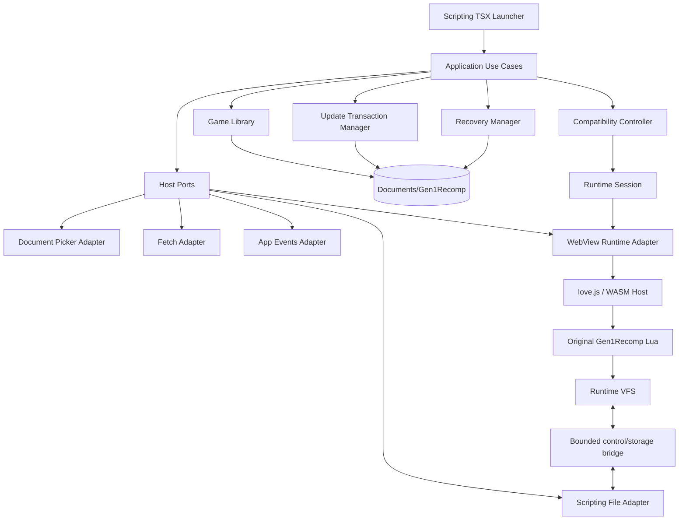
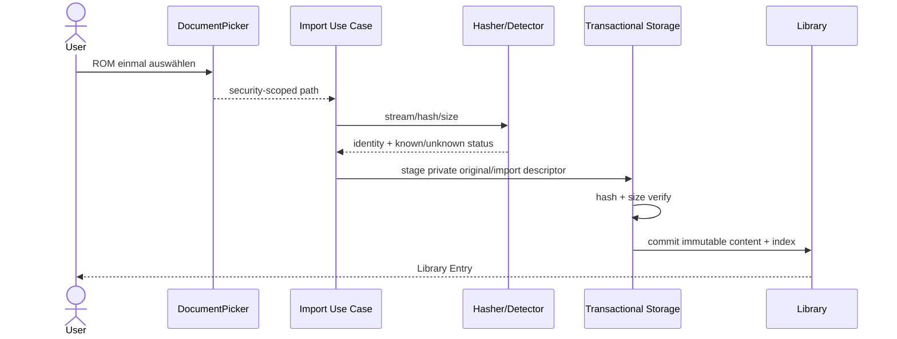
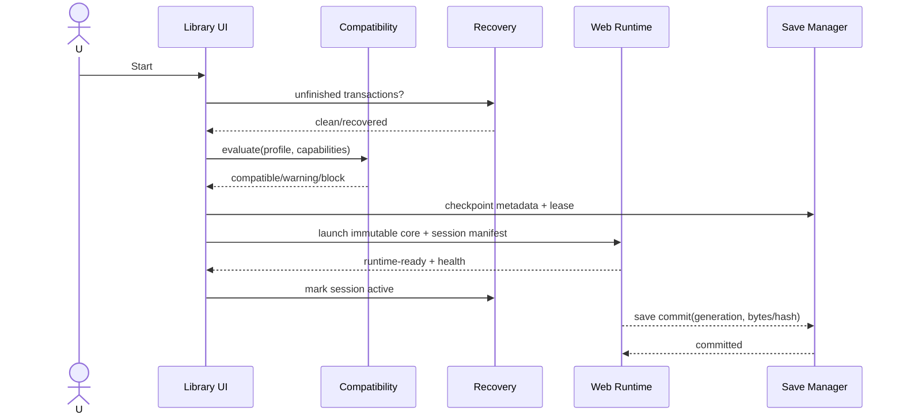
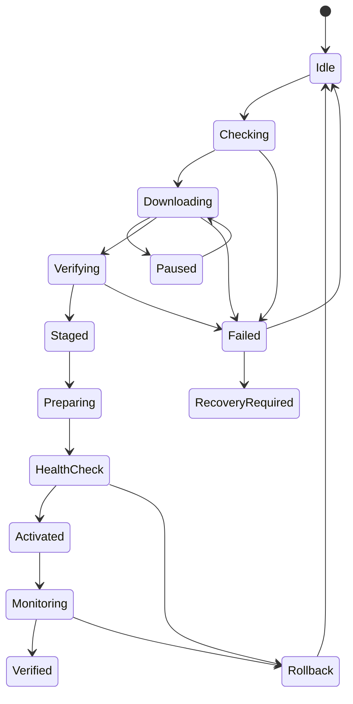
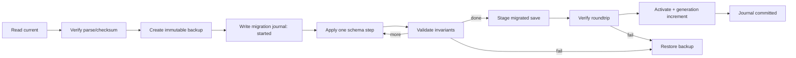
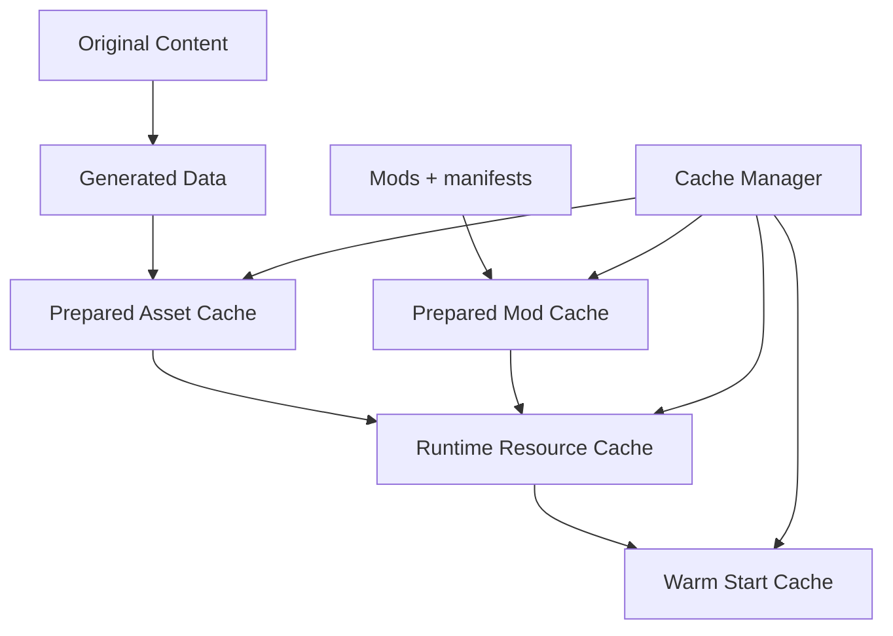
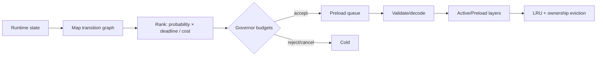
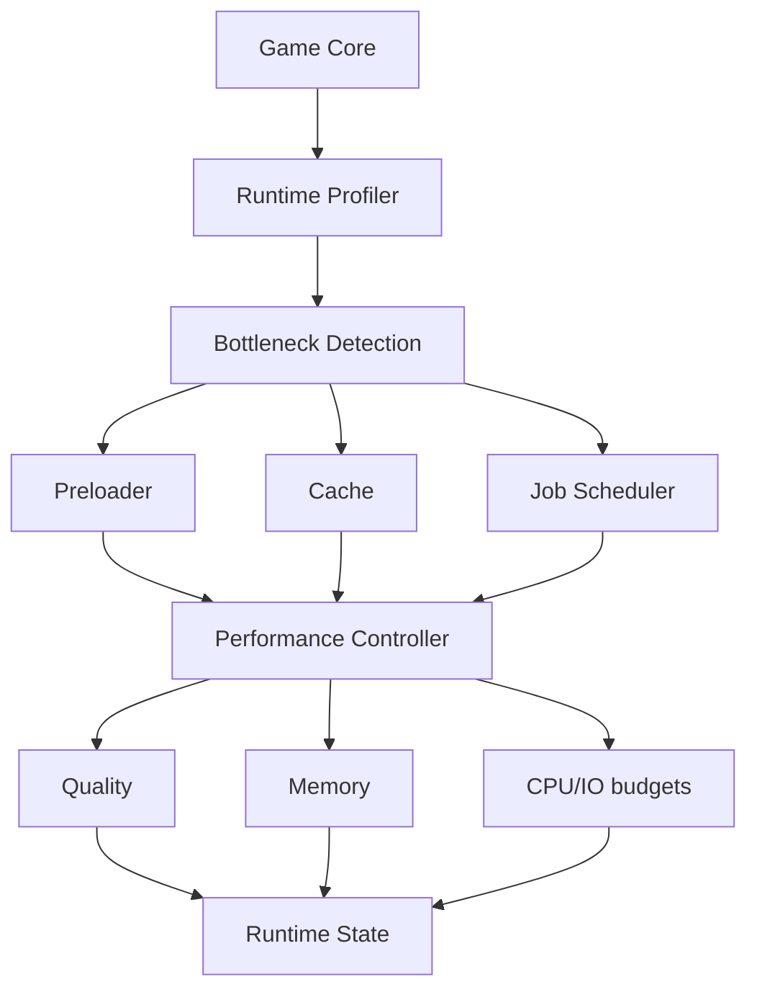
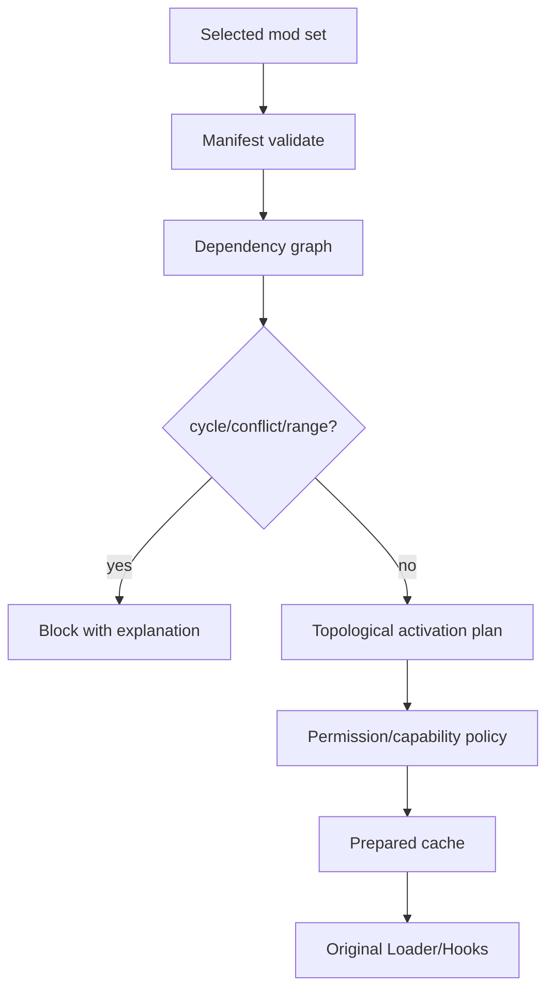
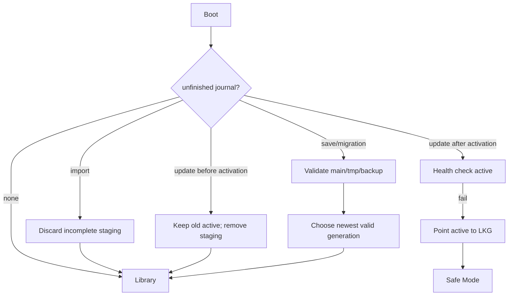

# Zielarchitektur Gen1Recomp → Scripting iOS

## 1. Executive Summary

Die Architektur verwendet **zwei Prozessebenen**:

1. Eine freie Scripting-TSX-Host-App verwaltet Library, sichtbare Dateien, Profile, Saves, Updates, Recovery, Diagnose und Sicherheit.
2. Ein versioniertes, reproduzierbares **love.js/Emscripten Runtime-Paket** führt den weitgehend unveränderten Lua/LÖVE-Core in einer `WebViewController`-Session aus.

Dies ist die einzige derzeit plausible Route, die den Originalcore, dessen Mod-/Hook-API und Gameplay-Semantik nicht in TypeScript dupliziert. Sie ist trotzdem **EXPERIMENTELL und durch Device-Gates blockiert**. Die vorhandene native Gen1Recomp-iOS-App ist technisch sicherer und leistungsfähiger, erfüllt aber nicht die Anforderung „innerhalb Scripting“.

Der inzwischen vollständig extrahierte offizielle Android-Payload bestätigt diese Grenze: Alle 1.150 `game.love`-Pfade entsprechen Tag v0.3.18; 1.149 sind byteidentisch, die einzige Differenz ist der vorgesehene Versionsstamp. Android bindet denselben Core an native Picker-, Netzwerk-, Update-, Schritt-, Audio- und Display-Bridges. Die Zielarchitektur erhält daher den Core und ersetzt diese Hostkante gezielt, statt Android-Java oder 1.072 Lua-Dateien neu zu implementieren. Siehe [`../audit/apk-static-analysis.md`](../audit/apk-static-analysis.md).

### Entscheidung

- **P0 jetzt:** Host-Library, Dateisystem, Identitäten, Profile, Transaktionen, Diagnose und Capability-Probe.
- **R1 Gate:** reproducible love.js Compatibility-Build von v0.3.18.
- **R2 Gate:** echter Scripting-iOS-Gerätetest.
- **Kein falsches Versprechen:** Ohne bestandenes Gate ist das Ergebnis ein vollständiger Library-/Recovery-Host, noch keine spielbare Runtime.

## 2. Leitprinzipien

- Ports & Adapters; Scripting kennt nur Adapter, Domain kennt Scripting nicht.
- Original Gen1Recomp ist die Engine-Wahrheit. Vorhandene Caches, Hooks, Mods, FixedStep, Save-Recovery und Updaterlogik werden adaptiert, nicht parallel erfunden.
- Konfiguration und Manifeste statt verstreuter Konstanten.
- Offline-first. Netzwerk darf installierte Inhalte nie sperren.
- Immutable/versioned Core Store; Aktivierung ist eine kleine Referenzänderung.
- Cache ist regenerierbar. Saves, Originalimporte, Profile und Journale sind kritisch.
- Free Tier: kein BackgroundKeeper und keine andere als Pro markierte API.

## 3. Gesamtarchitektur



Die WebView-Nachrichtenbridge überträgt **Kontroll- und kleine Statusnachrichten**, keine Frames und keine kontinuierlichen PCM-Buffer. Rendering und Audio bleiben innerhalb love.js/WebKit, um Kopien und Bridge-Latenz zu vermeiden.

## 4. Bounded Contexts und Verantwortungen

| Kontext | Verantwortung | Kein Eigentum an |
|---|---|---|
| Host Adapter | Files, Picker, Network, Lifecycle, Runtime View, Timing, Haptics | Game-Regeln |
| Game Library | importierte Spiele, Anzeige, letzter Start | Core-Binaries |
| Content Identity | Hash, Spiel/Region/Sprache/Format/Patch | Dateisystemoperationen |
| Content Storage | Pfade, Staging, Quota-Schätzungen, Integrität | Kompatibilitätsregeln |
| Core Store | immutable Core-Versionen, active/LKG/protected | Downloads |
| Launch Profiles | referenzielle Konfiguration | Engine-Ausführung |
| Compatibility | Matrix aus Game/Core/Mods/Save/Host | UI |
| Update Manager | persistenter Transaktionsautomat | Recovery-Policy |
| Recovery Manager | Journale prüfen, Rollback/Safe Mode | Update-Download |
| Save Manager | Slots, Backup, Integrität, Export | Spiellogik |
| Migration Manager | Schema-Pfade, Journal, Vorabbackup | Save-UI |
| Cache Manager | Namespace, Key, Eviction | kritische Daten |
| Resource Manager/Governor | Budgets und Prioritäten | Asset-Dekodierung selbst |
| Preload Manager | Kandidaten/Queue/Budget | vor R2 keine Vorhersagebehauptung |
| Performance Manager | Messung und Profile | ungemessene Optimierung |
| Mod/Hook/Dependency | vorhandene Gen1Recomp-API spiegeln | zweite Mod-API |
| Capability Manager | Host-Probeergebnisse und Feature-Gates | Browserannahmen |
| Graphics/Audio/Input | Runtime-Verträge und Fallback | Gameplay |
| Job Scheduler | Priorität, Abbruch, Deadline | unbegrenzter Hintergrundlauf |
| Diagnostics | redaktierte Events/Bundles | ROM-/Save-Inhalte |
| Trust Manager | Provenance, Hash, Limits, Policy | rechtliche Freigabe |
| Repository Provider | GitHub/local/manual hinter Port | Update-Aktivierung |
| Backup Manager | Export/Restore, Versionierung | Cloud-Sync in P0 |
| Configuration | Schema, Defaults, Flags, Lokalisierung | Runtime-State |

Der **Compatibility Controller** ist nur Orchestrator. Er ruft kleine Services auf, enthält weder Storage-I/O noch Hashing noch UI.

## 5. Dateisystem in der Dateien-App

`FileManager.documentsDirectory/Gen1Recomp/`:

```text
Gen1Recomp/
├── Library/
│   ├── index.v1.json
│   └── content/<sha256>/
│       ├── content.json
│       └── original.gb              # policy-konfigurierbar; privat, nie distributiert
├── Cores/<core-id>/<version>/<artifact-hash>/
│   ├── core-manifest.v1.json
│   └── web/                         # game.js, wasm, data parts, UI shell
├── Profiles/<profile-id>.json
├── Saves/<game-id>/<save-profile>/
│   ├── slots/
│   ├── backups/
│   └── migration-journal.json
├── Mods/<mod-id>/<version>/<hash>/
├── Generated/<content-hash>/<core-version>/
├── Cache/
│   ├── downloads/
│   ├── prepared/
│   ├── mods/
│   ├── metadata/
│   └── warm/
├── Transactions/<operation-id>/transaction.json
├── Diagnostics/events.ndjson
├── Recovery/last-known-good.json
├── Inbox/                         # Nutzer kann Dateien hier ablegen
├── Exports/
└── config.v1.json
```

Saves sind bewusst außerhalb `Cache`. WebView/IndexedDB ist niemals alleinige Wahrheit: Runtime-Saves werden an sicheren Punkten exportiert bzw. gespiegelt und mit Generation/Hash quittiert. Ob love.js VFS direkt in den sichtbaren Ordner synchronisiert werden kann, ist **NICHT VERIFIZIERT**; bis dahin ist ein explizites Session-Commit-Protokoll nötig.

## 6. Datenmodell

- `ContentIdentity`: SHA-256 als Storage-ID; erkannte upstream SHA-1 zusätzlich; Spiel, Generation, Region, Sprache, Revision, Format, ContentType, PatchChain.
- `CoreManifest`: coreId, semver, sourceCommit, artifactHash, API, hostContract, buildToolchain, features, minHost, files mit Hash/Größe.
- `LaunchProfile`: game/content/core refs; ModSetHash; Grafik/Input/Audio/Save/Performance; Sprache; Accessibility; Flags; Schema.
- `SaveDescriptor`: gameId, profile, slot, generation, schema, checksum, created/updated, core/api provenance.
- `Transaction`: operationId, kind, state, timestamps, expectedHash/Size, staging/target/backup, error, attempts.

Alle persistenten JSON-Dokumente tragen `schemaVersion`. IDs sind validierte Slugs oder zufällige UUIDs; Anzeigenamen werden nie als Pfad verwendet.

## 7. Game Import Data Flow



Für bekannte Red/Blue/Yellow-Revisionen wird gegen upstream Manifest geprüft. Unbekannter Hash bleibt „Unknown/unsupported“, wird nicht stillschweigend als kompatibel markiert. Standardmäßig kann die ROM nach erfolgreicher, bestätigter Runtime-Extraktion entfernt werden; bis dieses Protokoll verifiziert ist, bleibt sie im privaten sichtbaren Content-Ordner, damit kein zweiter Import nötig ist.

## 8. Game Launch



Launch blockiert bei fehlendem Core, falschem Hash, inkompatibler API, fehlendem Content oder erforderlicher Capability. Fehlende optionale Capability fällt auf Touch/scalar/single-thread/basic rendering zurück.

## 9. Core Store, Update und Rollback



- Core-Verzeichnisse sind content-addressed und immutable.
- `active` und `lastKnownGood` sind Referenzen in einem kleinen, journaled Dokument.
- Aktivierung erst nach Dateihashes, Manifest-Schema, HostContract und Smoke-Healthcheck.
- Retention: active + LKG + protected + optional ein vorheriges; nie während aktiver Session löschen.
- Signaturen sind **VORAUSSETZUNG** für „Verified/Signed“. Solange upstream nur SHA-256 bereitstellt, belegt Hash Integrität gegen das abgerufene Manifest, nicht autonome Herkunft bei kompromittiertem Repository.
- Repository Provider: `GitHubReleaseProvider`, `LocalFileProvider`, später `HttpManifestProvider`; Download und Aktivierung bleiben getrennt.
- **APK-Befund, VERIFIZIERT:** Das offizielle Android-Artefakt ist trotz v1/v2-Paketsignatur mit einer selbstsignierten Android-Debug-Identität signiert. Diese Identität wird nicht übernommen und gilt nicht als Vertrauensanker. APK-Installation und `REQUEST_INSTALL_PACKAGES` haben im Scripting-Host keine Entsprechung; aktualisiert werden nur Core-Payloads.
- **VORAUSSETZUNG:** Ein Scripting-Core darf erst „Signed“ heißen, wenn Manifest und Artifact durch eine separate, dokumentierte Release-Key-Policy inklusive Rotation/Revocation authentisiert sind. Bis dahin lautet der Trust-Level höchstens `Verified Hash/Provenance`.

## 10. Save und Migration



Unterschieden werden: normal save, engine save, mod save, checkpoint, optionaler save state, runtime state und Konfiguration. **Save states sind nicht zugesagt**, da Core-Support und Portable-Schema nicht verifiziert sind. Konflikte werden nie automatisch „last writer wins“ gelöst; Generation + Basis-Hash erkennen Paralleländerungen.

## 11. Cache und Prepared Data



Schlüssel: `contentHash/coreVersion/modSetHash/assetType/graphicsProfile/language/buildSchema`. Beschädigter Cache wird gelöscht und aus Original/Generated neu erstellt. Kritische Saves, Profile und Core-Manifeste werden nie zu Cache.

## 12. Preloading und Resource Governor



Stage 1 enthält nur Core, Player, sichtbare Map/Tiles, Input und notwendige UI. Stage 2 ist abbrechbar und darf Gameplay nicht blockieren. **Aber:** Der Originalcore besitzt bereits Map-/Asset-Caches; P1 instrumentiert diese zuerst. Ein neuer Predictive Manager ist nur gerechtfertigt, wenn Profile reale Transition-Stalls zeigen und ein Adapterpunkt ohne Semantikänderung existiert.

Priorität bei Druck: temporär → low-probability preload → cold cache → optionale Effekte → Hintergrundjobs. Saves bleiben unangetastet. Mangels dokumentiertem Memory-Pressure-Callback arbeitet P0 mit konservativen konfigurierten Budgets und beobachtbaren Allocation-/Frame-Proxys.

## 13. Performance-Modell



Zustände `HIGH/BALANCED/LOW/SAFE` werden erst nach R2 implementiert. P0 sammelt lokal: frame/logic/render, startup, save/load, asset load, cache/preload hit, hook/mod callback, job queue und approximierten Memory-Peak. Keine Netzwerk-Telemetrie ohne Opt-in. 60-Hz-Logik wird nicht an 120-Hz-Display gekoppelt.

Benchmarks (Median/P95, mindestens 30 Läufe soweit praktikabel): Cold/Warm Start, erste Map, Mapwechsel, Battle-Start, Save/Load, Hook chain 0/10/100, Mod preparation, WASM compile/instantiate, frame time, Audio underruns, Peak Memory. Jede Optimierung benötigt Golden-Parität.

## 14. Grafik, Audio und Input

- **Grafik:** love.js WebGL ist primärer Kandidat. Native TimelineCanvas ist nur Launcher/Fallback-Diagnose, da command replay und Main-Thread-Brücke SpriteBatch-Semantik nicht belegen. Pixel-perfect nearest, Safe Area, Rotation und Aspect Ratio sind Profilfelder.
- **Audio:** ChipAudio bleibt im Core. Compatibility love.js ohne pthreads kann problematisches Audio haben; deshalb Audio ist ein hartes R2-Gate. Native AVPlayer kann keine per-frame synthetisierte PCM-Pipeline ohne neuen Bridge-Backend ersetzen.
- **Input:** Touch overlay P0; Focus Loss löscht gehaltene Eingaben. Gamepad bleibt capability-gated. Priorität: System/modal UI → Host overlay → Mods (observe/consume nach Vertrag) → Game.
- **Haptik:** optionaler freier Basisadapter, niemals Gameplay-Abhängigkeit.

### Binär bestätigte Android-Hostkante → Scripting-Port

| APK-/Core-Vertrag | Binäre Evidenz | Scripting-Entscheidung | Status |
|---|---|---|---|
| File pick/create/export | DEX-Methoden und Picker-Stagingdateien vorhanden | `DocumentPicker` + transaktionaler File Adapter; Core-Aufruf erhalten | FREE / implementierbar, Contract-Test nötig |
| `httpDownload/httpPost/httpRequest` | DEX-Signaturen, HTTPS-only-/Limit-Literale vorhanden | begrenzter Network Port; Auth/Redirect/Size Policy im Host, offline nie blockieren | NUR MIT HOST-UNTERSTÜTZUNG |
| Raw TLS | `tlsOpen/Send/Receive/Status/Close` vorhanden | nicht in P0 freigeben; keine undokumentierte Socket-API behaupten | NICHT VERIFIZIERT |
| APK-Install/Restart | `installApk`, Provider und Install-Permission vorhanden | nicht portieren; Core Store Stage/Verify/Activate/LKG statt App-Selbstupdate | bewusst unsupported |
| Steps | `syncHealthSteps`, Permission und Pending-Datei vorhanden | optional; ohne dokumentierte freie Health-API Capability-Fehler, Gameplay bleibt unabhängig | NICHT VERIFIZIERT |
| Secondary Display | Activity und Frame-/Touchmethoden vorhanden | nicht P0; Single Display als Baseline | NICHT VERIFIZIERT |
| Vibration | Permission und Bridge vorhanden | optionaler Haptics Adapter, niemals harte Abhängigkeit | TEILWEISE VERIFIZIERT |
| Gamepad/USB | optionale Manifest-Features und LÖVE/SDL-Pfade | Touch zuerst; Controller nur nach Device-Probe | BENCHMARK/PROBE ERFORDERLICH |

Damit bleibt die API-Richtung original: Der Core fragt Fähigkeiten an; der Host implementiert oder verweigert sie explizit. Eine zweite, konkurrierende Game-/Mod-API entsteht nicht.

## 15. Mods, Hooks, Dependencies und Capabilities



Upstream Manifest v2 bleibt maßgeblich. Host-Trust ergänzt, ersetzt es nicht:

- Trusted Internal
- Signed (nur mit verifizierter Signaturkette)
- Verified Hash/Provenance
- Local Development
- Unverified

Ziel-Capabilities werden zunächst auf upstream Permissions abgebildet. Feinere Rechte (`content.read`, `render.overlay`, `storage.mod`, `network.fetch`, …) brauchen Upstream-Unterstützung; ein Hostlabel allein kann Lua-Sandbox-Zugriff nicht erzwingen. Daher Status **NUR MIT CORE-UNTERSTÜTZUNG**.

## 16. Security Threat Model

| Bedrohung | Kontrolle | Rest-Risiko |
|---|---|---|
| Manipulierter Core/Download | HTTPS, Manifest, SHA-256, immutable staging, LKG | Repository+Manifest gemeinsam kompromittiert; unabhängige Core-Signatur fehlt. Androids verifizierte Debug-Zertifikatsidentität ist ausdrücklich kein Trust Anchor. |
| Zip Slip/Bomb/Symlink | Projekt-eigener ZIP-Parser, zentrale/lokale Headerprüfung, normalisierte Ziele, CRC-32, Größen-/Ratio-Limits, keine Symlinks | PRO-pflichtige Scripting-Archive-APIs sind verboten; unbekannte ZIP-Methoden werden abgewiesen. |
| Fake Manifest/Downgrade | striktes Schema, source pin, monotone Policy, Nutzerbestätigung | legitimer Rollback muss explizit erlaubt werden. |
| Memory/Disk Exhaustion | declared size, quotas, bounded reads, cleanup reservation | iOS kann Prozess jederzeit beenden. |
| Malicious Mod | upstream Sandbox/Permissions, time/size limits, safe mode | Lua CPU loops können je nach Runtime blockieren; testen. |
| Path Traversal | IDs nie als rohe Pfade, `resolveUnderRoot`, Unicode/Separator checks | Host-Symlinksemantik separat testen. |
| Privacy Leak | kein ROM/Save in Logs; Netzwerk default deny für Mods | Core-/Mod-Netzwerk muss tatsächlich sandboxed bleiben. |
| Interrupted Save/Update | staging, journal, backup, generation/hash | Rename-Atomizität nicht zugesagt; Recovery muss beide Zustände behandeln. |

## 17. Lifecycle, Offline und Recovery



Recovery-Matrix:

| Ereignis | Detection | Recovery/Fallback | Datensicherheit |
|---|---|---|---|
| Crash Import | offenes Journal/staging | staging entfernen, Original unangetastet | hoch |
| Crash Update | State + staging | active/LKG behalten | hoch |
| Crash Migration | Journal + Backup | Backup wiederherstellen | hoch |
| Crash Save | generation + tmp/backup | neueste valide Generation wählen | hoch nach Contract-Test |
| Corrupt Core | Hash/health | LKG, dann protected | hoch |
| Corrupt Cache | Hash/decode | löschen/regenerieren | kritisch unabhängig |
| Missing ROM/content | Ref fehlt | Start blockieren, Reimport anbieten | Save behalten |
| Missing/incompatible Mod | Compatibility | deaktivieren/Safe Mode | Mod-Save behalten |
| Low Disk | preflight/failed write | Cache cleanup; Operation abbrechen | Saves unangetastet |
| Memory Pressure/WebView kill | session heartbeat/termination | letzte bestätigte Save-Generation, SAFE | uncommitted runtime progress möglich |
| Interrupted Download | `.part` + transaction | resume falls Provider unterstützt, sonst neu | active unberührt |
| App Kill | Boot journal scan | wie jeweilige Operation | keine Background-Garantie |

Safe Mode startet LKG ohne Drittmods, experimentelle Flags, Preload und optionalen Effekte. Offline startet jede vollständig installierte, kompatible Kombination; Updatefehler verändern sie nicht.

## 18. Observability und Diagnose

NDJSON-Felder: timestamp, component, event, severity, gameId (opaque), core, mod IDs, operation, duration, recoveryState, errorCode. Keine ROM-Pfade außerhalb redaktierter Root-Bezeichner, keine Bytes, Trainer-/Save-Inhalte oder personenbezogenen IDs. Diagnoseexport enthält Manifeste, Hashresultate, Capability-Probe, letzte 500 redaktierte Events und Storage-Statistik.

## 19. Teststrategie

- Unit: Hash/Identity, Pfadvalidierung, Manifest/Schema, Semver/Dependency, Cache Keys, Update-Automat, Migration/Recovery.
- Contract: Scripting FileManager rename/overwrite/crash, Picker bookmark, WebView local read access, bridge size limits.
- Integration: Import→Library→Profile, Core stage→health→activate→rollback, Save generation, Mod plan, Lifecycle.
- Golden: Start, Bewegung, Collision, Map, Battle, Save und Render-Fingerprints gegen denselben upstream Commit.
- Fuzz: JSON-Manifeste, Save-Parser, Archive-Ziele, Netzantworten, Hook-Payload-Schemas; kein Fuzzing mit echten Saves.
- Security: `../`, absolute/Unicode paths, duplicate paths, symlink, wrong hash, oversized count/size, dependency cycle, downgrade, ENOSPC.

## 20. Compatibility Matrix (Schema + aktueller Wissensstand)

| Game | Content | Core | Mod API | Save | Graphics | Input | Audio | Host | Ergebnis |
|---|---|---|---|---|---|---|---|---|---|
| Red US canonical | known SHA-1 | v0.3.18 source | v1/v2 upstream | upstream | native LÖVE iOS | touch | native | native app | Compatible upstream, nicht Scripting |
| Blue US canonical | known SHA-1 | v0.3.18 source | v1/v2 upstream | upstream | native LÖVE iOS | touch | native | native app | Compatible upstream, nicht Scripting |
| Yellow US canonical | known SHA-1 | v0.3.18 source | v1/v2 upstream | upstream | native LÖVE iOS | touch | native | native app | Compatible upstream, nicht Scripting |
| Red/Blue/Yellow | known | love.js candidate | unknown | bridge unknown | WebGL unknown | Touch candidate | unknown | Scripting 3.x | **Unknown / gated** |

Die persistente Produktmatrix enthält zusätzlich Region, Sprache, Content-/Core-/Mod-API, Schema, Host-Version und Feature Flags. `Unknown` wird nie als Warning-kompatibel behandelt, wenn eine harte Fähigkeit fehlt.

## 21. Architekturentscheidungen

### ADR-001: WebView/love.js statt Lua-Neuimplementierung
- Why: erhält Core und Mod API.
- Alternativen: native IPA (beste Technik, nicht Scripting); TS-Rewrite (zu groß/inkompatibel); externer Stream (nicht offline).
- Nachteile: WebKit-Fähigkeiten und Performance ungeklärt.
- Status: EXPERIMENTELL, Device-Gate.

### ADR-002: Scripting UI + Runtime View getrennt
- Why: Native Library/File UX und austauschbarer Runtime Adapter.
- Risiko: Session-/Save-Synchronisation.
- Status: VERIFIZIERT architektonisch; Runtime-Contract offen.

### ADR-003: Sichtbarer Documents Root
- Why: Nutzeranforderung, Backup und Recovery transparent.
- Nachteil: Nutzer kann Dateien verändern; daher Hash/Recovery.
- Status: VERIFIZIERT verfügbar.

### ADR-004: Immutable Core Store
- Why: sichere Updates/Rollback.
- Nachteil: zusätzlicher Speicher; Retention Policy.
- Status: implementierbar mit dokumentierter File API; Crash-Contract-Test nötig.

### ADR-005: Kein Pro API
- Why: harte Anforderung.
- Folge: kein BackgroundKeeper; alle Jobs pausier-/restartbar.
- Status: VERIFIZIERT.

## 22. Risiko-Matrix

Skala 1 niedrig bis 5 hoch; Priorität = Wahrscheinlichkeit × Impact.

| Risiko | P | I | Erkennung | Priorität | Mitigation/Fallback |
|---|---:|---:|---:|---:|---|
| love.js bootet nicht in Scripting | 4 | 5 | 5 | 20 | R0/R1 Gate; native iOS als technische Alternative dokumentieren. |
| Audio instabil ohne Threads | 4 | 5 | 4 | 20 | Compatibility build messen; Core-Fallback prüfen; kein Release ohne Audio-Golden. |
| WebView-Save nicht zuverlässig spiegelbar | 3 | 5 | 4 | 15 | generation/hash ACK, host backup, kill tests. |
| Memory Limit/Web process kill | 4 | 4 | 3 | 16 | Budgets, kleinere data chunks, SAFE, LKG, recovery. |
| Local file/CORS verhindert assets | 3 | 5 | 5 | 15 | `loadFile` read root probe; single-package/custom load strategy testen. |
| Mod-Sandbox im Webbuild abweichend | 3 | 4 | 3 | 12 | Mods nach Vanilla freigeben; permission/security suite. |
| Archive extraction unsicher | 3 | 5 | 3 | 15 | untrusted zip blockieren bis Preflight. |
| Scripting API ändert sich | 3 | 3 | 4 | 9 | Host Adapter, minHost, compatibility probe. |
| Lizenz-/Game-Data-Verstoß | 2 | 5 | 2 | 10 | GPL-Compliance, keine ROM/Assets, lokale Nutzerimporte; Rechtsprüfung. |

## 23. Roadmap

### R0 – abgeschlossen in diesem Repository
- Revisionsgebundener Source-/Host-Audit.
- Free-Tier- und Capability-Matrix.
- Hexagonales Storage-/Domain-Grundgerüst, Update-State-Machine und Pfadschutz.
- Scripting Launcher-Shell und sichtbares Ordnerschema.

### R1 – Build Spike (P0)
- v0.3.18 `.love` reproduzierbar packen; love.js Compatibility ohne pthreads bauen.
- Buildmanifest, Dateihashes, GPL Notices.
- Minimalwebhost lokal in Safari testen; Boot-, Render-, Audiofehler protokollieren.

### R2 – Scripting Device Gate (P0)
- Capability-Probe auf mindestens zwei Geräteklassen/iOS-Versionen.
- `loadFile` + erlaubter Read Root; WebGL/WASM/Audio/User Gesture; Relaunch Persistence.
- Vanilla Red Test-ROM nur lokal durch Eigentümer; keine Fixture/Upload.

### R3 – End-to-End Vertical Slice (P0)
- einmaliger Import, Library, Profile, Runtime-Launch, Host-Save-Commit, Lifecycle, Recovery.
- Red zuerst; Blue/Yellow erst nach Golden-Parität.

### R4 – Mods/Updates (P1)
- Upstream Manifest-/Dependency-Plan, lokale Mods zuerst.
- Versioned core update + LKG; Provider-Abstraktion.
- Kein Netzwerk für unverified Mods per Default.

### R5 – Messen/Optimieren (P1)
- Profiler und Baselines; Warm cache, prepared mod/assets nur bei belegtem Bottleneck.
- Predictive preload nur nach nachgewiesenen Map stalls.

P2/P3 bleiben SDK/Developer Tools, Sync/Multiplayer/Link/alternative Backends; keine P0-Abhängigkeit.

## 24. Messbare Abnahmekriterien

1. Spiel erscheint nach einem Import in der Library und verlangt beim nächsten Start keinen Picker.
2. Content/Core-Dateien werden vor Nutzung gegen Größe und Hash geprüft.
3. Fehlgeschlagenes Update verändert active/LKG nicht; simulierter Crash in jedem Zustand ist recoverbar.
4. Save-Migration hat vor der ersten Änderung Backup + Journal; beschädigtes Ergebnis aktiviert nicht.
5. Cache-Löschung entfernt keine Saves/Profile/Originale/Core-LKG.
6. Inkompatible Mods/Profile werden mit maschinenlesbarem Grund blockiert.
7. P0 importiert transitiv keine `pro: true`-API; automatischer Source-Scan ergänzt Device-Test.
8. Offline-Start einer installierten Kombination benötigt kein Netzwerk.
9. Background/Inactive setzt Input neutral und commitet bzw. journaled kritischen Zustand; kein KeepAlive-Versprechen.
10. Runtime-Release erst bei 60-Hz-Gameplay-Semantik, Render-Golden, Audio ohne unzulässige Aussetzer und Save-Kill-Recovery.
11. Jede Performance-Änderung hat Baseline, Median/P95, Memory-Peak und Golden-Parität.
12. Keine Distribution von ROM oder ROM-extrahierten Assets.

## 25. Legal/Licensing

Gen1Recomp v0.3.18 ist laut `LICENSE.MD` GPLv3. Ein verteiltes abgeleitetes love.js-Paket muss GPL-Pflichten einschließlich Corresponding Source und Notices erfüllen. Abhängigkeiten (LÖVE, SDL, Lua/LuaJIT, Emscripten/love.js, Fonts/Icons) benötigen eine SBOM-/Lizenzprüfung. Pokémon-ROMs, extrahierte Grafiken/Audio und Marken sind getrennt und werden nicht geliefert. Nutzer importieren eigene Inhalte lokal. Dies ist technische Planung, keine Rechtsberatung.

## 26. Offene harte Fragen

1. Kann die aktuelle Scripting-App in ihrem WebView das konkrete love.js-WASM laden und ausführen?
2. Funktionieren lokale `game.js/.wasm/.data`-Subrequests unter `loadFile(..., allowingReadAccessTo)`?
3. Ist Compatibility-love.js ohne pthreads für ChipAudio brauchbar?
4. Wie wird love.js VFS zuverlässig und begrenzt mit dem sichtbaren Host-Ordner synchronisiert?
5. Welche reale Memory-Grenze und WebContent-Crashrate haben Zielgeräte?
6. Unterstützt der Runtime-Kontext Gamepad/Controller?

Bis diese sechs Fragen durch reproduzierbare Tests beantwortet sind, bleibt „vollständig spielbar in Scripting“ **NICHT VERIFIZIERT**.

## 27. Accessibility und Localization

UI-Text liegt getrennt von Use Cases und wird mindestens Deutsch/Englisch angeboten. Native Scripting-Views liefern die beste Basis für VoiceOver und Dynamic Type; jede Cartridge-/Statusfarbe besitzt zusätzlich Text/Icon, Touchziele sind mindestens systemüblich groß, Reduced Motion deaktiviert dekorative Übergänge, Haptik ist abschaltbar. Die Runtime selbst benötigt einen Audit ihrer Canvas-Semantik: ein WebGL-Canvas ist nicht automatisch VoiceOver-zugänglich. Deshalb sind Host-Launcher-Zugänglichkeit und In-Game-Zugänglichkeit getrennte Abnahmepunkte.

## 28. Backup und Export

Ein versioniertes Exportmanifest referenziert Saves, Mod-Daten, Profile, Settings und Core-Metadaten; Core-Binaries und Original-ROM werden standardmäßig nicht exportiert. Vor ZIP-Erzeugung wird in einen konsistenten Snapshot-Ordner kopiert und jeder Eintrag gehasht. Restore erfolgt als Importtransaktion mit Preview, Konfliktentscheidung und niemals direkt über aktive Saves. Nicht portable Runtime-/Warm-State-Daten werden als solche markiert und ausgelassen. iCloud/Cloud-Sync ist kein P0-Backupversprechen.

## 29. Build- und Release-Pipeline

Jedes Runtime-Artefakt dokumentiert Source-Commit, dirty flag, love.js/Emscripten-Version, LÖVE/Lua-Version, Dependency Lock, Buildparameter, HostContract, Dateihashes und SBOM. CI packt zuerst die upstream `.love`, baut daraus die Web-Assets, erzeugt ein CoreManifest und führt Headless-/Browser-Smokes aus. Reproduzierbarkeit wird gemessen; ohne zwei byte-identische unabhängige Builds lautet der Status nicht „reproducible“. Release-Gate: Tests, Device-Matrix, GPL Source Offer/Notices, keine Game-Daten, Update-/Rollback-Simulation und signiertes Manifest, sobald eine Schlüssel-/Revocation-Policy existiert.
